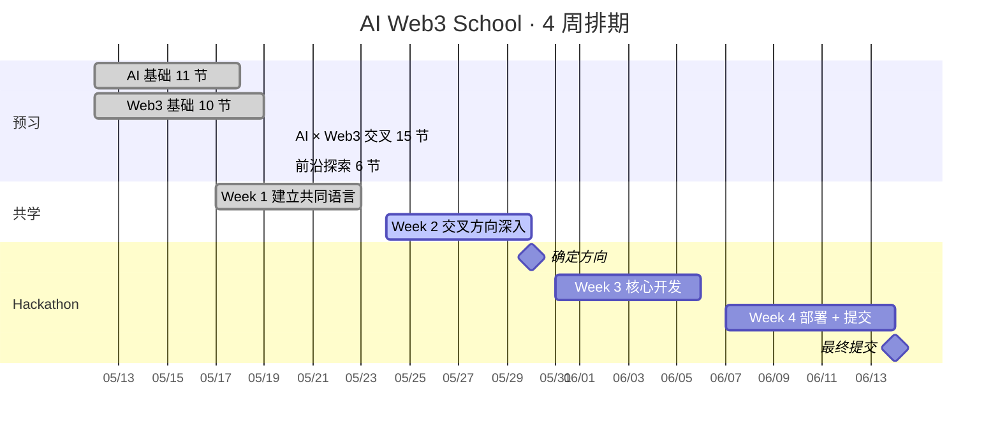
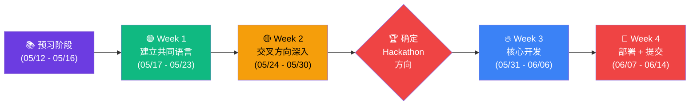
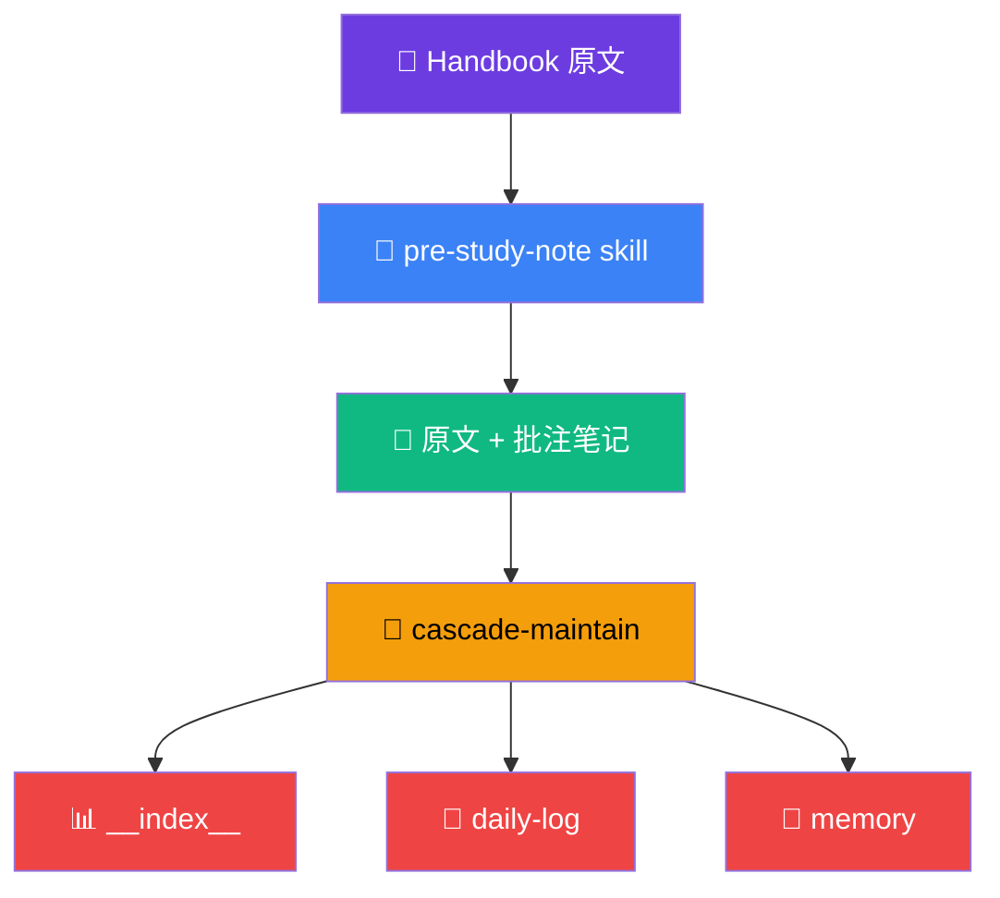
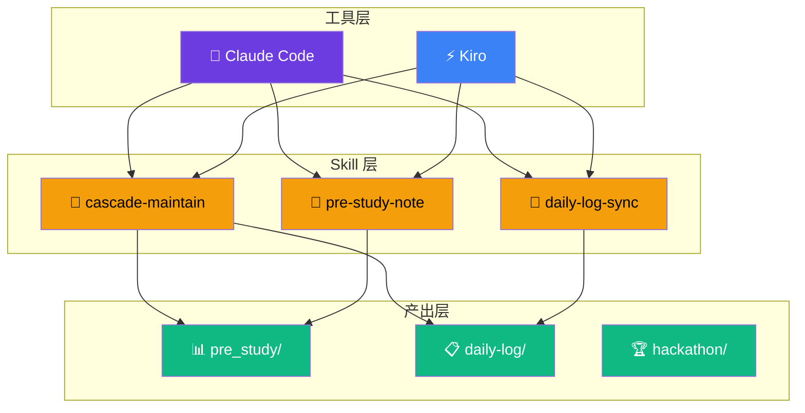

<p align="center">
  <h1 align="center">AI Web3 School · Study Track</h1>
  <p align="center"><strong>记录本学期参与的AI Web3 共学营 + 黑客松，从学习基础到产出 MVP 的全链路记录</strong></p>
</p>


<p align="center">
  
</p>

<p align="center">
  
  
  
  
</p>

<p align="center">
  <a href="#-highlights">Highlights</a> · <a href="#-当前进度">当前进度</a> · <a href="#-仓库结构">仓库结构</a> · <a href="#️-工作流">工作流</a> · <a href="#-hackathon-方向">Hackathon</a> · <a href="#-关键链接">关键链接</a>
</p>

---

## ✨ Highlights

- **pre study note:  42/42** — `AI Fundamentdals` 11 节 + `Web3 Fundamentals` 10 节 + `AI-Web3-Bridge` 15 节 + `Frontier` 6 节全部完成，每个主题文件夹包含: README.md(该原文的介绍+人工批注) + Theme-exercise.md(主题练习的demo)
- **Agent 驱动** — `Claude Code` / `Kiro` / other `Agent` 工具接入进行驱动，3 个在实践过程中自定义 Skill（`cascade-maintain` / `daily-log-sync` / `pre-study-note`）
- **全链路记录** — `pre_study` → `daily-log` → `hackathon`，即是笔记仓库也是 **proof-of-work workspace**
- **链上证明** — Hackathon 提交必须附 *测试网 Tx Hash*, PPT 演示可附带

### 排期



## 🌱 origin (起源)

> *先前从最初的 SDE 到泡在 AI  Coding圈子里, 叙事框架在 Web2 下, 不清楚 Web3 的生态, 范式, 体系, 了解到该共学营和黑客松的赛事培养安排, 有想法将 之前 AI Coding 的方法论和工作流投入到该repo中, 并持续产出迭代"。*

对 *授权、签名、不可伪造的执行记录、可撤销的能力*——这些恰好是 Web3 这十年攒下来的基础核心设施在做的事。可以用 **AI 正在把这些能力接入自动化流程**, 整个探索的过程还是很吸引并值得参与的

这个*交叉*  的 AI Web3 地带，把两套语言学到能互译，互通, 在交接带中最后打磨成一个能在测试网上跑起来的 MVP, 展示出一些实用的价值即满足, 这个仓库就是这个过程的基础学习记录 和 思考火花。

## 📊 progress

> (维护时间) / 最后更新：2026-05-20 · Week 1 · Day 4

### pre-study note (预习笔记)

| 模块 | 进度 | 状态 |
|------|------|------|
| AI 基础 | 11 / 11 | ✅ 全部完成 |
| Web3 基础 | 10 / 10 | ✅ 全部完成 |
| AI × Web3 交叉 | 15 / 15 | ✅ 全部完成 |
| 前沿探索 | 6 / 6 | ✅ 全部完成 |
| **合计** | **42 / 42 (100%)** | |

### timeline (时间线)

活动安排: 



### everyday-task (每日任务)

记录每日核心产出

| 日期 | 状态 | 主要产出 |
|------|:---:|---------|
| 05-17 (Day 1) | ✅ | 开营仪式整理精要 |
| 05-18 (Day 2) | ✅ | `ai-fundamentals/` 11 节 + 两场直播笔记 + 规范架构 |
| 05-19 (Day 3) | ✅ | `web3-fundamentals/` 10 节 + Case/Eval 归档 |

## 📂 repo-structure

pre-study: 学习基础知识

daily-log: 记录每日所得

hackathon: 记录` MVP / project `产出

```
输入 ──────────────── 过程 ──────────────── 输出

pre_study/              daily-log/              hackathon/
├── ai-fundamentals/    ├── week-1/             ├── contracts/
│   (11 节 ✅)          │   ├── 2026-05-17/     └── demo/
├── web3-fundamentals/  │   ├── 2026-05-18/
│   (10 节 ✅)          │   └── ...
├── ai-web3-bridge/     ├── week-2/
│   (15 节 ⚪)          ├── week-3/
└── frontier/           └── week-4/
    (6 节 ⚪)

handbook-feedback/       ← Handbook 反馈与共建
```


<details>
<summary>完整目录树（点击展开）</summary>

```
web3career-study-track/
├── README.md                  ← 你正在看的这个
├── profile.md                 ← 学员画像
├── GUIDE.md                   ← 项目通用规范（Claude Code / Kiro 等工具共用）
├── CLAUDE.md                  ← Claude Code 专用行为指引
├── steering.md                ← Kiro 专用方向与决策指引
│
├── .claude/                   ← Claude Code 配置（skill 注册）
│   └── skills/
│       ├── cascade-maintain/    链式维护
│       ├── daily-log-sync/      每日日志同步
│       └── pre-study-note/      预习笔记整理
│
├── .kiro/                     ← Kiro 配置（skill 规范）
│   └── skills/                  与 .claude/skills/ 对齐
│
├── pre_study/                 ← 输入：42 节预习笔记
│   ├── __index__.md             总目录 + 状态（⚪ / 🟡 / ✅）
│   ├── ai-fundamentals/         AI 基础（11 节）
│   ├── web3-fundamentals/       Web3 基础（10 节）
│   ├── ai-web3-bridge/          交叉地带（15 节）
│   └── frontier/                前沿探索（6 节）
│
├── daily-log/                 ← 过程：每周 → 每天
│   ├── __index__.md             规范和模板
│   └── week-1/
│       ├── __index__.md         当周索引
│       ├── WEEK.md              当周目标
│       └── 2026-05-XX/
│           ├── __index__.md     当日概览
│           ├── 2026-05-XX.md    学习笔记
│           ├── TASK.md          任务清单
│           └── assets/          截图
│
├── hackathon/                 ← 输出：最终项目
│   ├── contracts/               合约源码 + 测试网 Tx Hash
│   └── demo/                    演示材料
│
├── handbook-feedback/         ← Handbook 反馈与共建
│
├── idea/                      ← 实验：Skill 原型 + 案例
│   ├── skills/                  Skill 草稿
│   └── reference/               案例 + 评估规范
│
└── reference/                 ← 规范文件
    └── git-commit-reference.md
```

</details>

## ⚙️ workflow (工作流)

### loop (每日循环)


###  /cascade-maintain (自定义 Agent 维护 级联索引文件的 skill) 



### layer (分层)



## 💡 judge (判断)

> **🤖 关于 AI** — 模型输出永远是 *"候选答案"*，不是事实。越靠近执行层，越要把候选答案变成**可被代码验证的对象**。最警惕的 Agent 设计：`模糊目标 + 广泛工具 + 长期记忆 + 直接动钱`。

> **⛓️ 关于 Web3** — 私钥就是控制权本身。钱包交互三层权限——*只读 < 签名 < 发交易*——很多人以为自己在做第一层，其实点了第三层。Session Key 是 Agent Wallet 的胜负手：**可限制 + 可过期 + 可撤销**。

> **🔀 关于交叉地带** — Agent 不应该拥有"钱包"，它应该只拥有 **可限制、可审计、可撤销** 的能力。把私钥扔给 Agent 是 `root 权限滥用`。*Audit Trail* 是最容易也最先该落地的可验证层。

## 🏆 Hackathon 方向

> Week 1-2 边学边筛，Week 2 结束前确定

| # | 方向 | 一句话 |
|---|------|--------|
| 1 | 🔑 Smart Account + Session Key | 给 AI 一把 *"只能在某段时间、某个金额内、做某类事"* 的钥匙 |
| 2 | 🔄 Agentic Commerce 闭环 | 智能体决策 → 链上执行 → DeFi 组合 → 出错回滚 |
| 3 | 💳 AI-native Wallet | 重新设计钱包确认 UX，让用户每次签名都知道在*批准什么* |
| 4 | 📈 链上数据分析 Agent | 把 *"看 Etherscan 看到累"* 这件事自动化 |

硬性要求：**必须有测试网 Tx Hash**，*不接受 PPT 项目*。

## 🔗 link (关键链接)

| 用途 | 链接 |
|------|------|
| 🌐 营期官网 | <https://aiweb3.school/> |
| 📚 中文预习资料 | <https://aiweb3.school/zh/> |
| 📋 WCB 任务平台 | <https://web3career.build/zh/programs/AI-Web3-School?tab=apply> |
| 👤 Builder Profile | <https://web3career.build/profile> |
| 💬 Telegram 学员群 | <https://t.me/aiweb3school> |

## 🔒 privacy (隐私提醒)

> 本仓库为 **public**，请勿提交私钥、助记词、API Key、未公开联系方式或他人个人数据。
> 如需记录敏感操作，使用占位符或截图脱敏后提交。

## 🤝 cowork (合作生态)

> **🔗 LI.FI** — 跨链执行、流动性聚合、`Intent/Solver` 架构。做 *Agentic Commerce* 的 SDK 入口。

> **💧 Waterdrip Capital** — 黑客松评审、资源对接、算力支持。Demo 阶段争取*真实反馈*。
