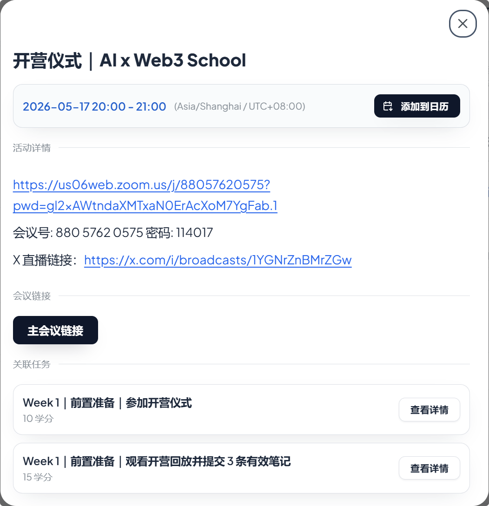

# 整理精要

## 关于任务

采用「共同基础 + 方向任务 + Hackathon 实践」的方式推进。大家会先完成通用基础任务，再根据自己的背景和兴趣选择主线方向；方向可以调整

### 关于学习的方向

- 通用基础：AI 工具使用、Agent/Vibe Coding、GitHub 作品记录、Web3 基础概念、钱包与测试网安全边界。所有同学都建议完成。
- 技术 / 开发向：适合想做 Demo、合约、前端、Agent、工具、链上交互或 Hackathon 项目的同学。重点是把想法做成可运行的原型。
- 产品 / 研究向：适合想做方向判断、问题定义、竞品分析、用户场景、方案设计和项目 proposal 的同学。重点是把问题讲清楚、把方案拆出来。
- 内容 / 社区 / 运营向：适合想做内容传播、社区组织、活动支持、用户反馈、项目叙事和生态连接的同学。重点是把复杂内容转化为能被更多人理解和参与的行动。
- Hackathon / Sponsor Challenge：适合希望在营期后半段组队完成项目的同学。可以来自技术、产品、设计、内容、研究等不同角色，不要求每个人都写代码。

## 关于打卡

- 每日打卡相关：每日打卡与任务提交并行，完成任务 ≠ 打卡成功，请注意学习面板与残酷共学的打卡要求。
- 学分会用于记录学习过程、任务完成度、评优、周边奖励以及后续资源推荐，请大家关注自己的打卡和任务状态。

### 学分和打卡机制

设置了打卡与学分机制。具体规则（如每日打卡要求、请假方式、学分获取等）

1. **每日打卡 - 残酷共学** 每天的学习打卡没有固定时间，当天打卡即可；重要学分来源
2. 学分是你在营期内学习过程与任务完成度的量化体现，它将作为最终评优、获得实体周边奖励以及获得后续资源推荐的重要参考依据。

## 关于请假

支持合理请假（每周可请假 2 次）；若实在无法保证，建议先以自学者身份跟进开源资源，待时间充裕时再参与营期。

## 答疑服务

主办方、协作者、导师、助教和工作人员都会在群里以及 Co-learning 中一起帮助大家解决问题。

在学员群里直接提问 或者 整理好问题, 在 Co-learning / 答疑时间集中提问

工作日会有线上 Co-learning 时间（每周一三五会有 1 小时线上共学 & 答疑） 如果无法参与，但是有疑问的话，也可以在群里或者提前收集起来在第二天的Co-learning  期间问助教老师 工作日晚上的时间段会有其他安排

## 课程录播服务

对于 安排需要及时参加会议听取安排

对于实在参加不了的同学回放会会剪辑好上传到 Bilibili 和 YouTube

- B 站账号：https://space.bilibili.com/3494366616226318
- 油管账号：https://www.youtube.com/@lxdao_official

## 其它QA

1. 没有技术基础可以参加吗？

   不是要求所有人都从 Solidity 开始。零基础同学建议先完成通用基础任务，理解 AI × Web3 的基本概念、工具链、安全边界和项目协作方式；后续可以选择产品研究、内容运营、社区协作、设计支持或轻技术实践方向。

2.  任务提交

   可以Google日历订阅日程表,  重要课程与分享都可在 Twitter 同步直播观看。但强烈建议你尽可能实时参与

3. 关于收获

​	会成为未来作品集、GitHub 记录和项目履历上的一笔积累。