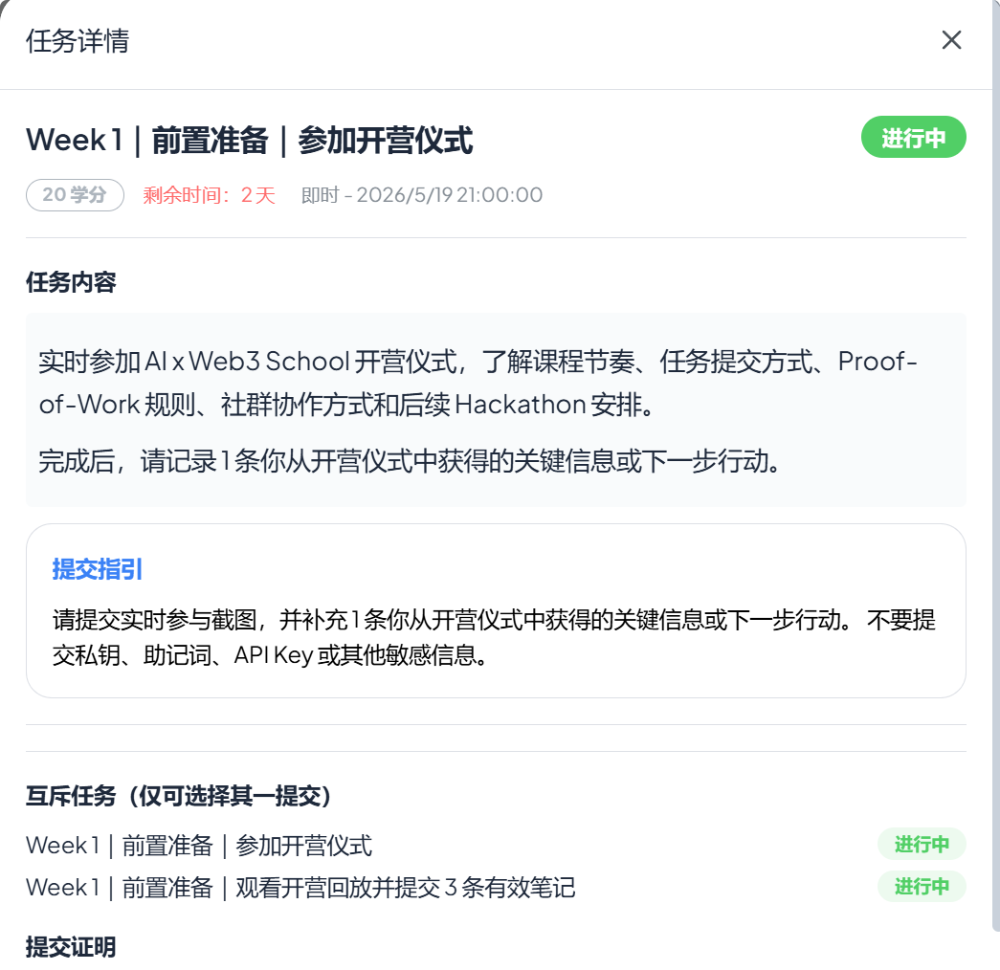
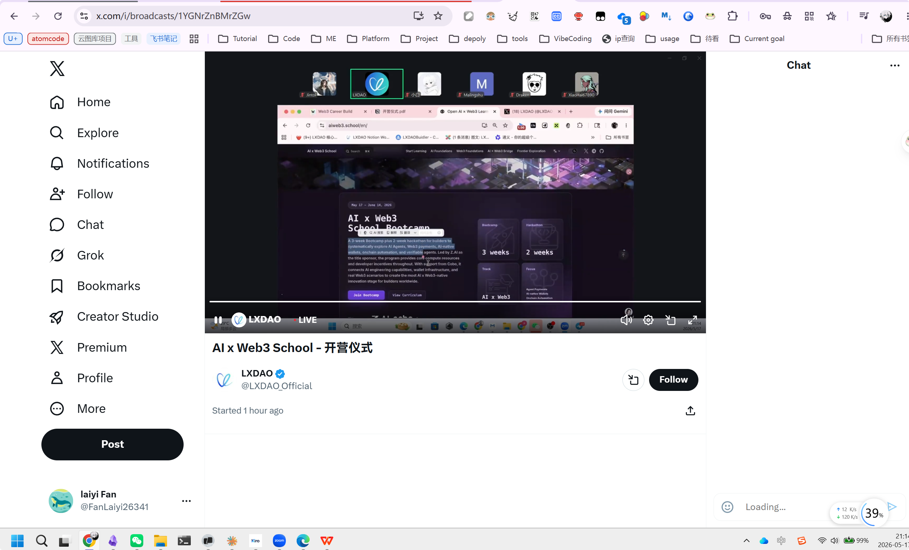

## 1. 三条有效笔记: 



```mark
  笔记 1 ｜ 营期采用「共同基础 + 方向任务 + Hackathon 实践」三段式架构

  所有学员先完成通用基础（AI 工具使用、Agent / Vibe Coding、GitHub 作品记录、Web3 基础概念、钱包与测试网安全边界），再根据自身背景从五个方向中选择主线：技术 /
  开发向、产品 / 研究向、内容 / 社区 / 运营向、Hackathon / Sponsor Challenge，或继续深耕通用基础。方向可调整，且 Hackathon
  不要求每个人都写代码，零基础同学也可以从内容、产品、研究等角色切入——这降低了"非技术背景"的参与门槛。

  

  笔记 2 ｜ 打卡 ≠ 任务，两套机制并行计入学分

  学分体系是营期的核心激励，但要特别注意："完成任务不等于打卡成功"。每日"残酷共学"打卡（当天打卡即可，无固定时间）与任务提交是两套独立流程，必须两边都做才能完整累积
  学分。学分将综合学习过程、任务完成度，最终作为评优、实体周边奖励、后续资源推荐的重要依据，所以日常节奏要同时兼顾"每天露脸打卡"+"按要求交作业"。


  笔记 3 ｜ 配套保障：请假、Co-learning 答疑、官方回放三重兜底

  营期对时间冲突给出了明确的应对方案：① 每周可请假 2 次，长期无法保证则建议先以自学者身份跟进开源资源；② 每周一、三、五各有 1 小时线上 Co-learning
  答疑，无法到场可在群里 / 提前收集问题，由助教在第二天答复；③ 录播会剪辑后上传到 LXDAO 官方 B 站（space.bilibili.com/3494366616226318）和
  YouTube（@lxdao_official）。这意味着即使错过单次直播也能补课，但需要主动安排观看时间、主动整理提问，而不是等老师推送。
```


## 2. 观看截图

