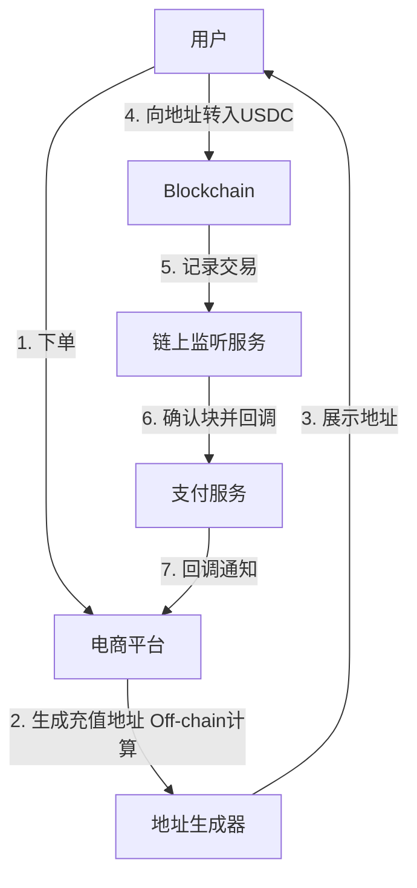

# AI 时代，Web3 开发者需要具备的基础知识和架构能力

## 核心结论

### 结论一：AI 未能降低系统复杂度，反而拔高了人的门槛

AI 只是效率放大器，将人从单兵作战变为"三头六臂"，但无法替代核心决策。基础知识的扎实程度，决定了开发者是驾驭 AI 还是被 AI 驾驭。

> *AI 给出的方案若你看不懂却照单全收，项目翻车只是时间问题。能看懂、能判断、能最终背锅，是开发者不可替代的价值。*

### 结论二：Web3 与 Web2 并非割裂，而是深度耦合

多数成功的 Web3 项目（如交易所、Polymarket、Uniswap），其 Web2 的能力占比极高。去中心化部分往往只聚焦在资产结算与确权的核心环节，前端、数据服务、风控等仍高度依赖传统 Web2 基础设施。

> *不要神化 Web3，它本质上是将原本由银行或权威机构承担的"信任"角色，置换为算法和链。抽象地看，公链就相当于你接入了另一家"银行"。*

### 结论三：安全在 Web3 中不是可选补丁，而是源自设计的生命线

Web2 允许"先跑起来再治理"，但 Web3 的黑暗森林法则下，设计缺陷会导致资产在上线瞬间归零。审计只是锦上添花，安全必须贯穿项目全生命周期，因为安全无法被证伪，你永远不知道哪次裸奔会中弹。

> *做再多安全措施都可能被黑，但不做就是在赌。而赌输的代价，是资产的永久归零。*

---

## 系统设计实例拆解：支付系统的架构演化

### Step 1：传统 Web2 支付模型

引入银行作为信任中介，由支付服务商接入银行完成扣款与清结算，其核心问题在于**信任的堆积**。

1. **请求流**：用户下单 → 电商平台请求支付服务 → 支付服务向银行获取支付单信息 → 用户支付 → 银行回调支付服务 → 支付服务回调电商平台 → 发货
2. **资金流**：用户银行卡 → 支付服务控制的备付金账户 → 定时清结算至电商平台银行卡
3. **安全考量**：API / Secret Key 的鉴权、支付密码 / MFA 等用户侧风控、对银行回调的绝对信任

> *整个模型建立在对权威机构的信任之上，如果回调被伪造或者机构作恶，系统将面临巨大风险。*

### Step 2：接入 Web3 支付（稳定币）

将信任锚点从银行迁移至区块链。

- **核心变更**：将电商场景中的 `Bank Institution` 直接替换为 `Blockchain` 和 `链上监听服务`
- **流程变化**：
  1. **生成地址**：电商平台首先生成一个链上充值地址。由于利用了链相同的地址衍生算法（Off-chain），这一步无需请求链
  2. **资金上链**：用户向该地址转账 USDC，交易被记入区块链这个"不可篡改的状态数据库"
  3. **可信监听**：由于区块链无法主动推送，需引入"链上监听服务"轮询或通过节点 Push 获取交易。待区块经过确认（如以太坊需等待两个 Epoch 避免分叉重组），并通过风控检查后，回调支付服务入账

> *Web3 支付的本质革新在于，支付服务"信任"的不是银行是否打款，而是区块链上不可篡改的转账记录。监听器在这里承担了"预言机"的角色，将链上事实传递给链下系统。*

### 信任与安全机制的范式转移

- **信任来源**：从"相信机构"转向"相信数学"
  1. **数据不可篡改**：共识机制保证
  2. **逻辑公开透明**：合约代码即公开的业务逻辑，运行结果确定性
- **鉴权方式**：从"API Key 对称验证"转向"非对称的私钥签名"
  - *意图鉴权（交易）*：用私钥签名交易数据，证明你有权动用资产
  - *身份证明（消息）*：服务端给出随机消息，你用私钥签名发回，服务端即可在不知私钥的情况下证明你的身份

---

## Web3 核心概念深潜：钱包与交易

### 钱包的本质

钱包 = 私钥 + 签名算法 + 资产管理界面。它是一个不存储资产只存储权限的黑盒系统。

- **输入**：随机数生成的 `Private Key`
- **输出**：`Signature`（交易签名用于资产确权；消息签名用于验证身份）

> *私钥即主权。链只认签名不认人，掌握私钥就掌握了账户的一切，丢失私钥意味着资产和个人身份的双重丢失。*

### 钱包分类图谱

- **账户类型**：
  - **EOA（外部账户）**：由私钥直接控制
  - **合约钱包（如 Safe）**：由链上代码逻辑控制的多签钱包
  - **AA（账户抽象）**：试图融合二者，实现更灵活的支付与权限管理（目前尚未成熟）

> *区分 EOA 与合约钱包是理解以太坊账户体系的基石。EOA 是人控，合约钱包是代码控。*

- **多签实现**：
  - **MPC 多方计算钱包**：将一把私钥碎片化，多人协同通过数学算法完成签名而不泄露各自的碎片，数学上极具美感（如 GG18 / GG20 协议）
  - **合约多签**：通过智能合约逻辑控制，天然适配多人协作，常见于 DAO 国库管理

> *前者是链下的数学分割，后者是链上的逻辑控制。MPC 对链透明，多签则是显式的链上规则。*

- **托管方式**：
  - **自托管（Self-Custody）**：你拥有私钥，享受绝对自由，却也承担绝对安全责任
  - **全托管（如交易所）**：你只拥有在 CEX 数据库里的一个账号
  - **混合托管（如 2/2 方案）**：你和服务商各持一片私钥碎片，任何一方独立均无法转走资产，共同签名才可移动

> *这是在易用性和安全性之间的权衡。混合托管是当下很多钱包服务商的折中选择。*

### 交易的生命周期与关键参数

一笔简单的转账背后包含着复杂的参数，这正是 Web3 精细度的体现。

1. **构造交易**：定义接收地址、金额、`calldata` 等
2. **私钥签名**：用私钥为这笔交易产生签名
3. **广播上链**：交易被广播至节点
4. **入块与最终性**：进入 Mempool 等待出块，经过多个区块确认最终不被回滚

**关键参数解读**：

- **Gas Fee（手续费）**：EIP-1559 模型下，由 `Base Fee`（基础销毁）和 `Priority Fee`（给矿工的小费）构成，决定了交易处理速度
- **Nonce（防重放）**：基于账户模型的账号内严格递增的交易序列号，确保每笔交易只被执行一次。类似于支付的幂等键

> *不同链对 Nonce 实现差异巨大。Solana 用最近区块哈希来防重，BTC 基于 UTXO 模型天然防双花。这是跨链开发必须深究的细节。*

- **Calldata（灵魂指令）**：交易携带的数据段。若没有它，链只能转账；有了 Calldata，EVM 才能将其解析为智能合约的函数调用，诞生出生态应用

> *Calldata 是链上世界从"转账"迈向"可编程金融"的惊险一跳。*

### 安全核心：私钥保护与交易模拟

- **私钥保护的攻防**：
  - **泄露风险**：任何形式的私钥 / 助记词保存和传输都存在风险
  - **钓鱼风险（签名欺诈）**：诱导你签署一个看似无害、实则是资产转移的交易。以太坊社区禁用 `eth_sign`、演化出 EIP-712 可视化签名，就是为了对抗这点，但目前仍对普通用户有门槛
  - **服务端最佳实践**：大资金使用多签 + 分层热钱包分散风险。使用 **TEE（可信执行环境）** 将私钥包裹在独立硬件安全区内解密、签名，确保私钥明文从不离开该"密闭容器"

> *当你签署一笔交易前，你是否真的完全理解 Calldata 里的每一个字？Web3 的安全终极考验是认知，而非技术。*

- **交易模拟（Simulation）**：**签名前**将交易发送到模拟环境执行一遍，观察各账户余额变动。若发现预期之外的额外转账，立刻中止签名

> *"签名后勿模拟，模拟须在签名前" — 这是铁律，因为签名一旦生成便已在网络中扩散。*

---

## AI 时代架构师的能力模型

AI 改变了"手"和"脚"的效率，但无法改变"大脑"的决策权。一个优秀的架构师需要具备：

1. **深度基础知识**：所有能力的底座，需要能深入到底层协议，理解像 Nonce、签名算法、共识机制等底层原理
2. **全局架构能力**：能设计方案，并评估 AI 辅助设计方案的合理性
3. **系统性 Debug 能力**：AI 只会根据 Prompt 生成代码，当复杂问题出现时，需要人能够去梳理全链路的资金流与数据流，定位病灶

**人机协作的定位**：人负责设计方案、评估方案、验收结果、分析问题；AI 负责协助细化方案、大规模编码、执行自我验证闭环。

> *我们的目标是驾驭 AI，而不是被 AI 输出的一堆看不懂的代码牵着鼻子走。学，让 AI 教你，直到你能看穿它，这才是真正的 AI-Native 开发者。*

---

## 视频章节总结

本视频深入探讨了 AI 时代下 Web3 开发者的核心能力要求。主讲人指出，AI 并未降低开发复杂度，反而要求开发者具备更扎实的基础知识和架构能力，以判断 AI 生成的代码质量和系统设计的合理性。视频通过一个支付系统案例，对比了 Web2 与 Web3 在资金流、信任机制及安全性方面的差异，强调安全必须贯穿项目全生命周期。主讲人详细解析了钱包机制、私钥签名、链上监听及交易模拟等关键技术点，强调了开发者需驾驭 AI 而非被 AI 驱动。整体来看，该分享为 Web3 从业者提供了从基础架构到安全实践的系统性思考指南。

### [00:00](https://bibigpt.co/content/faee91af-d516-454e-bd70-8df7f760fcb6?t=0.000) - 🤖 AI 与 Web3 开发者的边界

视频开篇探讨了 AI 对开发工作的影响。主讲人认为，面对 AI 技术，开发者不能盲目依赖，而应承担起方案设计、代码评估与验收的核心责任。AI 在编码效率上表现出色，但高质量产出依赖于 AI 的自我验证能力。开发者必须补齐基础知识，才能准确判断 AI 的细化方向和执行质量，确保系统在正确轨道上运行。

### [07:03](https://bibigpt.co/content/faee91af-d516-454e-bd70-8df7f760fcb6?t=423.000) - ⛓️ Web3 支付架构设计与信任重构

通过对比传统电商支付模型与 Web3 支付，主讲人阐述了两者在信任机制上的区别。Web2 支付依赖于权威机构的信用，而 Web3 通过区块链的算法共识、数据不可篡改性以及透明的合约逻辑来解决信任缺失。视频分析了从银行到区块链的资金流转差异，并解释了链上监听服务如何处理 Crypto 支付，明确了架构中各角色的职能与风险点。

### [14:46](https://bibigpt.co/content/faee91af-d516-454e-bd70-8df7f760fcb6?t=886.000) - 🔐 钱包机制、多签与私钥安全

本章重点解析了钱包作为身份与资产双重认证的关键性。主讲人详细讲解了私钥签名算法（ECDSA / EdDSA）在意图与身份验证中的应用。针对私钥泄露风险，视频介绍了 EOA 钱包、合约钱包、AA 钱包及 MPC 多签等不同方案。同时强调了 TEE 可信执行环境在服务器端签名保护中的重要性，指出安全防线必须从设计之初就做好严格把控。

### [29:42](https://bibigpt.co/content/faee91af-d516-454e-bd70-8df7f760fcb6?t=1782.000) - 📈 交易生命周期与安全审计

视频梳理了从构造交易、签名广播到最终上链的完整生命周期，探讨了 Gas 模型、Nonce 防重放机制及 Calldata 的交互作用。主讲人特别强调了交易模拟的重要性，建议在签名前进行模拟以规避钓鱼攻击。通过对不同链共识机制的分析，解释了等待确认时间（Finalization）对于应对链分叉风险的必要性。

### [43:07](https://bibigpt.co/content/faee91af-d516-454e-bd70-8df7f760fcb6?t=2587.000) - 💡 驾驭 AI 与架构师核心能力

视频结尾探讨了 AI 时代架构师的转型路径。AI 作为放大器，替代的是重复的体力劳动，但系统的复杂度和最终的责任归属始终在人类开发者手中。主讲人呼吁开发者通过 AI 辅助学习底层协议，提升对全局的洞察力。核心结论是：开发者应保持对架构与安全判断的掌控，实现 AI 协同工作，而非被 AI 技术驱动。

---

> *清洗说明：本文以 biliGPT 完整版替换 5/18 此前的手写简版（同一场直播，原版仅有 12 节要点列表，biliGPT 版补充了支付架构演化、钱包分类图谱、Calldata 哲学等结构化分析）。格式问题 10+ 处（frontmatter 日期 2024-05-24 → 2026-05-18、`{{视频链接}}` / `{{视频时长}}` 模板占位填充、`- ---` 横线、mermaid 代码块从列表项中提出、嵌套列表层级统一、`EDDSA` → `EdDSA`、`无损除` → `归零`、`预期之额外` → `预期之外的额外`）。未改写原文表述。*

#BibiGPT https://bibigpt.co
