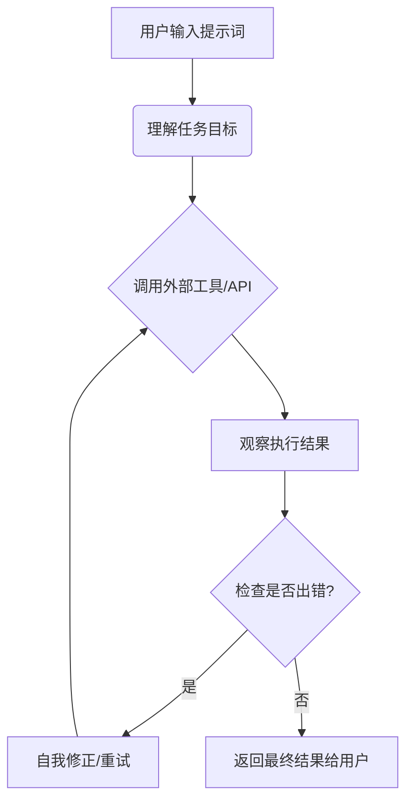

# AI Agent 入门 — Hermes 从 0 到 1

## 🎙️ 直播核心主题与要点概述

- 本次直播由资深开发者 Dra 老师主讲，旨在为 AI 小白厘清当下混乱的 AI 名词与工具体系。分享的核心脉络是从"聊天机器人"到"智能体"的思维转变。

> *Dra 老师一针见血地指出，目前大家最大的痛点不是没工具，而是名词太多（Copilot、Cursor、Codex、Agent），导致无从下手。*

- 直播实操了开源 AI 基建底座 **Hermes Agent** 的部署全流程，并深度探讨了如何通过"消息网关（微信/飞书）"降低使用门槛。Hermes 区别于普通聊天工具的核心在于其 **Memory（记忆）** 与 **Skills（技能固化）** 机制，它能将固定任务流程沉淀下来，像"迷你贾维斯"一样授权执行任务。
- 此外，Dra 老师针对观众疑问，精准区隔了 **Codex / Cursor（AI 编程 IDE）** 与 **Hermes（通用助手底座）** 的适用场景，并分享了如何利用分组与提示词将 Hermes 打造为"私人量化复盘助手"和"每日简报生成器"的真实案例，帮助新手从 0 到 1 构建属于自己的 AI 助手生态。

---

## 一、AI 认知篇：从聊天到代理的进化

### 1. 核心演化路径

- **初级阶段（问答式）**：本质上是一个智能化的搜索引擎，主要负责解释代码、总结文章、写文案。
- **高级阶段（任务执行式）**：去年开始发生质变，AI 能够真正帮人干活（如 Copilot、Agent 开发），不再只是动嘴皮子。

### 2. AI Agent 的运作机制

AI Agent 的核心在于"感知-决策-执行"的闭环：

> *这种自我纠错重试机制是区分高级 Agent 和普通脚本的核心差异，它赋予了机器一定的"韧性"。*

---

## 二、AI 工具生态图谱：五大阵营解析

为了避免混淆，Dra 老师将市面上的工具归为五类，尤其是**开发工具**和**助手底座**之间的差异：

| 阵营分类 | 代表产品 | 核心定位与批注 |
| :--- | :--- | :--- |
| **聊天型 AI** | ChatGPT、Gemini、Claude、DeepSeek | 网页对话形式，适合问答与文本生成 |
| **AI 编程 IDE** | Cursor、Copilot、Windsurf、Trae | 集成了 AI 的 VS Code 衍生版，针对开发者深度优化 |
| **终端 Agent** | Claude Code、Codex | 运行在终端环境下，适合极客通过命令行交互编码 |
| **模型平台** | OpenRouter、魔搭社区 | 汇集托管市面大模型，提供统一 API 对接，非"中转站" |
| **通用助手底座** | **Hermes**、Dify | 大模型 + 本地工具 + 记忆 + 消息平台，是"贾维斯"的基础基建 |

> *Dra 老师特别区分了"模型平台"与"API 中转站"的本质：前者是正规模型供应商的集合，后者多是通过反代订阅提供的代理，使用 Hermes 这类工具时容易受限。*

---

## 三、Hermes 核心能力篇：为什么选它？

针对新手，Hermes 的优势在于**多端交互**与**记忆沉淀**：

- **六大超能力**：支持多模型接入、工具调用、消息平台打通。
- **Memory 记忆持久化**：会将你的习惯写入 `memory.md` 文件，实现长效记忆，不会因重启而丢失"人设"。
- **Skills 技能固化**：

> *这是 Hermes 的精华。它可以将你日常重复的固定流程（如每日发简报、审核代码、复盘交易）打包成模板。遇到类似任务自动调用，避免了每次都要从头写提示词的麻烦。*

---

## 四、实战部署篇：Windows 环境下的从 0 到 1

### Step 1：环境准备与一键安装

- 环境要求：Windows 下推荐使用 **WSL（Windows Subsystem for Linux）**，对设备配置要求极低（3-4G 内存即可运行）。
- 安装指令：去 GitHub 搜索 `Hermes` 仓库，使用自带的一键安装指令。脚本会自动配置 Node、Python 及各类依赖。

> *新手不必手忙脚乱装环境，一键脚本会帮你解决 99% 的环境报错，期间遇到提示需要管理员权限直接输入密码即可。*

### Step 2：模型与世界配置

1. 运行 `h quick-setup`。
2. **Provider 配置**：选择大模型（OpenAI、Claude、DeepSeek、千问均可）。若是中转站注意选择对应对接方式。
3. **消息网关配置**：这是小白脱离终端的重点。配置微信或飞书，扫码登录后，即可在手机聊天框调用 AI。

> *这里有个实战教训：Dra 老师在直播中也遇到了扫码连不上、API 报错的问题。此时需要利用 Hermes 自身的指令让它帮你自我排查，或者查看后台日志，不要慌张。*

### Step 3：必做的安全与体验配置

- **白名单机制**：开启后只有指定用户才能调用助手，防止算力被盗刷。
- **唤醒词设置**：开启"提及才响应（如 @小黑）"或唤醒词，避免群聊误触。
- **分组与人格隔离**：针对不同任务（如工作、量化、学习）建立不同的 Group / Topic，它们之间的上下文和 Skills 是完全隔离的，不会串味。

### Step 4：进阶玩法 — 对接学习计划

- 通过官方提供的 `Learning Agent` 启动入口指令，直接发给配置好的微信助手。
- 助手会引导你补全"用户画像"（技术栈、目标方向），从而生成个性化的学习路径。

> *不要直接丢给 AI 一个杂乱的任务，而是要按照它给出的引导一步步补全信息，这样沉淀出的 Memory 才会精准。*

---

## 五、Q&A 精华补充

- **量化交易怎么用 Hermes？**

> Dra 老师视角：不要让它直接下单或发实盘信号（易产生幻觉乱操作）。最佳实践是让它做**复盘记录**、**因子生成**、**盯盘提醒**。AI 拿到的策略多是公开同质化的，核心决策仍需靠自己。

- **Codex 和 Hermes 如何协同？**

> 终端写代码用 Codex 更直接；Hermes 适合做整体工程的项目管理、跨平台消息分发。两者不冲突，但不建议在 Hermes 里直接改代码。

- **API Key 怎么给？**

> 出于安全，绝对不要直接把 Key 贴在对话框。应通过 Hermes 的环境变量配置向导或修改配置文件注入，防止密钥泄露。

---

## 视频章节总结

本视频由资深开发者 Dra 老师带来，详细介绍了 AI Agent 的基本概念、生态演进及从零到一的实操配置指南。视频重点演示了 Hermes Agent 的安装、环境依赖配置、消息网关（微信/飞书）对接以及多场景下的 Agent 应用实践。课程核心观点在于，AI Agent 已超越简单的问答对话，能够通过连接工具、记忆持久化和工作流（Skills）执行复杂任务。Dra 老师通过实操讲解了如何构建个性化 AI 助理，将其应用于学习规划、日常事务提醒及辅助量化分析，为小白用户提供了从入门到进阶的清晰路径。

### [00:00](https://bibigpt.co/content/1a2cb0f8-accb-471a-80dd-411466cfb78a?t=0.000) - 🤖 AI Agent 核心概念与生态图谱

本章讲解了 AI 技术从单纯的智能搜索引擎进化为能够执行任务的智能体的过程。讲师对比了聊天机器人与 Agent 的本质区别：后者不仅能理解指令，还能自动调用外部工具、处理执行结果并实现自我纠正。视频梳理了目前的五大 AI 工具阵营，包括聊天型 AI、编程助手（如 Cursor）、终端型 Agent（如 Hermes）、模型平台及通用助手底座，帮助初学者快速理清纷繁复杂的名词，明确不同工具的应用边界。

### [11:00](https://bibigpt.co/content/1a2cb0f8-accb-471a-80dd-411466cfb78a?t=660.000) - 🛠️ Hermes Agent 超能力与实战配置

本章详细剖析了 Hermes Agent 的六大核心能力，重点介绍了其在记忆持久化（Memory）和技能（Skills）沉淀方面的优势。讲师通过 Windows 环境演示了安装部署过程，涵盖了依赖项安装、环境变量设置及常用模型入口（如 OpenRouter 等）的对接配置。通过将 Hermes 配置为学习助手，演示了如何通过定制工作流和提示词，让 Agent 根据个人时间表自动生成学习计划，将技术基建转变为高效的个人生产力工具。

### [29:40](https://bibigpt.co/content/1a2cb0f8-accb-471a-80dd-411466cfb78a?t=1780.000) - 📱 进阶交互：微信/飞书网关与身份定制

本章探讨了如何通过消息网关（微信/飞书）将 Agent 部署到移动端，实现跨设备的高效协作。讲师演示了配置白名单、设置唤醒词和身份分组的操作细节，确保用户可以在手机上随时随地通过 Agent 整理新闻简报或执行定时任务。同时，针对观众关心的多身份角色扮演问题，强调了通过独立 Skill 和 Memory 设置，实现不同 Topic 下 AI 助理的逻辑隔离与知识个性化管理。

### [58:20](https://bibigpt.co/content/1a2cb0f8-accb-471a-80dd-411466cfb78a?t=3500.000) - 💡 问答互动：解决常见配置难题

问答环节重点解决了用户在实操中遇到的痛点，例如 API 调用失败的自我纠正机制、本地知识库读取、以及如何处理敏感密钥的安全风险。讲师强调了使用 Agent 进行量化研究时应将其作为"辅助工具"而非完全依赖其自动交易。最后，针对新手提出了明确的学习建议：通过官网 HandBook 的引导启动 Learning Agent，结合用户画像完善个性化设置，从而有效利用 Hermes 提升学习效率与任务处理能力。

---

> *清洗说明：修正错别字 / 一致性问题 1 处（讲师姓名 Jack → Dra 老师，与正文统一）、格式问题 6+ 处（frontmatter 日期 2025-12-07 → 2026-05-19、`{{视频链接}}` 模板占位填充、`- ---` 横线、嵌套列表层级修正、表格中英文混排标点）。未改写原文表述。*

#BibiGPT https://bibigpt.co
