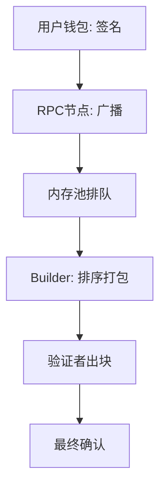

# Web3 运行原理深度解析 — 从第一性原理出发

## 核心概念：一笔交易的完整生命周期

在整个去中心化网络中，一笔交易的执行可以抽象为：**身份认证 → 授权 → 传播 → 排序 → 执行 → 最终确认**。

> *简单来说，就是你点下"确认转账"按钮后，这笔钱是怎么在全网无数双眼睛的监督下，安全、准确地跑到对方兜里的。这中间既没有银行，也没有支付宝。*

---

## 第一部分：身份基石 — 钱包私钥与个人主权

### 私钥、助记词与地址的生成逻辑

- **私钥**：一串极长的随机数，相当于银行账户的**密码**。拥有私钥即拥有对应资产的绝对控制权。
- **助记词**：私钥的"人类可读"备份。通过特定的派生路径，一份助记词可以生成无数对公私钥对。

> *助记词是根，丢了它，所有衍生出的钱包资产都会灰飞烟灭。它不是你的某个"账号"密码，而是你的"全家桶"密码。*

- **地址**：由公钥经过哈希运算并截取后 40 位字符（20 字节）生成，相当于银行**账号**，用于公开收款。

> *资产并不"存储"在钱包 App 里，而是挂在链上。钱包只是帮你保管钥匙，并帮你向链上发起指令。*

### 个人主权的起点

- 生成钱包无需任何人许可，无需绑定真实身份，即点即用。这在传统金融体系中是无法想象的，尤其适用于金融基础设施不完善的国家和地区。

> *这不仅是技术便利，更是一种社会学的赋权：只要你有设备，就能拥有一个全球通行的、不可被冻结的资产账户，这是真正的"个人主权"起点。*

- **安全性铁律**：区块链只认私钥签名，不认人。私钥 / 助记词一旦泄露（钓鱼、木马、截图上传），资产即刻失守，且无法申诉追回。

---

## 第二部分：交易与签名 — 意图的验证

### 交易的四个本质构成

一笔交易（Transaction）本质上是一段授权网络执行操作的数据，可拆解为四部分：

1. **操作内容**：是转账，还是调用某个合约函数？
2. **手续费**：为占用网络计算和存储资源付费。
3. **随机数**：一个递增的序号，用来防止上一笔交易被恶意重放。
4. **数字签名**：用你的私钥签署交易信息，全网任何人都能验证这笔操作确实出自你手，且内容未经篡改。

### Gas 费的双重使命

1. **防垃圾交易**：让无意义的攻击或刷量行为产生高昂成本。
2. **激励网络运行**：区块提议者和验证者需要靠 Gas 费来弥补服务器消耗并获取收益。

> *这就像你开车要烧油。路上车少的时候，油费便宜；大家抢着上链的时候（比如抢 NFT），油费能贵到让你肉疼。*

---

## 第三部分：区块链网络 — 从广播到共识

### 关键角色解析

- **RPC 节点**：Web2 世界与去中心化世界的**桥接器**。你的钱包通过 HTTP 服务连接到某个 RPC 节点，再由它将交易广播出去。

> *这里其实存在中心化风险：大部分普通用户都得依赖少数公司提供的 RPC 服务，如果它们宕机或拒绝服务，你就没办法上链了。除非你自己搭节点。*

- **内存池**：待打包交易的"候车大厅"。所有广播出来的交易先在这里排队。
- **Builder & 验证者**：
  - **Builder** 负责根据给的小费高低给队列里的交易排序打包。
  - **验证者** 质押 32 个 ETH，负责检验区块的合法性并签署见证。如果作恶，会被重罚。

### 共识机制：信任的根基

在一个成员互不相识的去中心化网络中，如何让大家就一份账本达成一致？

- **工作量证明（PoW）**：大家一起做难题，谁先做对谁记账。简单可靠，但消耗巨大能源。
- **权益证明（PoS）**：质押资产成为验证者，通过随机算法选出记账人，其余人负责监督。节能，是目前以太坊的共识方式。

> *这个机制用经济学原理解决了信任问题：当破坏规则的成本远高于收益时，诚实就是最理性的选择。*

### 最终确定性

一个刚生成的区块处于"未最终确定"状态。经过约 12 分钟（2 个 Epoch），该区块才会被标记为"最终确定"，意味着它极难被逆转或篡改，可以彻底放心。

> *也就是说，你转完账之后，最好等上 12 分钟，这笔钱才算真真正正地"落袋为安"。*

---

## 第四部分：智能合约 — Code is Law

### 第一性原理

智能合约就是一段写在链上、由交易触发、在虚拟机上运行的**不可篡改的代码**。所有的执行历史和状态变更都被清晰记录在链上。

### 社会学的意义：信任对象的转移

传统交易依靠第三方（律师、政府、中介），信任成本极高。现实中的规则是可以被"撕毁"的，但链上的代码规则一旦定好就不可更改。

> *在 Web3 的世界，我们相信共识、相信代码，而不是相信一个会变卦的人或中心化机构。这极大地降低了摩擦成本，这也是"Code is Law"的魅力所在。*

### 智能合约如何实现升级？

虽然部署在链上的字节码是死的，但通过**代理模式**可以实现逻辑升级。用户始终和那个不变的"代理合约"交互，而代理合约内部像一个指针，可以指向新版本的逻辑合约。

> *就像一个公司的前台电话永远不变，但你可以随时换掉后面接电话的人。当然，现在正规 DeFi 协议的升级通常会加一个"时间锁"，提前几天公示，给你足够时间决定是否撤资跑路。*

---

## 第五部分：区块链协议如何升级？

以太坊的升级是一个高度去中心化的流程：

1. **公开讨论**：在论坛和开发者会议上提出、辩论。
2. **形成 EIP 文档**：将确定要做的事情标准化。
3. **客户端实现与分叉**：所有客户端软件团队按标准实现新功能，并在约定好的区块高度开启，形成一次"硬分叉"。

> *这相当于把旧铁轨的一段，按新标准无缝换成了新的。旧的废弃了，大家都走新路。整个过程不是由某家公司说了算，而是由生态里所有的利益方、开发者、节点运营者共同决定的。这就体现了多客户端的重要性，单一客户端出 bug 不至于让全网瘫痪。*

---

## 摘要：Web3 的关键特性、三层学科与边界

### 五大关键特性

- **去中心化**：任何人都能创建钱包，节点遍布全球，但 RPC 层存在一定中心化问题。
- **无许可**：无需批准，支付手续费即可与全球智能合约交互。
- **抗审查**：节点和软件多元化，任何单一实体都无法轻易关闭网络。
- **开源可验证**：所有逻辑和交易数据公开透明。
- **隐私性**：匿名地址难以对应到真实身份，做到了"假名化"。

### Web3 的内在价值：三门学科的交叉

1. **密码学**：用数学保障所有权，签名即权力。
2. **经济学**：用 Gas 费、质押、奖惩机制协调数百万陌生参与者的行为。
3. **社会学**：用去中心化共识和治理，重塑数字世界的控制权分配。

> *这三环，缺了任何一环，这个系统就跑不起来。密码学被攻破，一切归零；经济学设计有漏洞，没人愿意当节点；失去了去中心化，那和一堆昂贵的分布式数据库没什么区别。*

---

## Q&A 环节

**Q1：以太坊验证者的经济收益具体是怎么来的？**

收益主要来自两部分：一是出块奖励，二是来自用户支付的 Gas 费中分给区块提议者的那部分小费。虽然最终会被众多验证者见证，但成功出块的验证者是拿大头的。所有收益记录都可以在链上查到，公开透明。

**Q2：以太坊硬分叉升级后，用户的钱包需要做什么操作吗？**

完全不需要。旧链在被抛弃后，大多数节点和用户都会迁移到支持新规则的那条链上。对普通用户来说，你的钱包和资产会自动跟随那条主流通的链，几乎无感，只是这个过程可能会需要几个小时。

**Q3：做链上数据分析的公司是怎么获取海量链上数据的？**

主要有两种路径：一是有钞能力的，直接买专业 RPC 服务商（如 Infura、Alchemy）的高性能接口服务，获取稳定可靠的数据源；二是最硬核的，自己掏钱在离主要节点近的机房（如德国）自建全节点，把全量数据拉到本地，追求极致的实时性和准确性。

**Q4：新节点启动后，如何在一个去中心化网络里找到其他节点？**

它有一个写死在代码里的"入门指南" — **启动节点**。节点软件启动后，会先连接这些由基金会或核心社区维护的初始节点，从它们那里获取一份"邻居列表"，然后逐步在 P2P 网络里扩散开。这就好比你到一个陌生的城市，先通过一个已知的官方服务站问到路，然后逐步融入整个城市的交通网。

---

## 视频章节总结

本视频由 BRUCE 老师主讲，从第一性原理出发，系统性地拆解了 Web3 的底层运行逻辑。内容涵盖了钱包与私钥的管理、交易签名与哈希机制、区块链网络节点交互、共识机制（PoW 与 PoS）、智能合约的本质及可升级性实现，以及以太坊协议升级的治理流程。课程旨在帮助初学者建立对 Web3 的深层认知，明确去中心化背后的密码学、经济学与社会学支撑，强调了个人主权在区块链世界中的核心价值，并探讨了 Web3 面临的安全性、治理与扩展性挑战。

### [00:00](https://bibigpt.co/content/2e1bf68c-ff70-45eb-adc7-0965ee3d16a9?t=0.000) - 🔑 钱包、私钥与个人主权

本章节详细介绍了 Web3 的核心起点 — 钱包与私钥。私钥被形象地比作资产的终极密码，而助记词则是为了方便人类记忆而设计的备份系统。BRUCE 老师强调了公钥与地址的派生逻辑，并指出地址本质上是公钥后 20 位的哈希截断。同时，他特别提醒了私钥的安全保管至关重要，一旦泄露，资产将不可挽回。这不仅是技术层面的设计，更是数字世界中实现个人主权、无需第三方批准即可管理资产的社会学起点。

### [10:51](https://bibigpt.co/content/2e1bf68c-ff70-45eb-adc7-0965ee3d16a9?t=651.000) - ✍️ 交易签名与 Gas 费机制

本章节探讨了区块链交易的本质：授权网络执行特定任务的数据包。详细阐述了交易的四个组成部分：执行意图、手续费（Gas）、防止重放的 Nonce 值以及至关重要的数字签名。签名通过私钥结合交易信息生成，并利用密码学算法在链上验证身份。此外，Gas 费机制被定义为一种防范垃圾交易的经济手段，旨在合理分配区块链资源，并对区块生产者进行激励，确保了网络的高效运转与安全性。

### [20:52](https://bibigpt.co/content/2e1bf68c-ff70-45eb-adc7-0965ee3d16a9?t=1252.000) - 🌐 区块链网络的运行与共识

本章节拆解了区块链节点网络的交互流程。从 RPC 网关的连接，到内存池（Mempool）的排队，再到构建器（Builder）与验证者（Validator）的打包出块，展示了交易上链的完整路径。详细对比了 PoW 与 PoS 共识机制，解释了以太坊如何通过质押机制确保节点的诚实性。同时，介绍了区块的确认（Finalization）过程，即等待足够长的时间让区块变得不可逆，从而保证账本的去中心化与可信度。

### [32:08](https://bibigpt.co/content/2e1bf68c-ff70-45eb-adc7-0965ee3d16a9?t=1928.000) - 📜 智能合约与治理升级

本章节聚焦于智能合约的运行机理及其代码即法律（Code is Law）的哲学含义。智能合约是运行在 EVM 之上的代码，具备透明、不可篡改的特性，极大地降低了信任成本。针对合约升级问题，介绍了代理合约（Proxy）模式，允许通过修改指针指向新的代码版本来实现逻辑变更。最后，分析了以太坊的协议升级流程，强调了去中心化治理的高沟通成本与严谨性，以及多样化客户端在规避系统性风险中的重要作用。

### [40:59](https://bibigpt.co/content/2e1bf68c-ff70-45eb-adc7-0965ee3d16a9?t=2459.000) - 💡 Web3 的价值与未来思考

本章节总结了 Web3 的关键特性：去中心化、无许可、抗审查与可组合性。BRUCE 老师认为 Web3 是密码学、经济学与社会学的交叉学科，核心在于控制权的重新分配。他留下了关于安全性、基础设施资金分配、有害信息治理以及公平分配等深刻问题供观众思考。通过深入浅出的分析，鼓励用户不仅要掌握技术细节，更要理解 Web3 背后对数字主权与治理模式的深刻影响，以此推动行业的健康发展。

---

> *清洗说明：格式问题 8+ 处（frontmatter 日期 2024-05-24 → 2026-05-20、`{{视频链接}}` 模板占位填充、mermaid 代码块从列表项中提出、"操作内容"破损 bibigpt 搜索链接还原为纯文本、`- ---` 横线、嵌套列表层级修正、中英标点统一）。未改写原文表述。*
