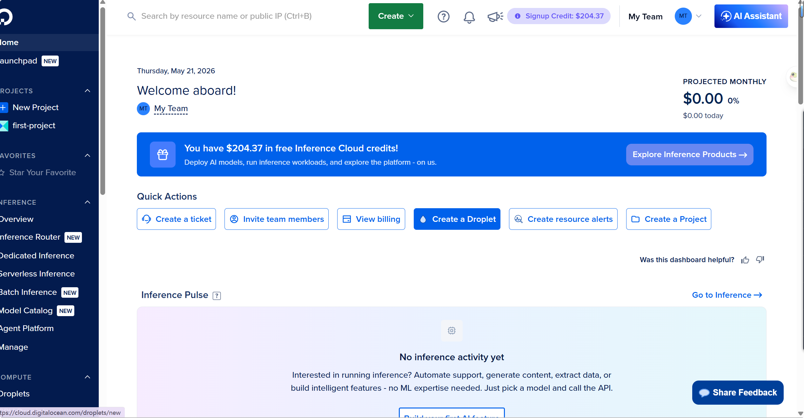
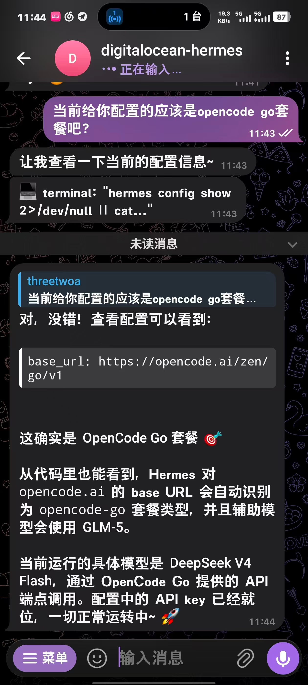

# 2026-05-21

> Week 1 · Day 5 · 周四

## 今天做了什么

- 20:00 参加直播：AI 下乡计划｜AI 在 Web3 的应用（Zoom / X 直播），事后挑关键点回看
- 用 GitHub Student Pack 申请 DigitalOcean 2C4G 云服务器
- 服务器部署 Agent，对接 Telegram Bot
- 配置 OpenCode Go 套餐，作为后续 Agent 开发的编码工具
- 回炉前三章 pre-study：AI 基础 / Web3 基础 / AI × Web3 Bridge

## 产出与检验

> 今天笔记没动，重在理解串联；产出主要是基建到位。

| 产出 | 状态 | 备注 |
|------|------|------|
| DigitalOcean 2C4G 云服务器 | ✅ | 通过 GitHub Student Pack 申请，作为 Agent 运行环境 |
| Telegram Agent 上线 | ✅ | 服务器部署 + Bot 对接完成 |
| OpenCode Go 套餐 | ✅ | 后续 Agent 编码主力工具 |
| 前三章 pre-study 复盘 | ✅ | [`ai-foundations`](../../../pre_study/ai-foundations/) · [`web3-foundations`](../../../pre_study/web3-foundations/) · [`ai-web3-bridge`](../../../pre_study/ai-web3-bridge/) |
| 直播关键点回看 | ✅ | [X 直播回放](https://x.com/i/broadcasts/1kJzDMjMVBwKv) · 完整笔记见 [`meetings/agent-24h-workflow.md`](./meetings/agent-24h-workflow.md) |

## 收获 / 卡点

- 今天主动减少了"记新笔记"的冲动，把精力压回到**理解串联**——AI / Web3 / Bridge 三块的概念在脑子里重新跑了一遍，比写新笔记更有用
- 第一次走通"领服务器 → 部 Agent → 接 Telegram"的链路，从 pre-study 的"读"切到"动手做"
- 直播听下来印象最深的是：AI 落地场景里很多问题不是技术问题——身份、信任、协作的边界，恰好是 Web3 能补位的地方

## 明天打算

- 进入 Week 1 收尾日：直播课 + Recap + 开始酝酿 Hackathon 选题方向
