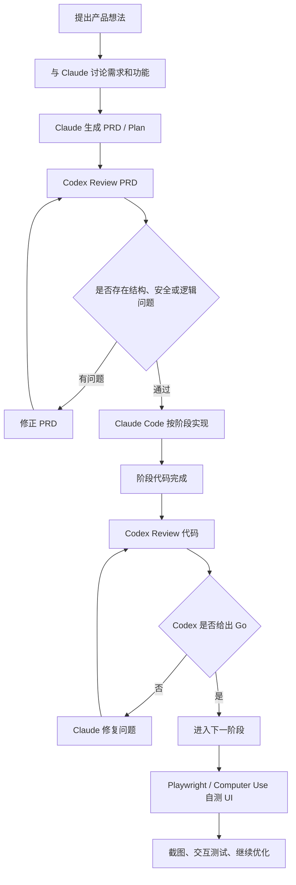
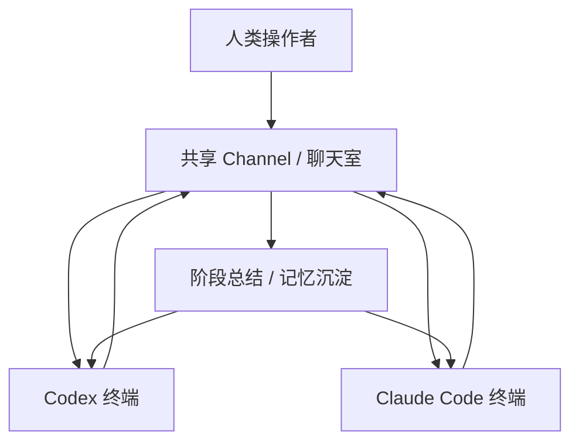

# 「AI 下乡计划」24 小时让 Agent 上工


## 本场核心主题概述

本期分享围绕"如何让 AI Agent 真正变成 24 小时可调用的工作副脑"展开。Sunny 的核心方案分为三层：第一层是远程控制，把一台 Mac mini、Windows、Linux 或任意闲置设备改造成常驻开发机，通过 RustDesk、Tailscale 或自建 VPS 中继实现手机、笔记本、主力机随时接入，解决人在外面但项目还在本地的问题。第二层是 Vibe Coding 工作流，用 Claude 负责需求理解、产品规划、审美与 PRD，用 Codex 负责代码质量、Review、安全与逻辑补漏，并通过 CLAUDE.md、阶段性 Review、Playwright / Computer Use 自测，让 Agent 尽量形成"写代码—检查—修复—继续"的闭环。第三层是长期记忆与上下文管理，通过计划文档、memory.md、长记忆工具和 24 小时在线设备，把不同 Agent、不同会话里的项目经验沉淀下来，减少每次重新喂上下文的损耗。后半段 QA 进一步讨论了本地知识库、向量检索、爬虫合规、Agent 协作、AI 商品图商业化等实战问题。

> *这场分享的价值不在"某个工具有多神"，而在于把远程控制、开发流程、记忆系统和商业落地串成了一套可执行的个人 Agent 基础设施。*

---

## 一、分享人背景与实践场景

### 1. Sunny 的实践背景

Sunny 自述是年初从零基础开始接触 Vibe Coding，通过实习计划、黑客松和项目实践逐步积累经验：

- 曾在黑客松中以个人项目 Demo 拿到亚军。
- 后续组建小团队 **BEEF Team**。
- 团队实践方向包括：
  - AI 中转站；
  - AI 商品图生成工具；
  - ToB 的 ERP / CRM / WhatsApp 集成类项目；
  - 面向企业的 AI Agent 工作流自动化。


### 2. 本场分享的核心问题

Sunny 这次重点解决的是：

> 人不在电脑前，如何让 AI Agent 继续 7×24 小时工作？

具体拆成三个问题：

| 问题 | 对应解决方向 |
|---|---|
| 人在外面，如何控制家里 / 办公室的开发机？ | RustDesk + Tailscale / VPS 中继 |
| AI 写代码如何避免"一句话开跑"导致质量差？ | Claude 规划 + Codex Review |
| 多个 Agent、多次会话之间如何延续上下文？ | PRD / Plan / Memory 文件 + 长记忆工具 |

---

## 二、远程控制方案：给 Agent 准备一台"不关机副脑"

### Step 1：准备一台常驻设备

Sunny 使用的是 Mac mini，但他强调：

- 不一定非要 Mac mini；
- Windows、Linux、普通 Mac、闲置电脑都可以；
- 只要能长期在线、能跑开发环境即可。

Mac mini 的优势在于：

- 适合长时间运行；
- 内存和稳定性更适合多线程开发；
- 对 Vibe Coding、Claude Code、Codex 这类工作流比较友好；
- 可以作为"生活机"和"工作机"分离后的工作副脑。

> *这里的重点不是买 Mac mini，而是建立一台稳定在线、可被远程调度的工作节点。设备只是载体。*


### Step 2：使用 RustDesk 实现多端远程控制

Sunny 推荐的核心工具是 **RustDesk**。

它支持：

- 手机控制电脑；
- Windows 控制 Mac；
- Mac 控制 Windows；
- 控制 Linux；
- 甚至电脑查看手机屏幕；
- 文件传输；
- 剪贴板同步；
- 键盘映射。

Sunny 演示的典型使用方式：

| 使用场景 | 操作方式 |
|---|---|
| 外出时用手机控制家里的开发机 | 手机端 RustDesk 连接常驻设备 |
| 在 Windows 主机上控制 Mac mini | Windows 装 RustDesk，远程操作 Mac |
| 工作 / 生活分屏 | 主屏处理生活事务，副屏放远程 Mac |
| 复制截图或文本到开发机 | Windows 复制，Mac 端直接粘贴 |
| 传输项目文件 | RustDesk 内置文件传输 |

Sunny 特别提到 RustDesk 的一个实用点：

- Windows 用户习惯 `Ctrl + C / Ctrl + V`；
- Mac 默认是 `Command + C / Command + V`；
- RustDesk 可以设置 **Control / Command 键交换**；
- 这样 Windows 用户控制 Mac 时不会频繁错按快捷键。


### Step 3：局域网内直连，外网用 Tailscale 或自建中继

Sunny 的网络方案分三层：

| 场景 | 推荐方案 | 特点 |
|---|---|---|
| 同一局域网内 | RustDesk 直连 | 延迟低，体验流畅 |
| 外网远程访问 | Tailscale | 免费、配置相对简单 |
| 更追求稳定与数据可控 | 自建 VPS 中继 | 更流畅，数据在自己的服务器中转 |

Sunny 自己使用的是：

- 自建 VPS；
- 自建 RustDesk 中继；
- 目的是提升连接稳定性，并让数据走自己的服务器。

他也准备了一个仓库：

- 里面整理了远程配置教程；
- 可以把仓库链接或二维码直接丢给 Agent；
- 让 Agent 按教程帮助安装和配置。

> *这个思路很符合 Agent 时代的工作方式：不是自己逐条看教程，而是把可信教程交给 Agent，让它代劳执行。人负责授权与检查。*


### Step 4：Tailscale 网络冲突的处理经验

QA 中有人问到 Tailscale 与代理 / Tun 模式冲突的问题。Sunny 的经验是：

> "如果出现网络冲突，可以先退出 Tailscale，保持 Clash 的 Tun 模式打开，然后重启 Tailscale。它会重新建立网络链接，通常会经过 Tun，这样会更流畅。"

整理成操作顺序：

1. 退出 Tailscale；
2. 保持 Clash / 代理工具的 Tun 模式开启；
3. 重新启动 Tailscale；
4. 等待它重建网络连接；
5. 再尝试 RustDesk 远程连接。

---

## 三、现有远程 Agent 控制方案的不足

Sunny 对比了几类常见方案。

### 1. Claude 自带 Remote Control

Claude / Claude Code 有一些远程控制能力：

- 可以在终端中输入 remote control 指令；
- 在 Claude 界面中查看和控制终端任务。

但 Sunny 认为它的问题是：

- 主要控制终端；
- 不适合完整查看网页、图片、文件、UI；
- 如果项目涉及前端页面、设计稿、图片生成等，体验不够完整。


### 2. Telegram Bot / OpenClaude / Hermes 类方案

这类方案常见形式是：

- 通过 Telegram Bot 和 Agent 对话；
- 让 Agent 写代码、跑任务、做小项目。

Sunny 认为它们适合轻量任务，但不适合复杂项目：

- 很难看清网站界面；
- 很难检查图片和文件；
- 不方便跟踪 UI 细节；
- 不适合做复杂产品的完整开发闭环。


### 3. 为什么完整远程桌面仍然重要？

因为真实开发不是只有终端：

- 要看网页；
- 要看 UI；
- 要看图片；
- 要传文件；
- 要复制截图；
- 要处理多个窗口；
- 要在生活机和工作机之间切换。

> *只控制终端，本质上是"遥控 Agent 的一只手"；远程桌面则是把整台工作机搬到你面前。*

---

## 四、Sunny 的 Vibe Coding 工作流：Claude + Codex 协作

### 原理一：Claude 负责产品与意图，Codex 负责代码质量

Sunny 的核心判断是：

| 工具 | 更擅长的部分 |
|---|---|
| Claude / Claude Code | 需求理解、产品规划、PRD、审美、UI 方向、发散探索 |
| Codex | 代码质量、完整性、Review、安全问题、结构性逻辑检查 |

他的建议不是二选一，而是组合使用：

> "Claude 很擅长理解你的意图和做 Plan；Codex 更擅长代码质量、完备性和 Review。应该把它们结合起来。"


### 原理二：不要一句话让 Agent 直接开写代码

Sunny 反复强调，不要上来就说：

> "帮我做一个 XXX 网站。"

更推荐的流程是：

1. 先和 Claude 聊产品想法；
2. 让 Claude 追问和补全需求；
3. 确认核心功能和呈现方式；
4. 让 Claude 生成 PRD；
5. 再让 Codex Review PRD；
6. 修正结构性问题、安全问题、逻辑问题；
7. 最后再让 Claude Code 分阶段实现。

这样比"一句话开跑"更稳。


### 原理三：先低成本探索，再生产级打磨

Sunny 的一个重要经验：

> "不要一上来就想着把代码写得非常完整、非常完美。可以先让 Claude 自由探索一些方向，用很小成本、几分钟的代码去验证一个功能是不是真的需要。"

整理为两阶段：

| 阶段 | 目标 | 做法 |
|---|---|---|
| 探索阶段 | 快速判断功能是否值得保留 | 允许 Claude 快速试错，不强求完美 |
| 生产阶段 | 把确定有价值的功能做扎实 | 引入 Codex Review、安全检查、结构优化 |

Sunny 认为，如果一开始就要求代码完美：

- 效率会变低；
- Agent 的发散能力发挥不出来；
- 人也会过早陷入工程细节；
- 很多本不该做的功能会被过度打磨。

> *这其实是产品开发里的经典原则：先验证方向，再优化工程质量。AI 只是把试错成本进一步压低了。*

---

## 五、推荐的 Agent 开发闭环

### Claude + Codex 阶段流




### CLAUDE.md 的关键作用

Sunny 建议在项目中维护 `CLAUDE.md`，并把工作规则写进去。可写入的规则包括：

```markdown
# 项目协作规则
1. 开发前必须先阅读 PRD / Plan。
2. 每完成一个阶段，必须同步当前进度。
3. 每个阶段完成后，必须调用 Codex 进行 Review。
4. Codex Review 未通过时，不允许进入下一阶段。
5. 前端页面完成后，必须使用 Playwright 或浏览器截图检查 UI。
6. UI 检查需要关注：
   - 页面是否正常渲染；
   - 交互是否跑通；
   - 布局是否美观；
   - 是否存在明显错位；
   - 是否符合 PRD。
7. 阶段结束后必须更新 memory / progress 文档。
```

Sunny 的说法是：

> "你要强制设定，让它写完前端之后自己去截图，自己理解自己写的前端好不好看，自己测试 UIUX。这样你就不用每次回来提醒它继续。"


### Playwright / Computer Use 用于前端自测

Sunny 提到，现在 Claude 和 Codex 都可以通过：

- Computer Use；
- Playwright；
- 控制浏览器；
- 截图；
- 阅读页面视觉效果；
- 来检查前端 UI 和交互。

但前提是：

- 你要在规则文件里明确要求；
- 否则 Agent 通常不会主动这么做。

适合检查的内容：

| 检查项 | 说明 |
|---|---|
| UI 是否渲染正常 | 页面有没有空白、错位、组件缺失 |
| 审美是否达标 | 布局、间距、颜色、字体是否合理 |
| 交互是否跑通 | 按钮、表单、跳转、状态更新是否正常 |
| 功能闭环是否完整 | 从输入到输出是否能完整执行 |
| 是否符合 PRD | 有没有偏离最初需求 |

---

## 六、工具选择：App、终端、VS Code 怎么选？

QA 中有人问：推荐用 VS Code、终端，还是 App？Sunny 的判断比较明确。

### 1. 非程序员 / Vibe Coding 新手：优先用 App

Sunny 认为，如果不是程序员出身：

> "你其实看不太懂它在写什么。如果只是想做出有用、好用的东西，不太 Care 代码细节，我推荐用 App。"

App 的优点：

- 左边能看到消息记录；
- 中间是对话；
- 更接近普通人的操作习惯；
- 对非工程背景用户更友好；
- 不需要记复杂命令。


### 2. 终端适合多开，但不建议盲目开太多

终端的优点：

- 可以多开很多 Session；
- 可以同时分派多个任务；
- 更灵活。

但 Sunny 不建议无限多开：

> "最终还是人来判断、收集信息。我的注意力最多能看四个终端，再多大脑会被信息流充满，心力和脑力消耗非常快。"

整理为建议：

| Session 数量 | Sunny 的判断 |
|---|---|
| 1-2 个 | 比较稳，可控 |
| 3-4 个 | 有经验后可以尝试 |
| 10 个以上 | 不推荐，人很难高质量判断 |

> *Agent 可以并行，但人的注意力不能无限扩容。多开不是效率，能判断才是效率。*

---

## 七、API 与模型接入方式

### 1. Claude 桌面版接第三方 API

Sunny 给出的方式：

1. 下载 Claude 官方 App；
2. 打开 Help；
3. 进入 Troubleshooting；
4. 打开开发者模式；
5. 重启 Claude App；
6. 再进入相关页面；
7. 使用第三方 API 接入能力。

适合：

- 想在桌面版 Claude 中使用第三方 API；
- 不想完全依赖官方账号；
- 希望更直观地操作。


### 2. 使用 CC Switch 切换 Key / 模型

Sunny 提到业内常用 **CC Switch**：

- 可以切换不同来源的 Key；
- 可以把 OpenAI / GPT 模型接进 Claude Code；
- 更适合终端版 Claude Code。

但他也提醒：

- CC Switch 更适合 Claude Code 终端；
- Claude 桌面版仍需按上面的开发者模式方式接入。


### 3. 中转站的局限

Sunny 作为中转站从业者，也指出了中转的缺点：

> "中转站就算是满血，也有一个不好的地方：缓存不一定是同一个账号的缓存，可能会切换不同账号，所以有时会出现你说的降智。"

这会导致：

- 上下文延续不稳定；
- 上一段任务的状态不一定接得上；
- 模型表现看起来忽高忽低。

---

## 八、Agent 长期记忆与上下文管理

### 原理一：本地记忆文件仍然是基础

Sunny 提到 Claude 本身就有类似：

- `CLAUDE.md`
- `memory.md`
- 项目计划文件；
- 阶段进度文件；
- 这类本地记忆方案。

适合记录：

| 文件 | 用途 |
|---|---|
| PRD.md | 产品需求与功能边界 |
| PLAN.md | 项目阶段计划 |
| PROGRESS.md | 当前开发进度 |
| MEMORY.md | 项目经验、坑点、决策 |
| CLAUDE.md | Agent 工作规则和项目约束 |

Sunny 的建议：

> "如果你要开始一个长项目，并且不止一个 Session 协作，就需要把项目计划写好。每完成某一阶段，同步进度。下一次新 Session 读这个 Plan 文件，就可以继续上次进度。"


### 原理二：只靠本地 Markdown 会损失细节

本地 Markdown 的问题：

- Agent 不一定主动更新；
- 需要你明确要求"同步记忆"；
- 只适合当前工具；
- 换到 Codex、Gemini、ChatGPT、Grok 等工具时，记忆不一定共享；
- 细节容易丢失。

Sunny 的判断是：

> "这种方式可以比较流畅地往下推进，但还是会损失一些关键的信息。"


### 原理三：长记忆工具把不同 Agent 的会话汇总起来

Sunny 推荐了一个长记忆工具，转录中名称近似为 **Nonnology / Long Memory**，具体名称以视频评论区链接为准。它的作用是：

- 保存多个 AI 工具的会话记忆；
- 支持 ChatGPT、Grok、Gemini、Claude、Codex 等；
- 形成统一记忆库；
- 生成知识库 / 知识图谱；
- 可以问它"昨天项目做了什么"；
- 可以总结你的工作模式、常用 Prompt、踩坑经验；
- 可以部署在一台 24 小时在线设备上；
- 通过 Cloudflare Tunnel 等方式远程访问。

Sunny 的使用方式：

- 把客户端放在 Mac mini 上；
- Mac mini 不停机；
- 所有会话和记忆都沉淀到这台机器；
- 其他设备通过网络访问这套记忆系统。


### 免费版与专业版

| 版本 | 特点 |
|---|---|
| 免费版 | 可用，但记忆收集上限较低 |
| Pro 版 | 约 9.9 美元，记忆容量更高或无限制 |


### 长记忆工具的价值

Sunny 认为长期积累后，可以反向分析：

- 你做过哪些项目；
- 哪些工作流效率低；
- 你常跟 Agent 说什么；
- 哪些话可以抽象成 Skill；
- 哪些经验可以沉淀成团队知识库；
- 哪些坑可以避免再次踩。

> *长期记忆的真正价值，不只是"记住昨天聊了什么"，而是把个人工作习惯沉淀成可复用的生产系统。*

---

## 九、记忆污染与 MemoryOS / EverOS 讨论

QA 中有人问：长记忆会不会污染？Sunny 的回答要点：

> "会有污染，但它有类似 Dream 的机制，会在空闲或定时的时候整合记忆，把错误或垃圾记忆标注、优化或丢弃。"

他描述的机制包括：

- AI 负责提炼关键点；
- 对记忆分级；
- 判断哪些值得长期保存；
- 对低价值内容做标注或丢弃；
- 类似 Claude 曾经提到的 Dream 机制。


### 为什么不用 MemoryOS / EverOS 这类开源系统？

Sunny 的判断：

- 他试过类似方案；
- 这类系统更像底座；
- 需要本地 Docker；
- 需要自己配置端点、接口、文件结构；
- 不够开箱即用；
- 更适合作为团队自研 Agent Memory 系统的基础。

他的原话倾向是：

> "它是一个很好的底座，可以在上面长出你的 Agent Team，但如果只是个人用，现成方案会更省事。"

---

## 十、Agent Team：让 Codex 和 Claude 互相协作

QA 中有人问：Codex 怎么反向调用 Claude Code？Sunny 认为官方没有直接方案：

> "官方做不到。除非用 Computer Use 这种低效方式。"

他自己的方案是：

- 做一个共享 Channel / 聊天室；
- 左边是人、Codex、Claude 的群聊；
- 右边分别是它们各自的终端；
- 人可以指定：
  - Codex 当指挥官；
  - Claude 当执行者；
  - 或反过来；
- 两个 Agent 在同一个通信空间中互相分派任务。


### Agent Team 协作示意



Sunny 认为这种方式的优点是：

- 直观；
- 可以看到两个 Agent 怎么协作；
- 可以由一个 Agent 指挥另一个；
- 人只在关键节点介入。

但上下文丢失问题仍然存在，核心还是要靠：

- 阶段总结；
- 记忆同步；
- Plan 文件；
- Memory 文件；
- 长记忆系统。

---

## 十一、信息抓取、爬虫与合规边界

QA 中有人问到：专门爬社交媒体、各种网上信息，做实时抓取、固定推送、数据分析和表格整合的产品，能不能做？Sunny 的回答比较谨慎。

### 1. 使用数据和做产品是两回事

他的核心观点：

- 自己用数据分析，风险相对小；
- 做成产品、对外提供服务，风险明显变大；
- 国内平台尤其容易涉及数据权益、账号风控、非法获取数据等问题；
- 批量注册账号、绕过限制、批量抓取都属于灰色甚至高风险行为。

> *这里需要特别克制：数据抓取不是纯技术问题，而是合规、平台协议和商业风险问题。*


### 2. 更推荐官方或合规渠道

Sunny 推荐的方向：

| 信息来源 | 推荐方式 |
|---|---|
| 新闻 / RSS | 用公开源或付费 API |
| Twitter / X | 使用已有开源工具或合规接口 |
| Telegram 频道 | 使用相关开源库抓取订阅频道内容 |
| 微信内容 | OCR / Computer Use 可做个人辅助，但做产品需谨慎 |
| 小红书 / 微博 | 风控强，封号风险高，不建议重度抓取 |

他提到一个开源库，转录中识别为 **Open CLI**，具体仓库以原评论区链接为准。Sunny 说它可用于让 Agent 获取 Twitter 等内容，并能像浏览网页一样读取评论和数据。


### 3. 关于 OCR 抓取

Sunny 提到：

- Codex / Computer Use 可以通过点击微信、OCR 识别内容；
- 这类操作可能会触发模型安全警告；
- 技术上可以跑，但不代表适合商业化。

> *如果要做数据产品，建议优先考虑公开 API、平台授权、客户自有数据和合规采购数据源。不要把"能爬"误判成"能卖"。*

---

## 十二、AI 商品图与 ToB 项目商业化讨论

QA 中有人问 Sunny 团队的 AI 商品图业务是否真的跑起来。Sunny 的回答核心是：

> "我们不是先做出来再找需求，而是先有需求，再去做这个东西。"


### 1. 目标用户画像

Sunny 提到主要面向：

- B 端小企业；
- 做电商的小老板；
- 草根商家；
- 需要商品图、白底图、模特图、场景图的人群；
- 有上架、朋友圈营销、跨境平台展示需求的人。


### 2. 常见产品形态

AI 商品图工具可以做：

| 功能 | 说明 |
|---|---|
| 白底图生成 | 用于电商平台上架 |
| 模特图生成 | 把服装套到模特身上 |
| 场景图生成 | 生成适合营销的商品场景 |
| 商品主图优化 | 提升视觉吸引力 |
| 批量出图 | 降低商家拍摄成本 |

Sunny 举了一个最简单的产品形态：

> "做一个网站，让用户上传服装，再上传想替换的模板，生成一张图，然后收费。"


### 3. 市场与获客

Sunny 的判断：

- 俄罗斯等市场有需求；
- 东南亚也有电商需求，但客单价和支付能力要具体看；
- 如果追求高客单价，要考虑目标市场；
- 最重要的是 connection，也就是能不能接触到真实客户。

他还给出一个朴素但有效的方法：

> "直接去地推。去楼下、商超、服装店找老板，问他需不需要模特图，几十秒现场出一张图给他看。"

> *这段很关键：AI 产品不是 Demo 做完就结束，真正难点是离客户足够近，知道谁愿意为什么付钱。*

---

## 十三、直播 QA 整理

以下整理保留问题与 Sunny 的实质回答，去掉寒暄与重复口语。

### Q1：Tailscale 和代理 / Tun 模式冲突怎么办？

**Sunny 回答：**

> "一般如果出现网络冲突，可以先把 Tailscale 退出，Clash 的 Tun 模式继续打开，然后重启 Tailscale。它会重置网络链接，通常会经过 Tun，这样会更流畅。"


### Q2：一定要双屏吗？单屏可以吗？

**Sunny 回答：**

> "不一定。单个屏幕也可以。只是我副屏放在左边，扭头就能看到，很方便。Vibe Coding 时代，屏幕越大，接收上下文越多，不用切来切去，效率会高很多。"


### Q3：推荐用 VS Code 插件、终端，还是 App？

**Sunny 回答：**

> "如果不是程序员出身，你其实看不太懂它在写什么。只是想 Vibe Coding 做出有用的东西，我推荐用 App。终端可以多开很多 Session，但人最后还是要判断信息，我最多能看四个终端，再多脑力消耗非常快。"


### Q4：买了 API，怎么接比较好？

**Sunny 回答：**

> "最人性化、最好看的方式，是打开 Claude App，在 Help 里的 Troubleshooting 打开开发者模式，重启后可以接第三方 API。另一个常用方式是 CC Switch，适合切换不同 Key，把 OpenAI 的模型用在 Claude Code 上。"


### Q5：中转站会不会降智？

**Sunny 回答：**

> "会有这种情况。中转站就算是满血，也有一个问题：缓存不一定是同一个账号的缓存，可能切到不同账号，所以有时候它不知道上一段能不能继续下去，看起来就像降智。"


### Q6：文本搜索工具里上传了很多文件，但总找不到想要的内容，怎么办？

**Sunny 回答：**

> "模型本身搜索能力有上限。如果你要找文件里的某一句话，它需要逐段读取遍历，但单次输入有 Token 上限。真要精确搜索，建议用专门的 Embedding 模型和向量检索，而不是只靠大模型硬读。"


### Q7：为什么用长记忆工具，而不是自己在本地建知识库？

**Sunny 回答：**

> "自己建当然可以，比如 Obsidian、Markdown、向量库。但你要做 Embedding、接口、文件格式、结构化适配，让不同 Agent 都能用，工程化会复杂。现成工具已经封装好了，个人用更省事。"


### Q8：你常用多少个 Agent？

**Sunny 回答：**

> "常用的话主要是 Codex、Claude、网页端 Claude，还有记笔记相关的几个。其他不常用。"


### Q9：为什么不用更成熟的 MemoryOS / EverOS？

**Sunny 回答：**

> "我试过。它需要本地 Docker 和很多配置，不是开箱即用。它更像一个底座，适合在上面开发团队自己的 Agent Memory 系统，但个人直接用会比较折腾。"


### Q10：长记忆会不会被垃圾信息污染？

**Sunny 回答：**

> "会有污染。但它有类似 Dream 的机制，会定时或空闲时整合记忆，把错误的、垃圾的内容标注、优化或丢弃。它会提炼关键点，再判断哪些值得长期保存。"


### Q11：社交媒体爬虫和实时数据推送产品能不能做？

**Sunny 回答：**

> "如果只是自己用，问题相对小。但如果做成产品，尤其是国内平台，可能涉及数据侵权或非法获取数据。很多批量账号、脚本抓取都是灰色的。更推荐用官方、合规或公开渠道。"


### Q12：有没有推荐的信息抓取工具？

**Sunny 回答：**

> "我推荐用一些正规可用的 Open CLI 类开源工具。它可以让 Agent 获取 Twitter 等内容，包括评论和数据。新闻和 Twitter 也可以用付费数据源。Telegram 频道也有很多开源库可以抓。"


### Q13：Codex 怎么反向调用 Claude Code？

**Sunny 回答：**

> "官方做不到。我的办法是做一个 Channel，让 Codex 和 Claude 都在里面。你可以指定 Codex 是指挥官，负责分派任务，让 Claude 执行。这样能看到它们两个怎么协作。"


### Q14：这样做上下文会不会丢？

**Sunny 回答：**

> "会。所以核心还是上下文管理。一个小阶段完成后就同步记忆。它能知道当前阶段，但不一定记住某一句具体的话。现在 Agent Memory 大概有两条路：一种是沉淀、提炼；一种是全量 Session 保存再用注意力机制检索。"


### Q15：AI 商品图业务真的能跑起来吗？

**Sunny 回答：**

> "我们是先有需求再做，不是做完再找需求。主要对接的是 B 端小企业、电商小老板，他们对商品图、模特图、场景图需求挺大。"


### Q16：这种产品怎么获客？

**Sunny 回答：**

> "最直接就是地推。去楼下、商超、服装店找老板，问他要不要出模特图，现场几十秒给他出一张图。最终还是要把东西卖出去，离客户最近是最快的。"

---

## 十四、可落地行动清单

### 1. 搭建 24 小时 Agent 工作机

- [ ] 准备一台常驻设备：Mac mini / Windows / Linux 均可；
- [ ] 安装 RustDesk；
- [ ] 局域网内测试远程控制；
- [ ] 外网使用 Tailscale 或自建 VPS 中继；
- [ ] 测试手机远程连接；
- [ ] 测试剪贴板同步；
- [ ] 测试文件传输；
- [ ] 配置 Control / Command 键映射。


### 2. 建立项目级 Agent 工作流

- [ ] 每个项目先写 PRD；
- [ ] 让 Claude 负责需求和产品方案；
- [ ] 让 Codex Review PRD；
- [ ] 建立 `CLAUDE.md`；
- [ ] 规定每阶段必须 Codex Review；
- [ ] 规定前端必须截图自测；
- [ ] 规定阶段结束必须同步记忆。


### 3. 建立上下文与记忆系统

- [ ] 创建 `PLAN.md`；
- [ ] 创建 `PROGRESS.md`；
- [ ] 创建 `MEMORY.md`；
- [ ] 每个阶段结束更新进度；
- [ ] 尝试长记忆工具；
- [ ] 将常用 Prompt 抽象成 Skill；
- [ ] 定期清理无效记忆。


### 4. 控制并行 Agent 数量

- [ ] 新手先从 1 个 Agent 开始；
- [ ] 熟悉后尝试 Claude + Codex 双 Agent；
- [ ] 终端 Session 不建议超过 4 个；
- [ ] 人只负责关键判断节点，不要被信息流淹没。

---

## 十五、关键结论

1. **Agent 要 24 小时工作，先要有一台 24 小时在线的工作机。**
2. **RustDesk + Tailscale / VPS 中继，是低成本实现远程副脑的实用方案。**
3. **Claude 和 Codex 不应互相替代，而应分工协作。**
4. **Claude 适合规划、PRD、审美和发散；Codex 适合 Review、质量和安全。**
5. **不要一开始追求完美代码，先用低成本原型验证方向。**
6. **`CLAUDE.md`、PRD、Plan、Progress、Memory 是长项目的基本盘。**
7. **前端项目必须让 Agent 自己截图、自测、检查 UIUX。**
8. **长记忆工具的价值在于跨工具、跨会话沉淀上下文。**
9. **多 Agent 协作的难点不是调用，而是上下文管理。**
10. **AI 产品商业化的关键不是 Demo，而是真实需求和获客路径。**

> *本场最值得带走的一句话：让 AI 多干活，不是多开几个窗口，而是给它稳定的工作环境、清晰的任务规则、可持续的记忆系统，以及人类在关键节点的判断。*

---

## 视频章节总结

本视频是"AI 下乡计划"第七期的预热分享，嘉宾 Sunny 深入探讨了如何利用 AI Agent 实现 24 小时自动办公。核心内容围绕三方面展开：一是远程控制方案，利用 RustDesk 配合 VPS 实现跨平台多设备（Mac / Win / Android）的高效互联与办公；二是 AI 编程工作流，通过 Claude 与 Codex 的差异化能力协作，构建 PRD 并实现代码的自动审查与迭代，有效提升开发完备性；三是长效记忆管理，推荐使用 Long Memory 工具同步 AI 对话上下文，解决 AI 跨会话协作的遗忘痛点。Sunny 还分享了其团队利用 AI 辅助 B 端小企业实现业务自动化（如电商自动修图）的实战经验，强调了通过建立知识库和合理调度 Agent，能实现低介入度的高质量任务闭环，为开发者和创业者提供了极具参考价值的效率提升思路。

### [00:00](https://bibigpt.co/content/e97bc362-eb4c-4fce-b87f-8c2f1af2c4e6?t=0.000) - 🖥️ 高效办公：跨平台远程控制方案

嘉宾介绍了如何搭建一个不受时空限制的远程办公环境。核心工具是 RustDesk，通过自建 VPS 进行中继，实现了 Windows、Mac、Android 等多端的低延迟互控。这种方案解决了异地开发时设备信息同步难、资源调度不便的问题，尤其适合将性能强劲的 Mac mini 作为开发副脑，随时随地通过其他终端进行接入，确保工作流的无缝切换与生产力持续输出。

### [09:38](https://bibigpt.co/content/e97bc362-eb4c-4fce-b87f-8c2f1af2c4e6?t=578.000) - 🤖 协同进化：Claude 与 Codex 的代码工作流

分享了利用 Claude 理解产品规划与 PRD 生成，配合 Codex 负责代码质量审查与逻辑纠错的"黄金搭档"工作流。Sunny 强调了不要直接追求代码的一次性完美，而是通过循环式协作：先由 Claude 快速发散生成功能方案，再让 Codex 介入评审代码的完备性与逻辑漏洞。通过配置 CLAUDE.md 文件，可以强制 Agent 进行自动化自我测试与界面截图比对，实现任务的高效闭环，大幅减少人类手动介入的频率。

### [30:15](https://bibigpt.co/content/e97bc362-eb4c-4fce-b87f-8c2f1af2c4e6?t=1815.000) - 🧠 智慧延续：AI Agent 的长效记忆管理

针对 AI 对话易遗忘上下文的问题，本节推荐了 Long Memory 等记忆管理工具，将不同 Session 的知识与对话记录沉淀在统一的记忆库中。Sunny 指出，通过定时将任务进度存入本地 Markdown 文件，或利用 Long Memory 的知识库索引功能，可以让 AI 在跨工具、跨时间段切换时仍能保持对项目上下文的认知。这种沉淀不仅优化了开发进度，还能辅助 Agent 更好地理解开发者的个人习惯，进一步提升智能化水平。

### [47:08](https://bibigpt.co/content/e97bc362-eb4c-4fce-b87f-8c2f1af2c4e6?t=2828.000) - 🚀 实战分享：B 端业务自动化与降本增效

探讨了如何将 AI 应用到真实商业场景中，例如辅助电商小商家进行商品图的自动化生产与处理。Sunny 分享了利用自然语言交互实现 ERP 操作自动化的实战思路，并强调了连接资源的重要性，建议通过实地调研或参与高质量 builder 社群来发现真实商业需求。最后还讨论了利用 OCR 技术与自动化工具进行数据合规抓取的方法，为想要将技术转化为商业产品的开发者提供了落地的参考策略。

---

> *清洗说明：格式问题 15+ 处（frontmatter 日期 2026-05-23 → 2026-05-21、`source: 未提供视频链接` 补全为 Bilibili 链接、多个 mermaid 代码块从列表项中提出、`- ---` 横线、过深的列表嵌套层级修正、中英标点统一、CLAUDE Markdown 表述统一为 CLAUDE.md）。未改写原文表述。*

#BibiGPT https://bibigpt.co
