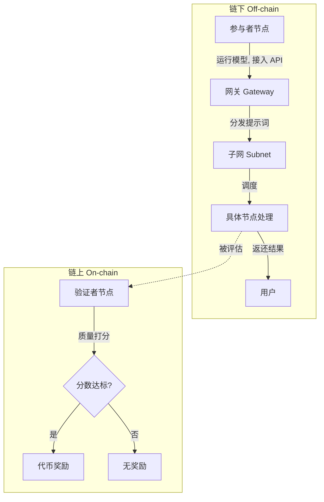
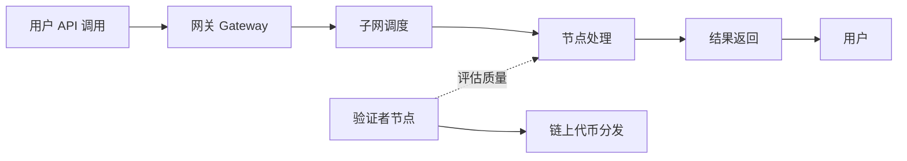

# AI 下乡计划｜AI 在 Web3 的应用

## 本场核心主题概述

本次分享探讨 AI 与 Web3 结合的双向赋能路径，由 Web3 开发者龙老师主讲。内容分两大块：Web3 如何为 AI 赋能（去中心化算力、Bittensor 子网机制），以及 AI 如何为 Web3 赋能（Agent 自主钱包、链上分析工具、钱包安全助手）。问答环节覆盖稳定币场景、AI 合约审计、独立开发者方向和学习路径。

> *核心观点：AI 落地场景里很多问题不是技术问题——身份、信任、协作的边界，恰好是 Web3 能补位的地方。*

---

## 一、Web3 如何为 AI 赋能

### 1. 核心愿景

构建去中心化 AI 网络——算力、数据和模型不再集中于单一组织，而是像区块链节点一样分布于世界各地，打破政策与文化壁垒，让 AI 真正属于全世界。

### 2. 典型模式：算力质押与子网分发

将算力和数据集分散部署到个人或小型组织的服务器上，由这些节点运行模型并提供服务。

> *以往区块链节点通过质押资产来参与网络，而这类项目则是"质押"服务器的算力与模型能力。*

**Bittensor 项目案例：**

- **节点转型**：参与者无需质押代币，而是通过运行符合要求的模型并将 API 接入项目网关，以提供算力和服务
- **子网划分**：将不同方向或技能的 AI Agent 划分为不同子网（如生图子网、代码子网），目前约有上百个子网。用户可自由部署能在自己硬件上运行的任何模型并加入相应子网
- **请求处理（链下）**：当用户通过 API 调用 AI 服务时，网关将提示词分发给对应子网，子网再调度至具体节点处理并返还结果
- **验证与激励（链上）**：链上操作的重点并非记录每次 AI 服务的数据，而是由"验证者节点"对各个节点提供服务的质量与内容进行打分。分数达标后，系统根据分数向节点分发代币奖励

**Bittensor 运作机制：**

> *整个业务处理在链下进行，只有验证者节点对模型能力的打分和代币经济激励在链上发生，以此保证效率与奖惩公平。*

**Bittensor 完整请求处理链：**

**当前局限性：**

- **性能不均**：各节点硬件能力、模型调教水平参差不齐，导致处理速度慢、结果不稳定
- **算力瓶颈**：个人或小组织财力有限，无法像大厂那样采购高端显卡，难以支撑起高质量的模型算力需求

> *这个方向远景宏大，若能将分布式算力有效聚合，一个"世界 AI"或许将由此诞生。但目前体验与中心化 AI 相比仍有较大差距，距离成熟还有很长一段路要走。*

---

## 二、AI 如何为 Web3 赋能

### 1. AI Agent 持有并自主管理钱包

**核心痛点**：当前使用 AI 调用第三方服务时，需手动购买、配置 API Key，过程繁琐且无法自动化。

**突破方向**：让 AI Agent 直接持有一个链上钱包并被赋予一定支付额度，使其在需要获取信息时，能自主完成"发现付费源 → 支付 → 调用 API"的全流程闭环。

> *这一设想源于"知识焦虑"——AI 获取信息能力太强，对内容平台造成冲击。因此，平台开始制定专门针对 AI 访问的收费协议（如 X402），而 Agent 自主支付能力则成为了应对这种新价值链的关键。*

**典型项目：Coinbase Agent Kit**

- 将钱包操作、链上交互等功能打包成模块化技能（Skill），接入服务的 Agent 即可获得操作链上钱包的能力

**当前应用场景：**

- **量化交易与合约监控**：让 Agent 拥有更快的处理权和直接发起交易的能力，以实现牟利
- **自动化运维**：支撑长期的、自动化的数据分析任务，避免因 API 余额耗尽而中断

**前景展望**：未来若能将"自然语言意图" → "链上合约调用"的路径完全打通，将极大降低普通人使用 DeFi 的门槛。

### 2. AI 驱动的链上分析工具

区块链数据晦涩难懂，AI 可以将复杂的链上交易、地址关系进行行为分析，使其变得直观可用。

**案例：Arkham**

- 实时抓取各区块链浏览器数据，利用 AI 进行行为分析
- 核心是通过分析钱包的交易模式、地址间转账关系，对匿名地址进行身份归类和标记，判断其可能归属的个人或组织
- 监控中心化/去中心化交易所的代币流入流出，为用户提供决策依据

**应用价值**：将原始的链上"匿名数据"转化为可解读的"行为情报"，为交易、风控、执法监控等提供支撑。

### 3. AI 驱动的钱包安全助手

**安全现状与痛点**：Web3 世界，每一次链上交互本质上都是发送 calldata 给 EVM 执行。恶意合约、误签、EIP-7702 等新协议带来的陷阱合约层出不穷，一旦交易上链确认，资金损失便不可挽回。仅靠现有的地址黑名单比对插件，防护效果有限。

**AI 的用武之地：**

- **意图分析**：在用户签名前，AI 模拟分析本次交易的 calldata 和目标智能合约，预判交易风险
- **安全模拟**：在 Fork 网络或沙盒环境中进行模拟执行，验证交互对象是否为恶意合约

**终极形态**：将"AI 安全分析"与"Agent 钱包操控"结合，实现"用户以自然语言下达指令，Agent 在确保绝对安全的前提下执行链上操作"。

> *龙老师认为，这是对独立开发者非常推荐的方向，可以从小插件做起，若能做出体验优秀的产品，极有可能成为爆款。*

---

## 三、问答环节关键洞见

### Q1：AI Agent 对于提升稳定币应用场景有何帮助？

**A：** 核心方向有两个。一是**语义化交易**，让用户能通过说话的方式转账，降低使用门槛。二是**稳定支付桥梁**，让用户在中转站兑换代币时，能便捷地使用稳定币支付。但稳定币的根本仍在于其绑定的经济属性与信任背书，AI 主要起到便捷化工具的作用。

### Q2：AI 合约审计有哪些可用的产品？

**A：**

- **LLM Bench**：OpenAI 推出的用于评估模型合约审计能力的平台，内置了大量审计 SQL。有实际使用案例发现，它能捕捉到一些收费高昂的外部审计机构都未发现的安全问题，建议学合约的同学用此工具自检代码
- **企业内部实践**：将历史上所有合约安全漏洞整理成案例知识库（Wiki），让 AI 在审计时，按案件类型和风险高低从库中调取知识，进行模拟攻击并生成报告，效果显著

### Q3：对独立开发者来说，AI+Web3 哪个方向成功率较高？

**A：** 强烈推荐做 **"AI 钱包安全助手"**的小工具或插件。可以自行接入 Codex、DeepSeek、Claude 等大模型，对交易 calldata 和目标地址进行链上分析，对交易进行风险评估打分。此类实用性工具个人完全能胜任。

### Q4：如何克服 AI 和 Web3 的学习焦虑？

**A：** 焦虑普遍存在，尤其是在技术概念日新月异的当下。关键在于**以目标驱动学习**，先构想一个想做的产品（如黑客松项目），再围绕这个目标去学习所需的技术栈，这样效率最高。同时要警惕被已有的技术框架所束缚，保持开放的创意心态。

---

## 四、视频章节总结

### [00:00](https://bibigpt.co/content/720f1148-fb09-44e0-9fbc-6898dd073bfd?t=0.000) - 🌐 Web3 如何为 AI 赋能

探讨将 AI 的算力与数据从中心化组织中剥离，利用分布式节点网络来实现去中心化 AI 的愿景。以 Bittensor 为案例，解释了不再依赖单一机构，而是通过算力质押和节点激励机制，让全球的个人或小组织参与模型维护。这种模式降低了对中心化服务器的依赖，并通过网关分发机制，让 AI 成为世界共享的资源。

### [07:19](https://bibigpt.co/content/720f1148-fb09-44e0-9fbc-6898dd073bfd?t=439.000) - 💰 AI 驱动的 Web3 支付与自主操作

讨论赋予智能体（Agent）链上钱包持有与支付能力的场景。通过让 Agent 持有一定额度的加密资产，它可以自主调用 API 完成信息获取并进行自动支付，无需用户频繁配置 API Key。以 Coinbase Agent Kit 为例，说明了 Agent 如何通过将钱包操作封装为功能模块，实现更高效的量化策略执行或智能合约监控。

### [11:08](https://bibigpt.co/content/720f1148-fb09-44e0-9fbc-6898dd073bfd?t=668.000) - 🔍 AI 驱动的链上数据分析与风控

分析 AI 在提升 Web3 数据透明度和用户安全性方面的作用。针对区块链数据复杂、难以解读的痛点，AI 可以通过对链上交易行为的实时分析，实现对钱包所有者的身份归类和风险预判。此外，结合智能合约代码扫描和交易意图识别，AI 能够有效防范恶意合约导致的资产损失。

### [17:51](https://bibigpt.co/content/720f1148-fb09-44e0-9fbc-6898dd073bfd?t=1071.000) - 💡 独立开发者如何切入 AI+Web3

针对个人开发者或独立团队，建议将 AI 和 Web3 结合视为职业发展的突破口。鼓励大家不要过度纠结于缺乏大公司级别的计算资源，而是应利用现有商业模型进行技能开发。学习的捷径在于设定明确的项目目标，无论是开发安全辅助工具还是智能交互应用，都比盲目学习效率更高。

---

> *清洗说明：biliGPT 原始输出格式基本规范，仅做微调——frontmatter 补全、章节标题统一、列表缩进修正、Mermaid 代码块已恢复。未改写表述。*

#BibiGPT https://bibigpt.co
