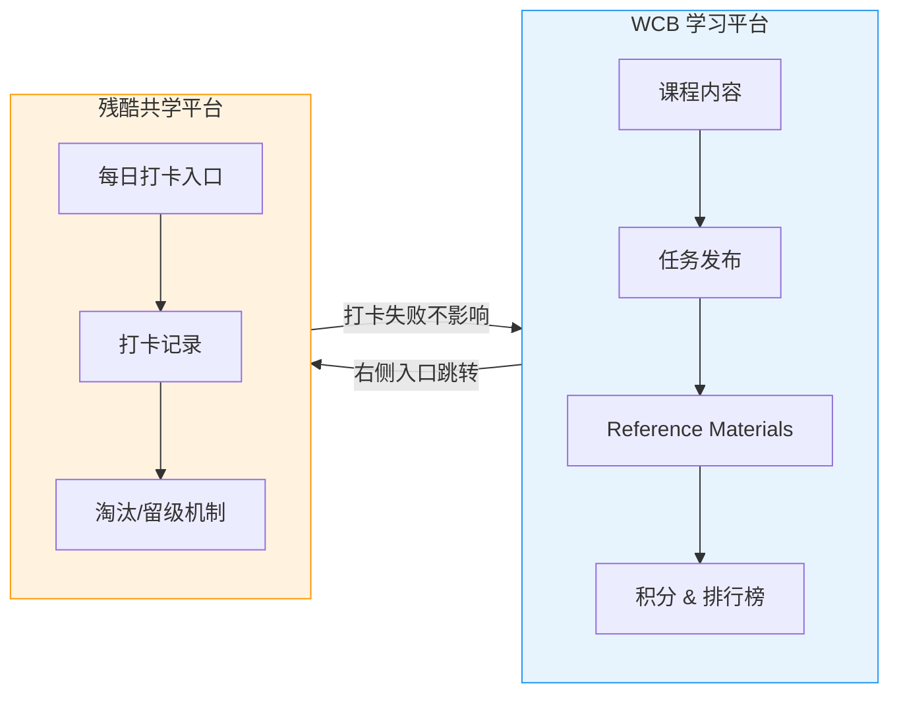
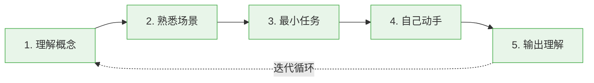

# AI x Web3 School 例会#1｜学习机制、优秀心得、黑客松准备与工具实践

## 本场核心主题概述

本次例会分为会前 Call Learning 答疑和正式第一周例会两部分。会前围绕学习机制展开：任务提交需要截图与文字说明，打卡系统与课程平台解耦，打卡失败不影响继续学习和参加黑客松。正式例会由小树/翠翠主持，展示优秀笔记与积分榜，邀请多位学员分享第一周学习心得（Web3 医疗应用、AI 学习闭环、钱包智能助手、WCB Agent API 自动化、Obsidian+Hermes 知识库、AI 技术焦虑应对、Codex 自动化开发技巧）。后半段预告第二周课程安排。

> *这场例会的价值不在于单点知识，而在于把"学习—输出—项目—展示—组队"这条链路讲清楚了。对刚入门的同学来说，比盲目追热点更重要的是先建立自己的学习闭环。*

---

## 一、会前 Call Learning：平台机制与学习路径说明

### 1. 任务提交与审核要求

参与课程、Call Learning、活动或直播任务时，建议立刻截图并提交，避免事后遗忘。任务提交通常需要两类内容：

| 内容 | 要求 |
|------|------|
| 截图证明 | 可直接复制粘贴、拖拽上传，推荐 JPG / PDF |
| 文字说明 | 写明当天参加了什么、学到了什么、谁提出了什么问题，或写下一步行动 |

如果是回放类任务，部分截图要求可以忽略，但仍建议补充文字说明。

> *这里的重点不是"证明你在线"，而是让学习行为留下可复查的痕迹。文字说明越具体，越容易通过人工审核。*

### 2. 打卡入口与残酷共学平台关系

日常打卡有两个入口：WCB 平台右侧入口跳转到「残酷共学」，或直接收藏残酷共学的打卡链接进入。残酷共学是良心道单独研发的平台，与 WCB 学习平台是解耦的。

核心结论：

- 打卡失败不等于学习资格失效
- 被残酷共学淘汰后，仍然可以继续学习课程、做任务、参加黑客松
- 不要因为打卡中断就放弃后续学习

> *打卡是激励机制，不是学习本身。不要把工具误认为目标。*

### 3. 学习方式：人工学习与 Agent 辅助学习

**人工学习**：通过 WCB 平台查看课程内容、任务和 Reference Materials。

**Agent 辅助学习**：围绕 Hermes Agent，参考资料包括 Dragon 老师的部署教程、recap 文字版、社区同学整理的部署文章和仓库、每日课程/活动 recap 汇总页、中英文两版课程回顾和 PPT 资源。

此外还整理了中文区 API 接入指南，包括 DeepSeek 接入方案、Qwen 接入方案、其他模型方案、AI Coding 选择、API Key 安全准则等。

### 4. Handbook 与 Roadmap

Handbook 提供 AI 基础、Web3 基础、AI x Web3 交叉方向、前沿 Track 等系统化学习路线。Roadmap 已经是精简版，适合有余力的同学继续拓展。Handbook 是开源仓库，可提交 PR 修正、补充或优化内容。

### 5. 英文直播听不懂怎么办

| 类型 | 工具 / 方法 |
|------|------------|
| 付费方案 | Immersive Translate 等实时翻译工具 |
| 免费方案 | Chrome / 系统 Accessibility 中的实时字幕或翻译能力 |

---

## 二、会前 Q&A

### Q1：后两周课程怎么安排？

第二周进入 AI 和 Web3 的交叉基础。第三周进入前沿方向和交叉实战，同时开启黑客松。第四周基本就是纯黑客松。

### Q2：积分有什么用？

积分首先是激励大家学习，也是引导学习路径的机制。积分和排行榜能让项目方、合作方、赞助方更容易发现活跃学员。平台会长期记录学习痕迹，可以理解为一个 showcase。

### Q3：接下来的黑客松 Track 有哪些？

大致围绕 Agentic Commerce、钱包、工具、安全、治理、Open Track 等方向。如果项目不属于前几个明确赛道，可以放到 Open Track。

### Q4：如何找黑客松队友？

不要只说"我是开发/运营，谁要我"。大家不是缺一个泛泛的开发或运营，而是缺一个已经有想法、知道自己能补哪块的人。先明确自己是不是 Lead、有没有 idea；如果不是 Lead，就看你想加入谁的队伍，对方缺什么。

### Q5：黑客松项目要做到什么程度？

这次有两周时间，不希望只是做玩具项目。至少要能跑通，并且看起来有继续开发的潜力。第三周也会有孵化机构和 VC 关注活动。

### Q6：想用 AI 操控钱包，应该自己做插件钱包还是接现成钱包？

建议先了解现在做得比较好的 Agentic Wallet，而不是从零开发一个钱包。比如看 Coinbase AgentKit / Agentic Wallet 开发者文档，学习它们如何集成原生 Agent 钱包。不要一上来造轮子，先了解有哪些好轮子能用。

### Q7：想做 OPC / 创客社区与 Web3 结合，是否成熟？

建议先调研已有的 OPC 社区和项目。比如 NCC 做数字游民社区，有「游牧岛」小程序，已经有成员主页、项目发起、投票等功能。做产品前要先看别人做到什么程度。

### Q8：AI + Web3 的优质项目去哪里找？

可以先关注 Virtuals，它在 Base 链上做 Agentic Commerce / Agentic GDP 方向。AI x Web3 现在有点像早期深圳，很多领域都在摸索，新的应用层机会还很多。

### Q9：过去黑客松作品去哪里看？

主要看三个渠道：主办方官网、Twitter / X、GitHub 仓库。

### Q10：黑客松期间会有 Co-building 吗？

会有 Co-building，会请实战老师来讲黑客松中的实战技巧，或帮助解答 debug 问题。

---

## 三、正式例会：第一周总结与学员分享

### 优秀笔记展示

主持人展示了几类值得参考的笔记：

| 笔记类型 | 特点 |
|---------|------|
| 跨学科思考型 | 从密码学、经济学、项目经历理解 Web3 基础概念 |
| 结构化总结型 | 每节包含核心结论、关键知识点、个人理解 |
| 超前预习型 | 有同学写了 42 节预习笔记 |
| 问题驱动型 | 围绕 Hermes Agent，从问题到结论一步步推理 |

> *优秀笔记的共同点不是"写得长"，而是有结构、有判断、有自己的问题意识。*

---

### 分享一：医学背景学员——Web3 在医疗场景中的三个应用想法

#### 1. 医疗理赔自动化

将病历数据上链，利用链上数据公开透明、可验证的特点，减少保险理赔中的重复申请和人工核对流程。通过智能合约和预言机，在满足条件时自动触发赔付。

#### 2. 临床科研数据授权

患者可以自主决定是否将自己的病历数据授权给研究所、药企或科研机构。授权过程通过签名完成，患者对数据访问拥有更强控制权。如果患者自愿贡献病例数据，也可以获得一定代币激励。

#### 3. 医疗纠纷存证

利用链上数据不可篡改、公开可查的特性，对医疗纠纷中的关键材料进行哈希存证，降低事后扯皮成本，使争议处理更透明、公正。

分享者也提到自己编程能力还在提升中，但擅长演讲、PPT 和运营路演，希望对医疗方向感兴趣的同学可以在黑客松中组队。

> *医疗上链的难点不只是技术，还有隐私、合规、数据标准和机构协作。作为黑客松方向，可以先从"哈希存证 + 授权流程 demo"切入，避免一开始做过重。*

---

### 分享二：尤娜——不要追热点，要把学习变成可执行流程

尤娜，区块链技术专业学生，大四，主要做合约和前端。核心观点：学习 AI 不要一开始就追工具、追热点，而要把学习过程变成一个可执行的流程。

#### AI 学习五步闭环

1. **先理解概念**：不只问"Agent 是什么"，还要问它和普通 chatbot 有什么区别、由哪些模块组成、在真实产品中解决什么问题
2. **放到熟悉场景**：Agent 放进钱包能做什么？放进合约交互能做什么？放进链上交易能做什么？哪些事情不能做？
3. **拆成最小可执行任务**：如果只做一个小 demo，第一步做什么？需要哪些页面、接口、合约或工具？如何验证它真的跑通？
4. **自己动手，不照搬 AI 答案**：AI 给出的方案可能看起来完整，但如果没有判断，直接照搬容易偏题
5. **输出自己的理解**：日报、学习笔记、GitHub README、流程图等。只有能用自己的话讲出来，知识才真正变成自己的能力

> *这个分享很适合所有新手复用。尤其是"熟悉场景 + 最小任务"这两个关键词，能显著降低 AI/Web3 学习的焦虑。*

---

### 分享三：谭/台老师——钱包智能助手与套利机器人设想

曾参加过良心道学习营和两次黑客松，目前希望寻找队友。

#### 项目方向

想做一个钱包智能助手，或者套利机器人。

#### 当前流程设想

1. 用 Hermes 获取链上数据
2. 定时扫描几类机会
3. 得到信号后，通过飞书机器人推送到手机
4. 用户选择是否手动操作
5. 后续希望逐渐自动化，让 Agent 直接执行低风险策略

#### 机会类型一：资金费率套利

当某个有序合约资金费率突然变高时，多头相当于给空头付费。机器人推送提醒后，用户可以买入现货、同时在合约侧开空，获取资金费率收益。

#### 机会类型二：交易量/空投机会

有些盘在人少时价格波动小、横盘，背后可能有人刷量或酝酿波动。可以快速买进卖出，刷交易量，从某些交易所获得空投奖励。

> *这类项目黑客松展示效果会比较强，但一定要注意风险边界。建议把"自动执行"设计成可配置、可模拟、可限额，而不是直接上来全自动交易。*

---

### 分享四：花花——WCB Agent API 与自动化打卡管线

花花，全栈背景，本期补 Agent 开发短板。

#### 关键发现

WCB 平台本身暴露了一套 Agent API，文档是写给 AI Agent 读的，不是传统 Swagger 风格。传统 API 文档是"人读完再写代码"，而这份文档更像是"Agent 读完就能直接调用"。

#### API 入口

只有一个核心入口 `POST /api/agent-call`，请求体类似 `{ "procedure": "procedure_name", "input": {} }`，风格类似 tRPC，认证使用平台生成的 key。

#### 常用 Procedure

| Procedure | 用途 |
|-----------|------|
| getProfile | 验证 key，拉取个人信息 |
| getById | 一站式获取课程信息、本周任务、公告等 |
| myTaskHistory | 查询某个任务提交历史 |
| score / leaderboard | 查看个人总分或积分信息 |
| submit proof mutation | 提交任务证明 |

#### 已经跑通的三个场景

1. **拉取 Week 1 全部进度** —— 38 个任务可以一秒列出，不需要网页逐个翻
2. **同步本周课程大纲到本地** —— 新一周课程开启后，自动拉取 Week N 内容，并生成中文摘要
3. **自动提交任务证明** —— mutation 仍在尝试中

#### 踩坑记录

`listForLearner` 这个接口如果不传任务 id，会返回空数组。解决方式：先通过 `getById` 拿到全部 task id，再循环调用 history 接口，最后拼出进度报告。

#### 沉淀脚本

| 脚本 | 作用 |
|------|------|
| WCB check-in prep | 自动拼出打卡原料，喂给 Claude 起稿 |
| WCB sync | 自动同步每周课程大纲 |
| Claude.md SOP | 写入 Claude 的使用流程，新会话自动加载 |

> *这是本场最"工程化"的分享之一。它把学习平台从"网页"变成了"可被 Agent 调用的系统"，非常符合 AI Native 学习方式。*

---

### 分享五：Luvia——用 Obsidian + Hermes 搭建个人知识库

Luvia，金融学大一学生。

#### 核心思路

用 Obsidian 和 Hermes 搭建 AI x Web3 学习知识库。Obsidian 用于沉淀个人知识结构，Hermes 用于辅助整理资料、生成笔记、部署到 GitHub。

#### 知识库搭建原则

1. 不要一开始过度设计分类
2. 文件夹层级保持浅层，最好不超过 1-2 级
3. 先让系统能持续运转，而不是追求完美架构
4. AI 可以帮助整理材料，但反思部分最好自己写

她提到一个重要观点：如果让 AI 读取并模仿自己的 reflection，可能会让自己的反思被 AI 的框架同化，最终分不清哪些是真正的自己。

#### PARA 分类法

| 分类 | 含义 | 示例 |
|------|------|------|
| Projects | 有明确目标和截止日期的短期项目 | 当前学习营、黑客松项目 |
| Areas | 需要长期维持的领域 | 健康、财务管理、学习习惯 |
| Resources | 持续收集的素材库 | Python 笔记、旅行攻略、摄影资料 |
| Archives | 已完成或暂时不用的资料 | 过往项目、暂停领域 |

#### MOC：Map of Content

MOC 相当于内容地图，是某个主题下所有笔记的入口。它不只是目录，更是知识之间的索引层。

#### 推荐插件

| 插件 | 用途 |
|------|------|
| Calendar | 查看每日笔记 |
| Templates / Templater | 自动生成笔记模板 |
| 双链 / Graph 相关能力 | 建立知识之间的连接 |

> *这套方法适合长期学习者。AI 负责整理，不负责替你思考；反思区不完全开放给 AI，是一个很好的边界意识。*

---

### 分享六：Black 老师——面对 AI 新概念，不要焦虑，要看底层框架

计算机本硕背景，研究生转 AI，做过前后端、嵌入式、量化智能体开发。

#### 核心观点

AI 方向新名词非常多，很多人焦虑是因为每出现一个新工具，就觉得自己又落后了。他的建议是：不要只追新名词，而要拆底层框架。

#### 怎么拆？

即使不看代码，也可以理解：它有哪些模块？每个模块负责什么能力？相比上一个工具新增了什么？是真正的新范式，还是在原有框架上加了一层功能？如果一个新东西让你非常焦虑，可能说明前一个东西也没有真正理解。

> *这是对"AI 工具焦虑"的一次降温。真正值得学的是抽象能力，而不是每天收藏几十个新工具。*

---

### 分享七：Codex / Web Coding 技巧——用目标模式和 Sub Agent 提升开发效率

#### 1. Codex 适合做项目开发

如果是写项目、做 demo、跑工程任务，Codex 体验较好；Hermes 更适合学习管理、打卡提醒、总结学习状态。

#### 2. 使用 Goal 模式

Codex 有一个内测能力，通过配置 `go = true` 启用，之后可使用 `/go 你的目标描述` 让 Codex 持续执行任务直到目标完成。适合扫描多个项目并总结技能、优化算法准确率、执行消融实验、批量整理历史项目经验等。

#### 3. 多 Agent / Sub Agent 用法

可以让主会话负责规划，再开多个子会话执行具体任务。通过深度链接复制子会话地址，让另一个 Agent 调用或监督执行。适用场景包括大项目分模块开发、多个实验并行、长上下文避免爆掉等。

#### 4. 可用于系统环境修复

Codex 可处理修改 UV 全局包缓存目录、切换 UV 镜像源、修复 Windows 下 ripgrep 权限问题、修复 Microsoft Store 代理连接问题、指定新版 PowerShell、改用 WSL 作为 Agent 执行环境等非传统开发任务。

#### 5. 与 Hermes / GitHub 同步

如果同时使用 Hermes 学习和 Codex 开发，可以通过 GitHub 建立共享上下文契约。学习笔记、commit、proof of work 都可以同步，使不同 Agent 都能读取当前学习状态。

> *对新手来说，不建议一开始就追求全自动；先理解任务拆分、上下文控制和 GitHub 同步，会更稳。*

---

## 四、第二周课程预告

| 日期 / 时间 | 主题 | 分享嘉宾 / 机构 | 重点方向 |
|------------|------|----------------|---------|
| 5月24日 09:30 | Agent 协议相关介绍 | EF Dev / Sophia | ERC-8004、ERC-8183、支付、身份验证 |
| 5月25日 20:00-21:00 | Agent 长期上下文与持续性 | 社区大使李飞儿 | Agent memory、长期性、上下文管理 |
| 5月26日前后 | 钱包权限、签名与安全执行 | 钱包产品经理 Ris | 钱包安全、权限、签名、执行边界 |
| 5月27日 | Privacy 相关英文分享 | Web3 Privacy Now / Peter | 隐私为何是 Web3 重要赛道 |
| 5月28日 / 周四 | ZAI 相关分享 | Kyle 老师 | 黑客松中如何利用 ZAI 构建赛道 |
| 5月29日 19:00-20:00 | 女性在 AI x Web3 领域的学习路径与全球机会 | Selina | 女性建设者、全球资源、成长路径 |

---

## 五、工具与资源清单

### 学习平台与资料

| 名称 | 用途 |
|------|------|
| WCB 平台 | 课程、任务、积分、排行榜 |
| 残酷共学 | 每日打卡与学习记录 |
| AI x Web3 Handbook | 系统化学习路线与开源知识库 |
| 每日 Recap 页面 | 课程回顾、PPT、中英文材料 |
| Reference Materials | 每周模块拓展学习资料 |

### Agent / Coding 工具

| 工具 | 用途 |
|------|------|
| Hermes Agent | 学习陪伴、任务提醒、笔记整理 |
| Claude Code | 本地项目协作、脚本生成 |
| Codex | 工程开发、长任务执行、自动化实验 |
| Obsidian | 个人知识库 |
| GitHub | 笔记、项目、Proof of Work 存档 |

### 项目与方向参考

| 名称 | 方向 |
|------|------|
| Coinbase AgentKit / Agentic Wallet | Agent 钱包集成 |
| OKX Wallet | 钱包与 Agent 结合方向 |
| Stripe | Web2 支付公司进入 Agentic Commerce 的可能参考 |
| Virtuals | Base 链上 Agentic Commerce / Agentic GDP 代表项目 |
| GoPlus | AI 安全 / Web3 安全方向参考 |
| Gitcoin | Governance / 公共物品 / 治理方向参考 |
| NCC / 游牧岛 | OPC、创客社区、数字游民社区产品参考 |
| X Hunt 插件 | Twitter / X 推主分析、KOL 工具 |

---

## 六、最终要点沉淀

1. **打卡失败不等于学习失败**：残酷共学与 WCB 平台解耦，仍可学习、做任务、参加黑客松。
2. **任务提交要有截图和文字说明**：截图证明参与，文字证明理解。
3. **学习 AI x Web3 不要追热点**：先找到熟悉场景，再拆成最小可执行任务。
4. **黑客松要尽早组队**：明确自己是 Lead、开发、产品、运营，还是某个具体模块的补位者。
5. **项目最好能跑通且有后续潜力**：两周黑客松不应只做玩具 demo。
6. **Agent 不是替代思考，而是放大学习和执行能力**：知识整理可以交给 AI，判断和反思仍要自己完成。
7. **工程同学可以主动把平台 API、GitHub、Agent 串成 workflow**：这会显著提高学习与项目推进效率。
8. **优质项目不必只看"成熟案例"**：AI x Web3 仍然早期，标杆项目也不完美，新人仍有机会做出更好的应用层形态。

> *本次例会传递出的社区气质很明显：不是等老师喂知识，而是鼓励每个人把学习痕迹、项目想法、工具实践和组队需求公开出来。越早输出，越容易被看见，也越容易找到同行者。*

---

## 视频章节摘要

> 以下为 biliGPT 自动提取的视频章节分段及摘要。

### Chapter 1：开场与会前 Call Learning

视频开头由主持人介绍本次例会的整体安排。会前 Call Learning 环节重点说明了任务提交的截图与文字要求、打卡机制与残酷共学平台的关系，以及 Agent 辅助学习的基本路径。

### Chapter 2：Handbook 与学习资源

介绍 AI x Web3 Handbook 的定位和使用方式，包括 Roadmap、Reference Materials、中英文 Recap 资源、API 接入指南等。强调 Handbook 是开源项目，欢迎 PR 贡献。

### Chapter 3：正式例会开幕与优秀笔记展示

小树/翠翠主持正式例会，展示第一周优秀笔记（跨学科思考型、结构化总结型、超前预习型、问题驱动型），说明积分与排行榜机制。

### Chapter 4：学员分享（上）——医疗、AI 学习闭环、钱包助手

三位学员依次分享：医学背景同学的 Web3 医疗应用三个想法；尤娜的 AI 学习五步闭环方法论；谭/台老师的钱包智能助手与套利机器人设想。

### Chapter 5：学员分享（下）——Agent API、知识库、AI 焦虑、Codex 技巧

花花演示 WCB Agent API 自动化打卡管线；Luvia 分享 Obsidian + Hermes 知识库搭建；Black 老师讲解如何拆解 AI 新概念缓解焦虑；最后介绍 Codex Goal 模式与 Sub Agent 开发技巧。

### Chapter 6：第二周课程预告与总结

预告第二周课程安排（Agent 协议、长期上下文、钱包安全、Privacy、ZAI、女性建设者等方向），汇总全场要点，鼓励学员尽早输出、组队、进入黑客松状态。

---

> *清洗说明：biliGPT 原始输出结构基本规范。清洗动作：补全 YAML frontmatter、表格格式统一、列表缩进修正。已恢复原始 Mermaid 代码块（双轨学习打卡系统流程图、AI 学习五步闭环流程图）及视频章节摘要。未改写表述。*

#BibiGPT https://bibigpt.co
