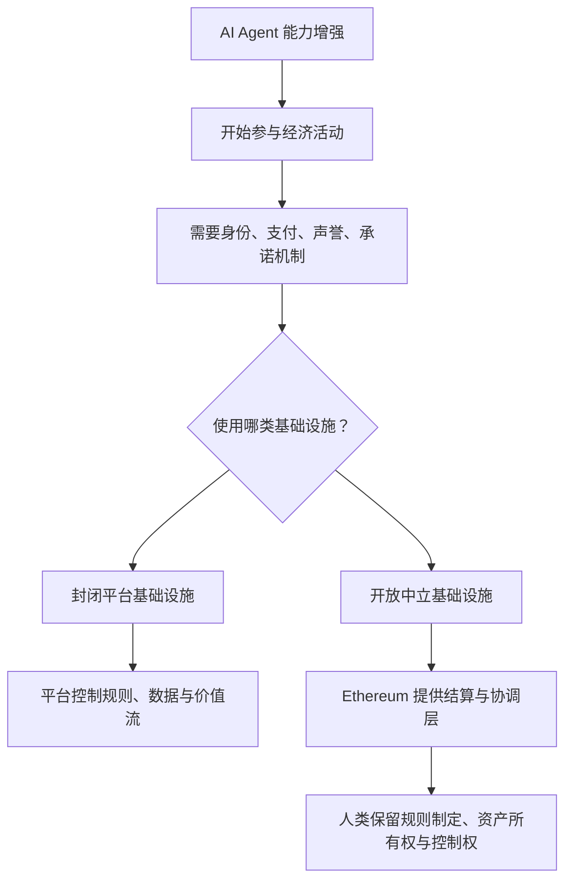
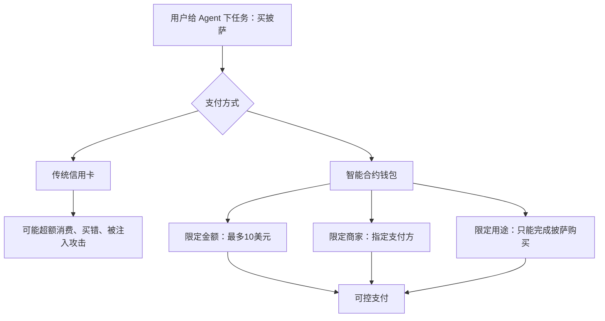

# AI × Web3 School · Open Agentic Economy — 从 ERC-8004 到 Builder Path

## 本场核心摘要

本场分享围绕"AI Agent 经济"与 Ethereum 的关系展开。Sophia 认为，过去 18 个月里，LLM 已经从问答式聊天机器人演化为能够写代码、做决策、支付、协商甚至调用其他 Agent 的经济参与者。因此，未来真正关键的问题不是"AI 能做什么"，而是这些 Agent 要运行在什么样的基础设施之上：如何拥有身份，如何积累声誉，如何支付，如何签订并执行承诺，如何避免被少数平台控制。Ethereum 的价值正在于提供一个开放、中立、可编程的结算与协调层，让机器之间可以交易与协作，同时仍由人类定义规则、拥有资产和保持控制权。分享重点解释了 Ethereum 的 CROPS 原则，即抗审查、开源自由、隐私与安全，并进一步介绍 ERC-8004 如何为 Agent 提供可验证身份、声誉与验证机制，x402 如何支持机器对机器的小额支付。最后，Sophia 给出 Builder 可切入的方向，包括 Agent 支付、身份与声誉、协议安全、zkML、公共物品资金分配、Agent 与智能合约自动协商等。

> *批注：这场分享的核心不是"AI + Web3"概念堆叠，而是把 AI Agent 视为新经济主体后，重新追问它们需要怎样的信任、支付与协调基础设施。Ethereum 在这里被定位为"中立的经济操作系统"。*

---

## 主讲人与内容脉络

| 阶段 | 主讲人 | 主要内容 |
|---|---|---|
| 会前答疑 | AI × Web3 School 运营 / 主持 | 课程任务、打卡、积分、黑客松、组队、Demo Day、PR、提问方式等 |
| 正式分享 | Sophia，Ethereum Foundation Developer Acceleration Team | AI Agent 经济、Ethereum 的协调层角色、CROPS 原则、ERC-8004、x402、Builder 方向 |
| Q&A | Sophia + 学员 | AI 应用方向、ERC-8004 声誉归属、Agent Commerce 与链上增长问题 |

---

## 核心概念

### 1. AI Agent 正在从"工具"变成"经济参与者"

Sophia 首先回顾了 LLM / AI Agent 的变化：

- 早期的大语言模型更像"智能聊天机器人"，主要用于回答问题。
- 过去约 18 个月，Agent 能力快速增强：
  - 写代码
  - 做决策
  - 与软件系统交互
  - 赚钱或管理资金
  - 协商任务
  - 雇佣或调用其他 Agent
  - 参与复杂的自动化流程

因此，AI 不再只是人类查询的工具，而正在成为一种新的经济参与者。由此引出几个基础问题：

| 问题 | 含义 |
|---|---|
| Agent 运行在哪些 rails 上？ | 它们依赖什么基础设施执行交易、协作、支付？ |
| Agent 如何付款？ | 是否需要银行卡、API Key、传统账单系统，还是可以直接使用链上支付？ |
| Agent 如何建立信任？ | 如何判断某个 Agent、API、Oracle 是否可靠？ |
| Agent 如何做承诺？ | 机器能否签订并执行可验证的协议？ |
| 谁控制这些基础设施？ | 是开放公共网络，还是少数大公司封闭控制？ |

> *批注：这个问题非常关键。如果 AI Agent 只是"会说话的软件"，那 Web2 基础设施尚可勉强承载；但如果 Agent 要变成经济主体，身份、支付、合约、声誉就会成为刚需。*

### 2. 为什么现在讨论 AI × Ethereum？

Sophia 认为，现在讨论 AI 与 Ethereum 的结合，是因为几个趋势开始同时出现：

1. **Agent 数量与能力快速增长** — AI Agent 不再停留在概念层，越来越多工具开始让普通开发者构建和部署 Agent。
2. **Agent 需要可交易、可协作的基础设施** — 当 Agent 可以调用工具、执行任务、购买服务、付款时，它们就需要经济网络。
3. **传统互联网基础设施并不是为机器设计的**：
   - 密码：Agent 可能把密码放进上下文窗口，无法真正安全保密
   - 银行账户：Agent 无法像人一样开户、KYC、签合同
   - 信用卡：Agent 拿到卡号后可能超额消费或被 prompt injection 操控
   - 法律合同：Agent 很难直接承担传统法律责任
   - 声誉系统：传统人类声誉渠道无法自然迁移给软件实体
4. **基础设施会决定未来 Agent 经济的形态**：
   - 如果 Agent 经济运行在封闭平台上，规则、身份、支付和价值流向都会被平台控制
   - 如果运行在开放协议上，则更可能形成开放参与、可组合、可审计的经济网络

### 3. Ethereum 在 Agentic Economy 中的定位

Sophia 对 Ethereum 的定义非常明确：

> Ethereum 是一个公共的、可编程的区块链，主要做两件事：
> 1. 让人们在没有中介的情况下拥有数字资产；
> 2. 让人们在没有中心化运营方的情况下进行协调。

对应到 AI Agent 经济里，Ethereum 可以提供：

- **价值结算层**：Agent 之间可以转账、支付、结算
- **承诺执行层**：智能合约可以自动执行规则
- **身份与声誉层**：Agent 可以拥有可验证身份和历史行为记录
- **开放协调层**：不同开发者、协议、Agent 可以在共同规则下交互
- **人类治理接口**：人类仍可审查、定义和治理规则

Sophia 的核心表述是：

> Ethereum is the decentralized settlement and coordination backbone for machines in the machine economy, with humans at the center.

整理成中文就是：

> Ethereum 可以成为机器经济中的去中心化结算与协调骨架，但人类仍然处在规则、所有权和控制权的中心。

> *批注：这里的重点不是"让机器取代人"，而是"让机器可协作，同时人类不失控"。这也是 Ethereum 被强调为中立层的原因。*

---

## Ethereum 的 CROPS 原则

Sophia 用 **CROPS** 概括 Ethereum 的关键设计原则：

| 缩写 | 英文 | 中文含义 | 对 AI Agent 的意义 |
|---|---|---|---|
| C | Censorship Resistance | 抗审查 | 有效交易和合约执行不应被单一主体随意阻止 |
| O | Open Source and Free | 开源与自由 | 基础设施与合约代码可审计、可复制、可组合 |
| P | Privacy | 隐私 | 可通过零知识证明等方式，在不暴露底层数据的情况下完成验证 |
| S | Security | 安全 | 网络与代码应可靠执行，不因中心化故障或单点攻击而失效 |

### 1. Censorship Resistance：抗审查

抗审查意味着没有单一主体可以阻止有效交易或有效活动。例如，一个智能合约部署到链上后，只要交易符合规则，就应当被网络执行，而不是被某个平台、公司或个人任意拦截。对 Agent 经济而言，这意味着：

- Agent 可以在开放网络中执行合约
- 支付与承诺不会被单点平台随意封锁
- 开发者可以构建不依赖单一公司许可的 Agent 应用

### 2. Open Source and Free：开源与自由

Ethereum 的基础设施和大量合约代码是开放的。开发者可以：

- 审计合约代码
- 查看合约实际逻辑
- 复制已有代码
- fork 并改造合约
- 像搭乐高一样组合协议

Sophia 举例说，如果你在与某个智能合约交互，可以直接在 Etherscan 上查看它的代码。如果不满意它的实现，也可以复制、修改、迭代。

### 3. Privacy：隐私

Ethereum 协议和生态中越来越多隐私能力与零知识证明结合。典型场景：

- 证明某件事是真的，但不暴露原始数据
- 让 Agent 在满足合规或权限要求时，不泄露全部上下文
- 为支付、身份、信用、机器学习推理提供隐私保护

### 4. Security：安全

安全意味着：

- 区块链应持续运行
- 合约应按规则执行
- 资产和状态不应被任意篡改
- 机器参与经济活动时，有可验证、可依赖的执行环境

> *批注：CROPS 不是抽象口号。对于 AI Agent 来说，它对应的是"能不能可靠地交易、能不能被审计、能不能保护隐私、能不能避免平台任意干预"。*

---

## ERC-8004：Agent 的身份、声誉与信任基础

Sophia 重点介绍了 **ERC-8004 / EIP-8004**。根据她的表述，这一标准的目标是为 AI Agent 提供：

- 可验证身份
- 可查询声誉
- 可验证行为或声明

它让开发者在与某个 Agent 交互时，可以判断：

- 这个 Agent 是谁？
- 它过去是否可靠？
- 它调用的 API 或服务是否可信？
- 它的行为是否被验证过？
- 它是否可能是恶意软件、失效端点或不可信服务？

### ERC-8004 的三个组成部分

| 模块 | 功能 | 说明 |
|---|---|---|
| Registry | 注册表 / 身份登记 | 记录 Agent 或数字服务的身份信息 |
| Reputation | 声誉 | 记录 Agent 的可信度、历史表现、外部评价等 |
| Validation | 验证 | 对 Agent 行为、能力或声明进行验证 |

Sophia 特别说明：ERC-8004 的声誉主要是给 **Agent 本身** 的，不是给 Agent 背后的人类 owner。不过，它也可以扩展到其他数字实体，例如：

- API
- Oracle
- 软件服务端点
- 其他需要声誉的数字服务

举例：一个 Agent 想调用某个 API endpoint，它需要知道：

- 这个 endpoint 是否可信？
- 是否包含恶意软件？
- 服务是否仍然在线？
- 历史表现是否稳定？

ERC-8004 就可以为这些判断提供基础数据。

> *批注：这点很重要。未来 Agent 调用 Agent、Agent 调用 API、Agent 调用合约会越来越频繁。如果没有机器可读的声誉层，整个网络会很容易变成"自动化黑箱互害"。*

---

## x402：机器对机器支付

Sophia 还提到 **x402**，它是与机器支付相关的协议方向。她将其描述为一种 "payment required status code"，可以让机器更容易发起或请求支付。它的价值在于：

- 不需要信用卡
- 不需要传统 API Key
- 不需要复杂账单系统
- 不需要人工发票
- 可以直接使用稳定币支付
- 更适合 Agent 与 Agent、Agent 与 API、Agent 与服务之间的小额自动结算

### Pizza 示例：为什么智能合约适合 Agent 支付？

Sophia 用"让 Agent 帮你买披萨"的例子解释。如果直接把信用卡交给 Agent，可能出现：

- 它花太多钱
- 它买错东西
- 它向错误商家付款
- 它受到 prompt injection 后乱花钱
- 它购买远超预期数量的披萨

但如果使用链上智能合约，可以设定明确约束：

- 钱包里只有 10 美元
- 只能花最多 10 美元
- 只能向指定支付提供商付款
- 只能完成指定任务

这样，Agent 即使是自动执行，也被约束在可验证规则内。

> *批注：Agent 支付真正的优势不是"链上转账很酷"，而是"可编程约束"。Agent 越强，支付边界越需要被代码化。*

---

## Ethereum 生态中的实际案例：AI Agent 分配公共物品资金

Sophia 提到 Ethereum Foundation 已经试点过一种机制：

> 让 AI Agent 辅助分配公共物品资金。

场景是：如果要把数十万美元资金分配给数百个 GitHub 仓库或公共物品项目，单靠人工判断会非常耗时，也容易受限于信息处理能力。

这个试点并不是让 AI 完全替人类做决定，而是：

- 人类设计 Agent 的价值标准
- Agent 根据这些标准辅助评估
- 人类不断调整 Agent 的权重与规则
- Agent 帮助放大人类判断能力
- 最终使资金分配更高效、更透明、更可扩展

这体现了一种重要方向：

> Agent 不一定替代人类治理，而是帮助人类治理扩展规模。

---

## Roadmap：接下来会出现的基础设施方向

Sophia 提到后续路线中会有几类重点：

| 方向 | 内容 |
|---|---|
| ERC-8004 Validation Registry | 面向 ERC-8004 的验证注册表 |
| TEE-based Verification | 基于可信执行环境的验证 |
| Private Payment Infrastructure | 扩展隐私支付基础设施 |
| Automated Negotiation | Agent 与 Agent、Agent 与智能合约之间的自动协商 |
| AI Framework Integration | 与 AI 框架和企业工具更深度集成 |
| University Research Partnerships | 与大学研究机构展开更深入合作 |

> *批注：这说明目前 Agentic Economy 仍处于基础设施早期。身份、验证、支付、隐私、协商这几块都还没有完全成熟，正是 Builder 可以进入的窗口期。*

---

## Builder Path：开发者可以切入的方向

结合 Sophia 的分享，本场可提炼出以下 Builder 方向：

### 1. Agent Payments / Agent Commerce

- Agent 自动购买服务
- Agent 调用 API 后自动结算
- 基于稳定币的小额支付
- x402 支付网关
- Agent 钱包权限管理
- 可编程消费限额

### 2. Agent Identity & Reputation

- ERC-8004 Agent 注册工具
- Agent 声誉查询面板
- API / Oracle 可信度评分
- Agent 行为历史记录
- 恶意 Agent 检测
- Agent 可信调用网络

### 3. AI-powered Protocol Security

- 用 AI Agent 审计智能合约
- 监控协议异常交易
- 检测攻击路径
- 分析治理提案风险
- 自动化安全预警

### 4. zkML / ZK LLM Credentials

- 使用零知识证明验证模型推理结果
- 证明某 Agent 满足条件但不暴露数据
- 隐私保护型信用或能力证明
- AI 输出可信验证

### 5. Agent + Public Goods Funding

- 公共物品项目评估 Agent
- GitHub 贡献分析
- 开源项目影响力评估
- 资助分配辅助系统
- 人类治理 + Agent 扩展判断

### 6. Automated Negotiation

- Agent 与智能合约自动谈判
- 服务报价与自动成交
- 多 Agent 任务分包
- 动态定价与自动履约
- Agent 间 SLA 协议

---

## 关于 ERC-8183 的说明

本场标题中出现了 **ERC-8183**，但从 transcript 内容看，Sophia 正式展开讲解的重点主要是：

- Ethereum 与 AI Agent 经济
- CROPS 原则
- ERC-8004
- x402
- Agent 身份、声誉、支付和 Builder 方向

transcript 中没有对 ERC-8183 做出清晰、成体系的解释，因此本笔记不强行补全 ERC-8183 的具体内容。

> *批注：这里不建议为了标题完整而硬补标准细节。后续如果有 slides 或完整视频，可以单独补一版 ERC-8183 专项笔记。*

---

## 资源链接

| 资源 | 链接 | 用途 |
|---|---|---|
| Ethereum AI | https://ai.ethereum.foundation | Ethereum 与 AI 相关资源 |
| Protocol Support / Public Goods 相关 | https://psc.dev | Ethereum 公共物品、协议支持相关资源 |
| ERC-8004 | https://8004.org | ERC-8004 / Agent 信任相关资源 |
| Eth Skills | 主讲人在 chat 中发送，具体链接 transcript 未完整保留 | 给 Agent 使用的 Ethereum 技能文件，帮助 Agent 理解如何在 Ethereum 上构建 |

---

## 正式 Q&A 整理

### Q1：AI 主要会应用在哪些领域？目前已经看到很多支付系统在使用 AI

**Sophia 的回答整理**

Sophia 认为，如果是刚进入这个领域的开发者，可以先关注 **Eth Skills**。这是一个可以提供给 Agent 的 skill file，里面包含：

- Ethereum 的基础知识
- 如何在 Ethereum 上构建
- Agent 能做什么、不能做什么
- 如何注册到 ERC-8004
- 如何使用相关 EIP / 协议

对于 AI 的应用方向，她明确表示：

> Payments are probably the biggest area.

也就是：**支付很可能是 AI Agent 经济中最重要、最先落地的方向之一。**

原因在于链上支付本质上是 **programmable money**。智能合约可以规定：

- 钱能花到哪里
- 最多能花多少
- 能调用哪个支付服务
- 满足什么条件才能付款
- 付款后如何验证结果

她用披萨例子说明：如果直接把信用卡交给 Agent，Agent 可能花太多钱、买错东西、被错误商家扣款。但如果给 Agent 一个只含 10 美元的钱包，并通过智能合约限制它只能向指定商家支付，那么用户就可以更确定 Agent 会按预期执行。

> *批注：Sophia 的回答本质上是在说，Agent 支付不是单纯"自动付款"，而是"带规则的自动付款"。这会是 AI × Crypto 最自然的结合点之一。*

### Q2：ERC-8004 里的 reputation 代表的是 Agent 的声誉，还是 Agent owner 的声誉？

**Sophia 的回答整理**

Sophia 明确回答：

> It's for the agent itself.

也就是说，ERC-8004 中的 reputation 主要代表 **Agent 本身的声誉**，不是背后人类 owner 的声誉。她进一步解释，这个机制也可以扩展到：

- API
- Oracle
- 其他数字软件实体
- 所有需要机器可读声誉的服务

例如，一个 Agent 要调用某个 API endpoint 时，它需要判断：

- 这个 endpoint 是否可信
- 是否是恶意服务
- 是否仍然在线
- 历史表现是否可靠

ERC-8004 就可以为这些判断提供基础。

> *批注：这一点会影响产品设计。如果声誉绑定的是 owner，人类身份会变成中心；如果绑定 Agent 本身，就更适合机器网络中的自动筛选、组合和调用。*

### Q3：Agent Commerce、ERC-8004 / ERC-8183 等原语很有前景，但链上活动似乎增长较慢，这个 gap 怎么看？

**思考背景整理**

提问者 Swing 提到：

- AI 正在成为新的互联网基础设施层
- 最近几个月 AI 的变化非常快，不只是叙事，而是真正进入基础设施扩张
- 他特别关注 Agent Commerce，以及 ERC-8004、ERC-8183 等相关 primitives
- 但同时也看到一个落差：AI 发展很快，而链上活动增长似乎较慢
- 例如某些 Agent 相关协议或项目的数据增长并不明显

**回答状态**

transcript 在该问题尚未完整问完时中断，没有保留 Sophia 的回答。因此此处只记录问题，不补写回答。

> *批注：这是本场最值得继续追问的问题之一。AI Agent 的能力增长与链上真实需求之间确实存在时间差，关键在于是否能找到"非链上做不了，或链上明显更好"的场景。*

---

## 会前运营与课程答疑整理

> 以下内容属于正式分享前的课程运营答疑，与本场技术主题弱相关，但对参加 AI × Web3 School 的学员有实际参考价值。

### 1. 关于课程任务为什么很多

组织者解释：

- 课程任务不是一次性全部开放，而是按周逐步开放
- 第一周只开放第一周任务，第二周、第三周会继续追加
- 这样做是为了避免部分能力强的同学过早完成全部内容
- 任务设计的核心逻辑是"输出倒逼输入"
- 如果没有足够输出，线上学习很容易流于听过但没有真正掌握

> *批注：这里的任务不是单纯刷分，而是作为自学吸收程度的检测工具。*

### 2. 关于上麦分享和加分

组织者提到：

- 上麦分享会有加分
- 上麦本身不一定直接提高技术能力
- 但如果能分享出自己的心得、框架或成体系的理解，说明已经对知识点有一定内化
- 分享也是训练表达和结构化思维的一种方式

### 3. 关于 Workshop 和 Twitter Space

课程鼓励学员组织两类活动：

| 类型 | 特点 |
|---|---|
| Workshop | 更偏实操演示，例如投屏讲代码、工具、实现流程 |
| Twitter Space | 更偏问答、讨论、主题分享和前沿观点交流 |

可以讨论的话题包括 AI 支付、AI Agent、Web3 基础设施、前沿技术观点、学员自己的项目实践。这些活动可以按小组形式加分。

### 4. 关于打卡与积分榜

组织者说明：

- 每周通常有两天休息时间，允许错过打卡
- 其他五天需要完成打卡
- 如果错过打卡，主要影响是否计入积分排行榜
- 不影响继续听课程和参与分享
- 排行榜本质上是激励机制，不是课程准入门槛

有同学反馈 Web3 课程里的打卡记录和残酷共学记录同步问题，组织者表示会进一步反馈和确认。

### 5. 关于黑客松奖金与赞助方

组织者透露：

- 黑客松奖金池暂未正式公布
- 预计第二周快结束时公布
- 奖金可能以 USDC / 稳定币形式发放
- 如果是组队项目，奖金发给队长
- 如果是 solo 项目，发给个人钱包
- 赞助方包括 ZI、智谱、Combo 等
- 建议重点关注赞助方后续分享，因为黑客松赛道和评审偏好可能与赞助方方向相关

> *批注：对参赛者来说，听赞助方分享不是"走流程"，而是理解命题人需求。黑客松项目如果贴合赞助方方向，获奖概率通常会更高。*

### 6. 关于 Demo Day

组织者初步安排：

- Demo Day 预计在 6 月 14 日
- 6 月 13 日没有课程安排，留给学员完善项目
- 如果项目数量较多，可能分上下午两场
- 如果项目数量较少，每个项目可能给 7 分钟
- 如果项目数量较多，每个项目大约 5 分钟
- 评委可能还有 Q&A，因此展示要精简

**Demo 建议**

- 提前录制 5 分钟左右的视频，避免现场设备或网络问题
- 不要花太多时间讲"来时路"
- 优先讲清楚：项目解决什么问题、为什么重要、Demo 如何运行、与赛道的关联、技术亮点、后续可扩展性

### 7. 关于组队方式

组织者建议：

- 可以 solo，也可以组队
- 团队人数建议最多 3-5 人
- 推荐配置：产品经理 / 技术开发（全栈 / 前端 / 后端均可） / UI / 设计
- 具体仍以团队自身能力和项目需求为准
- 如果以前有相关 Demo，也可以继续优化后参赛，不要求必须从零开始

### 8. 关于赛道选择与获奖规则

组织者说明：

- 一个项目可以和多个赛道相关
- 但评奖时只能选择最相关或最有把握的一个赛道
- 一个项目不能在多个赛道重复领奖
- 建议团队选择最贴近项目优势、最有把握拿奖的赛道

### 9. 关于 PR 是什么

有同学问到 PR。组织者解释：

- PR 是 Pull Request
- 即在 GitHub 上对某个仓库提出修改请求
- 通常是把自己分支上的修改提交给仓库 owner
- owner 审核后决定是否合并
- 不建议为了学分随便提 PR，否则可能被直接关闭

### 10. 关于如何提出好问题

组织者认为很多问题本身不是不能问，而是没有想清楚。建议：

- 提问前先自己检索
- 明确自己已经尝试过什么
- 描述环境、步骤和错误
- 说明期望结果与实际结果
- 不要只抛一句"怎么做"或"为什么不行"

### 11. 关于职业与社区建议

组织者结合自身经历提到几点：

- 如果懂开发，DevRel 是一个值得探索的方向
- 英语能力非常重要，尤其是想寻找国际机会时
- 不要"单出一张牌"，最好形成组合能力：技术能力 / 英语 / 沟通能力 / 协调能力 / 一定的运营或增长意识
- 在社区里，Proof of Work 很重要
- 不是只有面试才能获得机会，持续参与、交付和协作也会被观察到
- "靠谱"非常关键，具体表现是：事事有回应、能解决问题、小问题也认真闭环、在线协作中保持稳定沟通

> *批注：这段虽然不是技术内容，但对 Web3 社区很实用。很多机会不是投简历来的，而是在开放协作中被看见的。*

---

## 视频章节总结

本视频深入探讨了 AI Agent 与 Web3 技术的融合趋势，特别是以太坊在未来 AI 经济中的核心基础设施地位。分享嘉宾 Sophia 来自以太坊基金会，介绍了 ERC-8004 与 ERC-8183 等关键标准，这些标准为 AI Agent 赋予了可验证的数字身份、声誉系统及自动支付能力。视频强调，AI 不再仅是查询工具，而是具备独立经济参与能力的代理人。以太坊作为中立的协调层，通过去中心化、透明及可编程的特性，为 AI Agent 提供了安全的交易与承诺执行环境。同时，视频还探讨了 AI 在公共物品资助、自动化支付与代理人商业模式中的实际应用潜力，并鼓励开发者积极参与此类基础设施建设，共同推动 AI 与区块链生态的跃迁。

### [00:00](https://bibigpt.co/content/368965a5-1c40-4297-9c77-c8d518fb8c19?t=0.000) - 🎙️ 活动开场与课程规划

视频开篇介绍了 AI × Web3 School 的共学营背景与课程安排。主持人在嘉宾因时差稍作延迟期间，与社区成员互动，讨论了课程任务设计、积分激励机制以及如何通过输出倒逼输入来提升学习质量。重点强调了下周课程深度的增加，鼓励学员利用空余时间完成助教答疑，并预告了后续黑客松奖金池的潜在激励。

### [35:43](https://bibigpt.co/content/368965a5-1c40-4297-9c77-c8d518fb8c19?t=2143.000) - 💡 AI Agent 与以太坊的互联未来

嘉宾 Sophia 深入分析了 AI Agent 如何从简单的聊天机器人转变为具备经济参与能力的独立个体。她指出，传统互联网基础设施（如密码、API Key）无法满足 Agent 的安全与信任需求，而以太坊凭借去中心化、抗审查、开源等设计原则（CROPS 原则），成为最适合 Agent 运行的协调层。以太坊能为 Agent 提供可验证的身份、声誉记录及自动化的合约执行，确保其在开放经济环境中的行为逻辑可被监管与追溯。

### [50:43](https://bibigpt.co/content/368965a5-1c40-4297-9c77-c8d518fb8c19?t=3043.000) - ⚙️ ERC-8004 与代际经济标准

本章节详细解析了技术标准如何赋能 AI Agent 经济。ERC-8004 为 Agent 提供了可验证的数字身份与声誉注册机制，解决了信任缺失问题；而 ERC-8183 则支持机器对机器（M2M）的直接支付，允许 Agent 利用稳定币进行透明、受控的商业交易。这些协议的落地，使得 Agent 能够以更低成本、更高透明度在链上完成复杂商务逻辑的闭环，是构建去中心化 AI 经济生态的基石。

### [53:14](https://bibigpt.co/content/368965a5-1c40-4297-9c77-c8d518fb8c19?t=3194.000) - 🚀 实战案例与未来展望

Sophia 通过以太坊基金会利用 AI Agent 进行公共物品资助分配的实例，展示了 AI 如何扩展人类判断力的边界。她建议开发者通过"Eth Skills"等工具库深入理解标准应用。针对未来展望，嘉宾强调了支付系统将是 AI Agent 最快落地的领域，因为链上智能合约能通过规则限制赋予 Agent 明确的支出上限，从而实现"可控的自主"。此外，她鼓励女性开发者及各背景 builder 积极参与相关生态建设，通过实践验证 AI 与 Web3 结合的商业机会。

---

> *清洗说明：格式问题 10+ 处（标题补全、frontmatter 规范化、`- ---` 横线、多 mermaid 块从列表项中提出、`00:06 月 13 日` → `6 月 13 日`、英文单引号 `It's` 修正、章节标题层级统一、"Eat Skills" → "Eth Skills"）。未改写原文表述。*

#BibiGPT https://bibigpt.co
