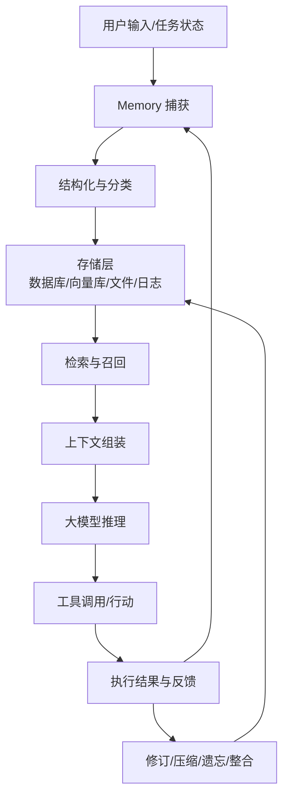
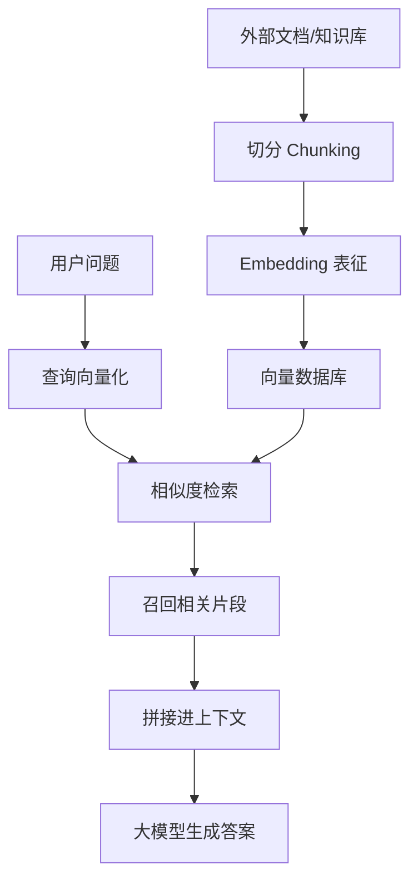

# Long-term Memory for AI Agents：让 Agent 拥有持续上下文与长期一致性


## 直播基本信息

| 项目 | 内容 |
|---|---|
| 主题 | Long-term Memory for AI Agents：如何让 AI Agent 拥有持续上下文和长期智能 |
| 主持人 | 薇薇 |
| 主讲人 | 李小二老师（转写中提到其为 Everyman 相关设计大使） |
| 分享形式 | 主题分享 + 问答 |
| 核心对象 | AI Agent 开发者、Web3 Builder、传统 AI 产品/工程从业者、RAG/上下文工程实践者 |
| 重点问题 | Agent 为什么需要长期记忆；ChatGPT、Claude Code、小龙虾等产品的 memory 差异；Agent Memory 的技术栈、分类与生命周期管理 |

---

## 本次直播核心主题与要点概述

本次分享围绕"AI Agent 的长期记忆"展开。主讲人认为，Agent Memory 不是一个简单的"记住用户资料"的功能，而是一个跨越时间的意图与状态管理系统。人类表达往往模糊、不完整，Agent 需要在多轮交互中不断补全目标、偏好、决策和执行状态；如果没有记忆，任务一旦跨 session、跨时间推进，就会反复丢失上下文。

分享先从产品视角比较 ChatGPT 与 Claude Code：前者强调用户连续性，保存用户偏好、事实和历史对话；后者作为 coding agent，更重视项目规则、代码库约定、技术决策和执行恢复。随后又以"小龙虾"等开源 Agent 为例，说明执行链路越长，memory 缺陷越容易暴露。

技术部分则将 memory 放在 RAG、上下文工程、Agent 工程和强化学习的交叉处，强调 memory 的生命周期管理，包括捕获、检索、修订、摘要、压缩、遗忘与冲突处理。最后，主讲人区分了 working/short-term/long-term memory，以及语义记忆、情景记忆和程序性记忆，指出未来真正有价值的 Agent，不只是"回答更好"，而是能从自身经验中持续学习、修正和进化。

> *批注：这场分享的核心价值不在于给出一套现成架构，而在于把"memory"从产品功能提升到了 Agent 基础设施层面来讨论。对正在做 RAG、Coding Agent、个人助理或陪伴类产品的人来说，这个视角很关键。*

---

## 一、核心判断：Agent Memory 是跨时间的意图与状态管理系统

主讲人给 Agent Memory 下了一个很重要的定义：

> Agent Memory 是一个跨越时间的意图和状态管理系统。

这句话可以拆成两层：

### 1. 意图管理

- 人类用户的表达通常是不完整、不清晰的。
- 用户经常说"把这个整理一下""帮我处理那个""像上次那样改"。
- "这个""那个""上次"都依赖历史上下文，如果 Agent 没有记忆，就无法准确理解。

### 2. 状态管理

- Agent 的任务状态不是一开始就完整存在的。
- 它是在用户与 Agent 的持续交互中逐渐涌现出来的。
- 比如：
  - 用户的目标不断被澄清；
  - 新的创意在对话中出现；
  - 工具调用策略会随着任务推进变化；
  - 项目决策、执行路径、失败教训会逐渐积累。

因此，Memory 不只是"记住用户是谁"，而是要让 Agent 能够在长时间任务中保持连续性。

---

### 为什么单次对话很难支撑长期任务？

主讲人认为，单次 session 的问题在于：它天然不适合承载长期任务。

典型问题包括：

| 问题 | 表现 |
|---|---|
| 上下文丢失 | 用户之前解释过目标、偏好、背景，但新会话中 Agent 不知道 |
| 重复 setup work | 用户每次都要重新告诉 Agent 自己是谁、项目是什么、现在做到哪一步 |
| 决策断裂 | 之前已经确定的方案、技术取舍、产品方向无法延续 |
| 执行轨迹不可复查 | Agent 做过什么、为什么这么做、失败过什么，无法被追踪 |
| 身份/目标漂移 | 多人协作或长期任务中，Agent 容易偏离原始角色和目标 |

主讲人特别强调：

Memory 的第一个价值不是"记住我是谁"，而是**不要再让用户重复做 setup work**。

> *批注：这点非常贴近真实使用体验。很多人对 AI 产品失望，并不是因为某一次回答不好，而是因为它"明明我以前说过，却每次都像第一次见我"。*

---

## 二、为什么 Memory 对 C 端产品和 Agent 都是刚需？

### 1. C 端 AI 产品：没有记忆会严重影响留存

分享中提到一个面向 C 端 AI 硬件/陪伴产品的例子：

如果一个 AI 硬件或陪伴类产品没有 memory，用户留存会明显下降。主讲人提到其观察数据中，大约会有接近一半用户在使用后流失。

这里不是强调某个具体数值，而是说明：

- 陪伴类产品如果不记得用户，情感连接很难建立；
- 个人助理如果不记得用户偏好，效率价值会大打折扣；
- AI 硬件如果每次都像"重置人格"，用户很难长期依赖它。

### 2. Agent 场景：没有 memory 就无法长时段运行

Agent 与普通 Chatbot 的区别在于：Agent 通常要执行任务，而不是只回答问题。

尤其在这些场景中，memory 会变成基础能力：

- 软件开发；
- 数据分析；
- 项目管理；
- 多 Agent 协作；
- 长周期研究；
- Web3 自动化任务；
- 个人知识助理；
- 客服/销售跟进；
- AI 伴侣或陪伴硬件。

如果 Agent 无法记住过去的状态，它就无法真正进行长期任务。

---

## 三、产品视角：ChatGPT、Claude Code 与"小龙虾"的 Memory 差异

主讲人没有一上来直接讲技术，而是先从几个大家熟悉的产品切入：ChatGPT、Claude Code，以及开源/社区热度较高的"小龙虾"类 Agent。

### 1. ChatGPT：代表"用户连续性"

ChatGPT 的 Memory 更偏向于服务个人用户的连续体验。

它要解决的问题是：

- 用户不想每次重新介绍自己；
- 用户希望 AI 记得长期偏好；
- 用户希望 AI 记得有意义的上下文；
- 用户希望自己能管理、删除、修改这些记忆。

#### ChatGPT 的两层 Memory

主讲人提到 ChatGPT 里大致有两种 memory：

| 类型 | 作用 |
|---|---|
| Saved Memory | 保存长期有效的事实和偏好 |
| Chat History | 从历史对话中参考上下文，增强连续性 |

这两层都和用户隐私、数据管理、跨会话连续性有关。

尤其是面向全球用户的 C 端产品，需要考虑：

- GDPR 等隐私法规；
- 用户对数据控制权的要求；
- 用户对"被记住"和"可删除"的双重期待；
- 企业用户的数据隔离与合规需求。

#### ChatGPT Memory 时间线

根据主讲人的说法，ChatGPT Memory 大致经历了这些阶段：

| 时间 | 事件 |
|---|---|
| 2024-02-13 | 推出 Memory Beta 测试 |
| 2024-09-05 | 向付费用户和企业用户正式推出 |
| 2025-04-10 | Saved Memory 与 Chat History 的管理能力更加显性化 |
| 2025-05 左右 | 出现更轻量的对话连续性示例和迭代 |

> *批注：这里的具体日期建议后续和 OpenAI 官方文档交叉核对。主讲人的重点不是考据日期，而是说明 ChatGPT 很早就把 memory 作为 C 端体验的关键能力。*

---

### 2. Claude Code：代表"项目连续性"

Claude Code 和 ChatGPT 的重点不同。

它不是主要为了记住"用户是谁"，而是为了记住一个软件项目如何持续推进。

Claude Code 面对的不是普通聊天，而是软件工程。

它需要记住：

- 项目的代码库结构；
- 编码规范；
- 技术栈；
- 构建命令；
- 测试命令；
- lint 规则；
- CI/CD 约束；
- 过往技术决策；
- 已经踩过的坑；
- session 结束后如何恢复工作。

#### Claude Code 的 Memory 目标

Claude Code 的核心问题是：

> 如何让 Coding Agent 在一个软件工程项目中长时间工作，同时避免代码漂移？

所谓"代码漂移"，可以理解为：

- Agent 忘记项目约定；
- 改着改着偏离架构；
- 重复造轮子；
- 忘记之前失败过的方案；
- 在不同 session 中产生不一致的实现风格。

#### CLAUDE.md 与项目记忆

主讲人提到，很多 Claude Code 用户会打磨 `CLAUDE.md` 文件。

常见实践包括：

- 用 `/init` 生成项目说明；
- 用 `/memory` 编辑 memory；
- 将项目规则、偏好、约束写入 `CLAUDE.md`；
- 控制文件长度，比如尽量控制在 200 行以内；
- 记录项目特定的工作方式。

示例内容可能包括：

```markdown
# Project Rules
- Use TypeScript.
- Run pnpm test before committing.
- Do not modify database migrations without confirmation.
- Follow existing folder structure.
- Prefer small, incremental changes.
```

#### Claude Code Memory 时间线

主讲人认为，Claude Code 并不是没有能力更早做 memory，而是因为 coding agent 场景更复杂，所以更谨慎。

| 时间 | 事件 |
|---|---|
| 2025 年前后 | Claude Code 开始更系统地上线 memory 相关能力 |
| 2025-04 左右 | Memory 能力正式化、产品化 |
| 后续 | 支持手动编辑、`/memory`、项目级文件、更多恢复与上下文管理能力 |
| 近期趋势 | 可能继续加强 memory 与 session 恢复、项目经验整合相关功能 |

> *批注：Claude Code 的 memory 更像"项目操作手册 + 经验沉淀 + 执行约束"。这和 ChatGPT 的"用户画像 + 偏好记忆"不是同一种问题。*

---

### 3. "小龙虾"：开源 Agent 暴露出的 Memory 痛点

主讲人口中的"小龙虾"指的是一类在社区中曾经很火的开源 Agent/远程控制式 Agent 产品。

它的吸引力在于：

- 可以通过移动端操控电脑；
- 可以接入 Telegram、Discord 等；
- 适合远程指挥多个 Agent；
- 给用户带来了"移动办公 + 多 Agent 调度"的想象力。

但它也暴露了很严重的 memory 问题。

#### 小龙虾的 Memory 痛点

主讲人提到，小龙虾的 memory 架构比较扁平，常见方式类似：

- Markdown 文件；
- 每天一篇日记；
- 只新增，不做复杂的增删改查；
- 人类能读，Agent 也能读；
- session 太长后只能清空或压缩。

这会导致几个问题：

| 问题 | 说明 |
|---|---|
| 记忆扁平化 | 缺乏层级、权重、类型区分 |
| 只追加不修订 | 旧记忆和新事实发生冲突时很难处理 |
| 压缩丢信息 | session 太长后压缩，容易丢掉关键上下文 |
| 执行链路过长 | 移动端、网络、电脑、Agent、工具调用层层叠加，失败概率增加 |
| 缺少生命周期管理 | 记忆没有明确的创建、召回、修改、删除机制 |

主讲人强调，封装成熟的产品通常不会让用户明显感知到这些痛点；但开源项目一旦被大量用户使用，memory 架构问题会很快暴露出来。

---

## 四、三类产品中的 Memory 对比

| 产品/场景 | Memory 主要服务对象 | 记住什么 | 核心目标 |
|---|---|---|---|
| ChatGPT | 个人用户 | 用户偏好、事实、历史对话 | 用户连续性 |
| Claude Code | 软件项目 | 代码库规则、技术决策、命令、约束 | 项目连续性 |
| 小龙虾类开源 Agent | 远程任务执行 | 日志、任务状态、操作记录 | 长链路任务恢复与移动调度 |

可以总结为：

- ChatGPT 解决的是：**这个 AI 是否记得我？**
- Claude Code 解决的是：**这个 Agent 是否记得项目怎么工作？**
- 小龙虾类 Agent 暴露的是：**任务链路变长后，memory 不可靠会迅速放大失败率。**

---

## 五、技术视角：Agent Memory 不等于数据库

### 1. Memory 不是单纯的数据存储

分享中反复强调：Agent Memory 不应该简单等同于数据库。

数据库背景当然有帮助，因为 memory 也涉及：

- 数据存储；
- 检索；
- 增删改查；
- 数据生命周期；
- 权限与隐私；
- 一致性维护。

但 Agent Memory 又不只是数据库。

它还涉及：

- 大模型上下文窗口；
- RAG 管线；
- embedding 模型；
- 向量数据库；
- 工具调用；
- Agent 状态；
- 用户意图；
- 强化学习；
- 持续学习；
- 多轮交互中的状态演化。

主讲人认为，如果完全用传统数据库思维理解 Agent Memory，反而可能受限。

> *批注：这句话很值得记。数据库解决"数据怎么存和查"，但 Agent Memory 还要解决"什么值得被记住、什么时候想起来、想起来后怎么影响行动"。*

---

### 2. Agent Memory 位于多个技术领域交叉处

主讲人将 Agent Memory 看作三个方向的交叉：

| 方向 | 说明 |
|---|---|
| 数据库/RAG | 负责外部知识、历史信息、向量检索、知识图谱等 |
| 上下文工程 | 决定哪些信息进入模型上下文窗口 |
| Agent 强化学习/持续学习 | 让 Agent 从经验中改进行为和策略 |

可以把它理解成：



这个流程说明：

Memory 不是一次性的"存进去"，而是一个持续循环。

---

## 六、Memory 的生命周期管理

主讲人用数据库里的"增删改查"作类比，指出 Agent Memory 同样需要全生命周期管理。

### 1. 一条 memory 从产生到失效，可能经历这些阶段

| 阶段 | 问题 |
|---|---|
| Capture 捕获 | 什么内容值得被记录？用户说的每句话都要记吗？ |
| Store 存储 | 存在哪里？用什么结构？是否持久化？ |
| Retrieve 检索 | 什么时候想起来？根据什么召回？ |
| Rank 排序 | 多条相关记忆中，哪条更重要？ |
| Revise 修订 | 新事实和旧事实冲突时怎么办？ |
| Merge 整合 | 多条碎片记忆是否需要合并？ |
| Summarize 摘要 | 长对话是否需要压缩？ |
| Forget 遗忘 | 过时、错误、敏感信息是否要删除？ |
| Audit 审计 | 记忆如何被追踪、复查、解释？ |

### 2. 权重变化与冲突处理

主讲人举了一个生活化例子：

- 用户以前告诉 Agent："我和某某谈恋爱了。"
- 后来用户又说："我和他分手了。"
- 如果 Agent 没有更新记忆，之后还问"你今天和你男朋友怎么样"，就会造成很糟糕的体验。

这说明 memory 不是静态记录，而要处理：

- 记忆过期；
- 事实更新；
- 冲突覆盖；
- 情绪敏感；
- 上下文适配。

> *批注：很多产品只做"记住"，却没做好"忘记"和"改记"。但真实世界里，错误的记忆比没有记忆更伤害体验。*

---

## 七、召回：为什么 Recall 是 Memory 的关键指标？

主讲人提到，目前市面上已经有不少 Agent Memory Benchmark，会测试不同场景下的 memory 能力。

在各种指标中，他个人更看重 **Recall（召回）**。

原因很直接：

> 只有解决了记忆召回问题，用户才会真切感受到：这个 Agent 记得我。

例如：

- 用户一个月前说过："我和张三吃了饭。"
- 一个月后用户问："我上个月和谁吃了饭？"
- 如果 Agent 检索不到这条信息，用户就不会觉得它真的有记忆。

这里的重点不是"存没存"，而是：

- 存了能不能找到；
- 找到的是不是正确的；
- 找到后能不能放进合适的上下文；
- 是否能在回答和行动中自然使用。

### RAG 中的检索 vs Agent Memory 中的召回

RAG 里的检索更像是：

- 从文档库中找相关片段；
- 拼接进 prompt；
- 帮助模型生成答案。

Agent Memory 的召回更复杂，因为它要面向：

- 用户身份；
- 用户偏好；
- 历史交互；
- 时间线；
- 当前任务状态；
- Agent 自身行为记录；
- 过往工具调用结果。

因此，Agent Memory 里的 recall 不是单纯的信息检索，而是和任务状态、用户关系、执行策略都有关。

---

## 八、Memory 的几组核心概念辨析

### 1. Working Memory、Short-term Memory、Long-term Memory

主讲人提到，不同框架会有不同分法，有的分两层，有的分三层。

常见分类如下：

| 类型 | 说明 |
|---|---|
| Working Memory 工作记忆 | 当前任务、当前推理过程中临时需要的信息 |
| Short-term Memory 短期记忆 | 当前 session 或近期交互中的状态，可能不会长期保存 |
| Long-term Memory 长期记忆 | 跨 session、跨时间持久保存的偏好、事实、经验和规则 |

核心区别在于：**是否持久化，以及持续多久。**

简单理解：

- 工作记忆：Agent 当前脑子里正在处理的东西；
- 短期记忆：最近聊过/做过但不一定永久保存的东西；
- 长期记忆：未来长期可能复用的重要信息。

---

### 2. 语义记忆、情景记忆、程序性记忆

这是分享中非常重要的一组分类。

#### 语义记忆 Semantic Memory

语义记忆记录的是事实性内容。

例子：

> "2025 年 5 月 25 日晚上 8 点到 9 点，我和同学们交流了 Agent Memory。"

这句话里包含的事实可以被抽取为语义记忆：

- 时间：2025-05-25 20:00-21:00；
- 事件：分享 Agent Memory；
- 对象：同学们/参与者；
- 主体：用户/主讲人。

#### 情景记忆 Episodic Memory

情景记忆记录的是一次具体交互、经历或事件发生的上下文。

主讲人举了一个容易混淆的例子：

- 事实发生在：2025 年 5 月 25 日；
- 但用户可能是在：2025 年 5 月 26 日告诉 Agent 这件事。

那么 Agent 需要区分：

1. 用户说的事实是什么；
2. 用户是在什么时候告诉我的；
3. 这次交互属于哪一次对话/哪个 session；
4. 当时上下文是什么。

情景记忆带有更强的时间性、场景性和主观体验。

#### 程序性记忆 Procedural Memory

程序性记忆记录的是 Agent 自己会做什么、怎么做。

包括：

- 技能；
- workflow；
- 操作步骤；
- 工具调用习惯；
- 某类任务的最佳实践；
- 失败后的修正策略。

例如 Coding Agent 的程序性记忆可能是：

```markdown
When modifying backend APIs:
1. Check existing route conventions.
2. Update schema first.
3. Run unit tests.
4. Do not change migration files without confirmation.
```

### 三类记忆对比

| 类型 | 记住什么 | 更接近谁的记忆 |
|---|---|---|
| 语义记忆 | 事实、偏好、知识 | 用户/世界事实 |
| 情景记忆 | 某次交互、某段经历、时间上下文 | 用户与 Agent 的互动历史 |
| 程序性记忆 | 怎么做事、技能、流程 | Agent 自己的能力经验 |

> *批注：语义记忆回答"是什么"，情景记忆回答"什么时候、在什么情境下发生"，程序性记忆回答"以后遇到类似情况该怎么做"。这个区分对设计 memory schema 很有帮助。*

---

## 九、Memory 与人脑记忆的类比

主讲人提到，Agent Memory 的很多灵感来自脑科学和认知神经科学。

人类记忆并不是一个单一仓库，而是分层系统。分享中提到：

- 前额叶；
- 海马体；
- 其他相关脑区。

这些脑区共同决定：

- 什么被临时保留；
- 什么被长期保存；
- 什么被遗忘；
- 什么被整合成经验；
- 什么会在未来被再次唤起。

Agent Memory 的设计也类似：

它不是简单保存所有日志，而是要决定哪些信息值得长期保留，并在合适的时候被重新召回。

---

## 十、Embedding、向量数据库、RAG 与 Memory 的关系

主讲人专门区分了几个容易混淆的概念。

### 1. Memory 是更高层级

Memory 是一个总系统，或者可以理解为一种"Memory OS"。

它负责：

- 管理记忆的生命周期；
- 决定记什么；
- 决定何时召回；
- 决定如何影响模型推理；
- 决定是否修订、合并、遗忘。

### 2. RAG 是数据管线

RAG，全称 Retrieval-Augmented Generation，即检索增强生成。

它是一条数据处理管线：



RAG 的核心是：

把外部知识检索出来，增强模型生成。

### 3. Embedding 是表征方法

Embedding 模型负责把自然语言变成数学向量。

可以理解为：

- 文本 → 向量；
- 向量之间可以计算相似度；
- 相似度高的内容更容易被检索出来。

### 4. 向量数据库是存储和检索设施

向量数据库负责保存 embedding 后的向量，并支持相似度检索。

### 5. Memory 与这些概念的关系

| 概念 | 层级 | 作用 |
|---|---|---|
| Memory | 系统层 | 管理记忆生命周期和上下文注入 |
| RAG | 管线层 | 检索外部知识并增强生成 |
| Retrieval | 动作层 | 从存储中找相关内容 |
| Embedding | 表征层 | 把文本变成向量 |
| Vector DB | 存储层 | 保存和检索向量 |

---

## 十一、中文场景中的 Embedding 问题

分享中提到一个很实际的例子：

某些 Agent 或 memory 框架内置的向量模型是以英文为主要优化语言的，这会导致中文场景下 memory 检索效果不好。

具体表现：

- 中文语义召回不准确；
- 相似内容匹配不到；
- 长中文上下文被错误切分；
- 中英文混合项目效果不稳定；
- 用户以为是 memory 设计差，其实可能是 embedding 模型不适合中文。

> *批注：做中文 RAG 或中文 Agent Memory 时，embedding 模型选型非常关键。不要默认英文生态里的模型在中文里也同样好用。*

---

## 十二、Prompt Engineering、Context Engineering、Agent Engineering 与 Memory Engineering

主讲人区分了几个阶段性的工程概念。

### 1. Prompt Engineering：提示词工程

提示词工程主要解决：

> 如何更清楚地把意图传达给裸模型？

它更适合单轮或少轮交互。

典型场景：

- 文生图；
- 一次性问答；
- 一次性写作；
- 对裸模型进行格式约束；
- 用 JSON、参数、模板约束输出。

但大模型本质上仍是概率机器，所以即使提示词写得很好，也不一定每次都稳定。

### 2. Context Engineering：上下文工程

上下文工程关心的是：

> 哪些信息应该被放进模型上下文窗口？

随着模型上下文窗口变大，输入内容可以包括：

- 代码库；
- PDF；
- Markdown；
- HTML；
- 历史对话；
- 工具调用结果；
- 数据分析结果；
- 多模态内容。

Context Engineering 的重点不只是"塞更多"，而是"放对信息"。

### 3. Agent Engineering：Agent 工程

Agent 工程比上下文工程更大，涉及：

- 任务规划；
- 工具调用；
- 状态管理；
- 多轮执行；
- 失败恢复；
- 多 Agent 协作；
- 权限控制；
- memory 生命周期。

### 4. Memory Engineering：记忆工程

Memory Engineering 位于 Context Engineering 和 Agent Engineering 的核心交叉处。

它决定：

- 哪些人类意图进入上下文；
- 哪些历史事实进入上下文；
- 哪些工具调用结果需要保留；
- 哪些 Agent 状态要恢复；
- 哪些经验要成为程序性记忆；
- 哪些记忆应该遗忘或修订。

主讲人认为，Memory Engineering 是 Agent Engineering 中非常重要的一环。

---

## 十三、Memory 的所有权：谁来写？谁来改？

分享中提出一个关键问题：Memory 的 ownership 是什么？

也就是：

- 记忆由谁写入？
- 用户写，还是 Agent 自动写？
- 用户能不能修改？
- Agent 能不能主动总结？
- 系统能不能删除冲突记忆？
- 企业场景中谁拥有这些记忆？
- 多人协作时，哪些记忆属于个人，哪些属于项目？

这会影响整个 Agent 系统的可信度和可控性。

### 不同场景下的 ownership 差异

| 场景 | Memory 所有权重点 |
|---|---|
| 个人助理 | 用户应有强控制权，可查看、修改、删除 |
| 陪伴产品 | 需要特别注意敏感情绪和隐私 |
| Coding Agent | 项目团队可能共享一部分项目记忆 |
| 企业 Agent | 需要权限、审计、合规、数据隔离 |
| 多 Agent 系统 | 需要区分个人记忆、共享记忆、任务记忆 |

> *批注：Memory 越强，隐私和控制权问题越重要。一个记忆能力很强但不可控的 Agent，用户未必会信任。*

---

## 十四、生态观察：Mem0、Letta、MyMind 等

主讲人提到目前已经有一些 memory 相关的开源项目和创业公司。

包括：

| 名称 | 说明 |
|---|---|
| Mem0 | 较知名的开源 Agent Memory 项目之一 |
| Letta | 早期叫 MemGPT，后来改名为 Letta |
| MyMind / Everyman 相关方向 | 主讲人所在公司或相关项目方向，聚焦 memory/个人上下文相关能力 |

主讲人认为，这些公司或项目都有一个共同追求：

> 做一个通用的 Memory 层。

也就是希望用户的上下文、偏好、经验、历史能统一管理，而不是散落在不同 AI 产品中。

但他也对"通用 Memory"持观望态度。因为不同场景差异很大：

- Chatbot 记用户；
- Coding Agent 记项目；
- 企业 Agent 记流程；
- 陪伴 Agent 记关系；
- 自动化 Agent 记执行轨迹；
- 多 Agent 系统还要处理共享记忆和私有记忆。

因此，要做一个真正泛化的 memory 层并不容易。

---

## 十五、主讲人的核心结论

### 1. Memory 是 Agent 基础设施

Memory 不是附加功能，而是 Agent 基础设施的一部分。

尤其当 Agent 要跨时间运行、跨 session 工作、处理复杂任务时，memory 会成为决定性能力。

### 2. Memory 的难点不只是"存储"

真正难的是：

- 判断什么值得记；
- 在正确时间召回；
- 处理冲突和过期；
- 管理权重；
- 保持用户控制权；
- 支持长期任务恢复；
- 从经验中持续改进行为。

### 3. 真正的 Agent 不只是回答更好，而是会进化

分享最后主讲人提到，对人工智能的想象不应该只停留在"回答更好"。

更重要的是：

> 机器是否能从自身经验中学习，持续改进，并不断进化。

这也正是 Agent Memory 和普通 RAG、普通数据库之间最本质的区别。

---

## 十六、问答环节整理

### Q1：Memory 到底是数据结构、存储形式，还是实际存在数据库里的东西？

**提问整理**

观众问：
Memory 到底指的是一种数据结构、一种存储形式，还是实际存储在某个数据库里的内容？

**主讲人回答整理**

主讲人的核心回答是：

> Memory 不是数据库。
> 如果你有数据库背景，会更快理解这个领域；但上手之后会意识到，Agent Memory 是一个新的领域，不能和数据库完全划等号。

进一步解释：

- 数据库背景有帮助，因为 memory 也涉及存储、检索、生命周期管理；
- 但 Agent Memory 还要理解大模型、上下文、RAG、Agent 状态、强化学习；
- 如果完全用传统数据库思维去看，可能会限制 AI-native 的设计思路；
- Agent 的程序性记忆未来可能成为 Agent 持续学习、自我提升的重要数据来源。

**保留主讲人原话风格摘录**

> "我觉得 memory 它不是数据库，这个可以给你明确答复。假如你有数据库背景，可能会更快上手这个领域；但是等你上手之后，你会意识到这个领域是一个全新的领域，它跟数据库不能完全划上等号。"

---

### Q2：语义记忆、情景记忆、程序性记忆是怎么区分的？是打 tag 后自动抓取吗？

**提问整理**

观众问：
主讲人前面提到语义记忆、情景记忆和程序性记忆，这些记忆是如何区分的？是不是通过打 tag，然后自动抓取？

**主讲人回答整理**

主讲人强调，这三类概念更多是帮助思考的脚手架，不同框架和项目未必都按这个方式实现。

他的解释是：

- 语义记忆：把一句话中的事实陈述保存下来；
- 情景记忆：记录用户在某个时间、某次交互中告诉 Agent 的事情；
- 程序性记忆：记录 Agent 自己的能力、技能、workflow。

主讲人举例：

假设用户告诉 Agent：

> "我 2025 年 5 月 25 日晚上 8 点到 9 点给大家讲 Agent Memory。"

这句话本身包含一个事实，属于语义记忆。

但如果用户是在 2025 年 5 月 26 日告诉 Agent 这件事，那么"用户在 5 月 26 日与 Agent 交互时说了这件事"又属于情景记忆。

程序性记忆则不是记用户说了什么，而是记 Agent 自己以后如何做事。

**保留主讲人原话风格摘录**

> "这三个概念的区分，更多是一个帮助我们思考的脚手架。语义记忆相当于把事实陈述存下来；情景记忆是说，我在某一天和 Agent 互动的时候告诉了它这件事；程序性记忆更多是关于 Agent 自己的记忆。"

---

### Q3：RAG 项目里短期记忆和长期记忆怎么存？短期记忆是否适合 embedding 后存 Redis？

**提问整理**

观众描述了自己的实践问题：

- 正在搭一个 RAG 项目；
- 已经涉及上下文管理；
- 将 memory 分成短期记忆和长期记忆；
- 当前存到本地；
- 对话过多时响应变慢；
- 想知道短期记忆是否应该 embedding 后存进 Redis，从内存中读取。

**主讲人回答整理**

由于网络中断，回答不完整，但核心思路可以整理为：

1. **要看具体 Agent 场景**
   - 不同场景下短期记忆设计不同；
   - 不能脱离产品和任务类型直接决定存储方案。

2. **可以参考小龙虾的简单架构**
   - 它的 memory 比较扁平；
   - 类似每天写 Markdown 日记；
   - 只新增，不做复杂增删改查；
   - 人类和 Agent 都可以读；
   - 但 session 长了以后只能清空或压缩，容易丢关键信息。

3. **短期记忆常见处理方式有几类**
   - 持久化保存；
   - 摘要/压缩；
   - 直接丢弃；
   - 使用 prompt caching 等机制减少重复上下文成本。

4. **压缩会带来信息损失**
   - 压缩并不是万能的；
   - 如果关键上下文被压掉，Agent 后续会失败；
   - 需要决定哪些信息可压缩，哪些必须原样保留。

**保留主讲人原话风格摘录**

> "短期记忆无外乎就这几个招数：一个是持久化，第二个是压缩或者摘要，第三个是比较激进地直接丢弃。小龙虾之前就出现过压缩之后丢失关键信息的问题。"

> *批注：这个问题其实非常工程化，主讲人没有给出 Redis/向量库的直接选型答案。更稳妥的结论是：先定义短期记忆的生命周期和召回需求，再决定是否 embedding、是否进 Redis、是否摘要压缩。*

---

## 十七、可落地的实践建议

### 1. 如果你在做 Chatbot / 个人助理

优先设计：

- 用户偏好；
- 用户长期事实；
- 可查看/可删除的 memory 面板；
- 历史对话摘要；
- 冲突记忆处理；
- 敏感信息遗忘机制。

### 2. 如果你在做 Coding Agent

优先设计：

- 项目级 memory；
- repo 结构说明；
- 命令约定；
- 技术决策记录；
- 错误经验记录；
- session resume；
- 代码风格和架构约束。

推荐维护类似：

```markdown
# Agent Project Memory

### Project Overview
...

### Commands
- pnpm dev
- pnpm test
- pnpm lint

### Coding Rules
...

### Technical Decisions
...

### Known Pitfalls
...
```

### 3. 如果你在做 RAG + Agent

不要只关注"怎么存"，还要关注：

- 记忆分层；
- 召回指标；
- 中文 embedding 效果；
- 摘要压缩策略；
- 冲突更新；
- 时间戳；
- 用户可控性；
- 隐私与权限。

### 4. 如果你在做长期任务 Agent

需要重点处理：

- 当前任务状态；
- 已完成步骤；
- 下一步计划；
- 工具调用记录；
- 失败原因；
- 人类确认过的决策；
- 可复查的执行轨迹。

---

## 十八、一句话总结

Agent Memory 的真正价值，不是让 AI "记住更多东西"，而是让它在长期交互和复杂任务中保持连续、一致、可恢复、可修正，并最终能从经验中学习和进化。

---

> *清洗说明：修正日期 1 处（原文件日期为 2026-05-28，校正为直播实际日期 2026-05-25），移除 BibiGPT 页脚水印 1 处，将元数据迁移至 YAML frontmatter，未改写表述。*
