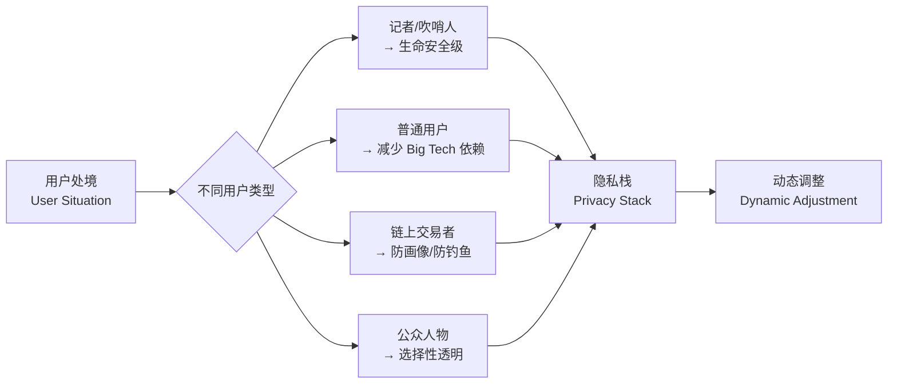

# Neo-Cypherpunk & the Cultural Layers of Privacy

## 本场核心主题概述

本场分享由 Victoria 主持，Web3Privacy Now 核心成员 Peter 主讲，主题是"为什么隐私对建设者重要"。Peter 从 1990 年代的 Cypherpunk 运动讲起，解释 Neo-Cypherpunk 如何在当代语境下重新理解隐私：它不再只是密码学专家或小圈子黑客的事情，而是一套面向普通用户、开发者、艺术家、政策研究者和社区组织者的实践文化。隐私不是产品上线后的补丁，而应当从项目设计初期就被纳入架构边界。

> *整场分享最适合建设者吸收的一句话是：不要等产品做完再补隐私。隐私边界应该在项目最初的设计阶段就被画出来。*

---

## 一、为什么现在要重新讨论 Cypherpunk？

早期互联网曾经被寄予"让人更自由"的期待，但现实中逐渐变成了一个大规模观察、测量、画像和出售用户数据的系统。在这种环境下，隐私不应被理解成一个可有可无的附加功能，而应当是 AI 和 Web3 建设者必须理解的底层能力。

尤其对于开发者来说，隐私问题不应该等产品上线后再修补，而应该在项目最初的设计阶段就考虑：

- 用户数据会在哪里产生？
- 谁能访问这些数据？
- 哪些数据会被链上永久记录？
- 哪些行为模式会被第三方观察到？
- 用户是否有选择透明或匿名的权利？
- 项目是否默认暴露过多信息？

> *Peter 的核心立场很明确：隐私不是 UI 层面的"开关"，而是产品架构、协议设计和社区文化共同决定的能力。*

---

## 二、从 Cypherpunk 到 Neo-Cypherpunk

### 1. 经典 Cypherpunk：密码学作为自由工具

Cypherpunk 运动兴起于 1990 年代。Peter 特别提到 Eric Hughes 的《A Cypherpunk's Manifesto》。当时，密码学更多被视为军事或政府技术，早期 Cypherpunk 希望将密码学转化为公共可用的开源技术、保护个人自由的工具、对抗国家与大型机构监控的基础设施。

经典 Cypherpunk 的重要预判是：互联网未来可能会变成控制、限制和操纵人的工具。从今天的现实来看，这种预判已经部分发生。

### 2. Neo-Cypherpunk：不是怀旧，而是重混

Neo-Cypherpunk 不是简单回到 1993 年的黑客文化。Peter 将它概括为一种新的组合：privacy（隐私）、play（游戏性、可参与性）、care（关怀）、community（社区）、autonomy（自主性）。Neo-Cypherpunk 强调：隐私和自主权属于所有人，不只是密码学家、黑客或极客。

> *这一点是整场分享的中心：Neo-Cypherpunk 把隐私从"专家政治"拉回到"公共文化"。它不要求每个人都成为安全专家，而是让每个人都有能力做出更好的隐私选择。*

---

## 三、Neo-Cypherpunk 的思想来源与发展脉络

Neo-Cypherpunk 这个词最早由 DarkFi 相关的 Rachel O'Leary 提出，后来由都柏林大学区块链教授 Paul Dylan-Ennis 推动其可见度。Web3Privacy Now 尝试进一步重新解释这一概念，并发布了自己的过渡性宣言。

Vitalik Buterin 关于"Make Ethereum Cypherpunk Again"的文章也被 Peter 视为重要语境之一。

### Ethereum 与 Cypherpunk 价值的关系

以太坊不应该只被理解为更高效的金融系统、更容易投机的赌场。它最初也承载了"世界计算机"的愿景，应该具备一些基础价值：privacy preserving（保护隐私）、secure（安全）、open source（开源）、permissionless（无需许可）、censorship resistance（抗审查）。

早期加密技术和区块链并不只是关于"赚钱"或"买币致富"，而是关于重新获得某些过去只有政府才能掌握的能力，例如发行货币、组织协作、建立无需许可的网络。

---

## 四、Neo-Cypherpunk 宣言中的关键主张

### 1. 重新把隐私视为公共品

隐私不只是个人需求，也是一种公共基础设施。如果一个社会中没有隐私，异议表达会受到压制，少数群体更容易被追踪，金融行为会被过度暴露，创新者和建设者会被迫自我审查。

### 2. 资助符合伦理的基础设施

Neo-Cypherpunk 不只是呼吁大家使用隐私工具，也强调要支持那些真正有公共价值的基础设施——尽可能开源、独立、可验证、默认保护用户、不依赖单一中心化机构、不以剥削用户数据为商业模式。

### 3. 鼓励跨背景协作

隐私生态不能只由开发者或密码学家构成。需要让开发者、研究者、政策制定者、艺术家、设计师、市场传播者、教育者、普通用户、人权和自由技术活动者都进入对话。如果每个群体都只待在自己的小圈子里，隐私议题就很难形成真正的社会影响。

### 4. 用互助替代恶性竞争

隐私领域过去常常带有一种"末日感"和"精英感"。Neo-Cypherpunk 希望改变这种氛围：少一点恐惧叙事，多一点互助、好奇、共同学习、幽默和 meme 文化。

### 5. 建立守护自由的社区，但不是恐惧驱动的社区

隐私当然严肃，但参与隐私运动不必永远阴郁。

> *很多安全和隐私教育失败，不是因为技术不重要，而是因为传播方式太沉重、太羞辱用户，导致普通人根本不愿意进入。*

---

## 五、隐私实践：不是绝对匿名，而是持续选择

### 1. 不需要一开始就成为"隐私极端主义者"

Neo-Cypherpunk 不是要求每个人立刻做到 100% 私密。更现实的方式是：理解大型科技公司如何收集数据，理解使用某个工具的后果，在不同场景下选择更合适的隐私工具，从一个小工具开始改变，慢慢构建自己的隐私栈。

例如：用 Brave 替代 Chrome，用 Signal 替代 Telegram / WhatsApp 的部分场景，使用 VPN，使用隐私友好的文档工具，尝试链上隐私工具，逐渐了解 mixer、ZK、匿名支付等技术的存在。

### 2. 隐私是一个 0 到 100 的光谱

- 对某些人来说，10 分隐私已经是进步
- 对另一些人来说，90 分隐私仍然不够
- 对记者、吹哨人、政治活动者来说，隐私可能关乎生命安全
- 对普通用户来说，隐私可能只是减少对 Big Tech 的依赖
- 对链上交易者来说，隐私可能是防止被黑客或钓鱼者盯上
- 对公众人物来说，某些透明度反而是建立信任的方式

没有一种隐私工具或隐私方案适用于所有人。

> *这是一种更成熟的隐私观：隐私不是宗教，也不是身份标签，而是根据风险、目标和处境进行的动态决策。*

---

## 六、Personal Privacy Stack：个人隐私栈

Web3Privacy Now 推动了 Personal Privacy Stack 的概念，鼓励不同人分享自己实际使用的隐私工具组合。这些工具栈不是标准答案，而是用来启发用户：有哪些工具可以替代 Big Tech？哪些工具适合自己的风险模型？哪些工具适合通信、浏览、文档、支付等不同场景？

Peter 举例提到 Fileverse 的 Docs，认为它像 Google Docs 一样易用，但更隐私友好，并且与链上环境结合。

### 隐私工具选择原则

| 原则 | 说明 |
|------|------|
| 不迷信单一工具 | 没有一个工具能解决所有隐私问题 |
| 根据场景选择 | 通信、浏览、支付、协作、身份管理都需要不同工具 |
| 不羞辱别人 | 不应因为别人使用"不够隐私"的工具就进行道德指责 |
| 从低门槛开始 | 能替换一个工具，就是进步 |
| 多栈并存 | 不同人、不同国家、不同风险环境，需要不同隐私栈 |
| 关注可用性 | 工具再安全，如果普通人无法使用，也难以产生社会影响 |

---

## 七、Neo-Cypherpunk 的文化层

### 1. Privacy-first apps：默认隐私优先的应用

包括私密浏览器、私密通信工具、隐私友好的文档协作工具、隐私支付工具、链上隐私协议、安全身份与账户工具。

### 2. On-chain native：理解链上隐私

至少要知道：链上交易是可观察的，地址之间的关系可能被分析，资金流向可以被追踪，巨鲸和高频交易者容易被画像，mixer、隐私池、ZK 等工具的存在和基本用途。

### 3. Collective：隐私需要线下与线上社区

隐私不应只停留在某个 Telegram 群或论坛中，而要走向更广泛的人群。

### 4. Memes and joy：用幽默降低进入门槛

如果隐私传播永远只有恐惧、压迫和末日叙事，很多人会主动远离。meme、玩笑、贴纸、周边文化是降低隐私运动门槛的方式。

### 5. Dialogue, not secrecy：对话，而不只是保密

Neo-Cypherpunk 并不是"所有事情都不要说"，而是要让更多人理解：什么信息应该公开、什么信息应该保护、什么场景需要透明、什么场景需要匿名、谁有权决定这些边界。

---

## 八、Old-school Cypherpunk 与 Neo-Cypherpunk 对比

| 维度 | 经典 Cypherpunk | Neo-Cypherpunk |
|------|----------------|----------------|
| 参与者 | 主要是密码学家、黑客、专家 | 任何人都可以参与，包括普通用户、开发者、设计师、艺术家、政策研究者 |
| 隐私目标 | 个人防御、个人匿名 | 个人隐私 + 社区保护 + 集体韧性 |
| 工具态度 | 强调全栈隐私、极致匿名 | 可以从一个工具开始，逐步提升 |
| 文化气质 | 常见末日感、对抗感 | 更强调 joy、meme、幽默、开放 |
| 政治边界 | 更关注国家权力与个人对抗 | 更全球化，社区可跨越国界形成 |
| 社区关系 | 更个人主义 | 更强调互助、关怀、开放对话 |
| 技术姿态 | 容易出现专家傲慢 | 更希望降低门槛，让更多人加入 |
| 核心问题 | 如何保护我自己 | 如何保护彼此，并建设更自由的基础设施 |

> *Neo-Cypherpunk 的"neo"不只是新工具，而是新社会关系：从个人隐身，走向集体互助。*

---

## 九、Privacy Builder Pack：给建设者的资源包

Web3Privacy Now 提供给开发者的 Privacy Builder Pack，面向想要构建隐私产品、协议或应用的建设者。

| 模块 | 用途 |
|------|------|
| Glossary | 帮助理解隐私领域术语 |
| Tools | 收集面向开发者的隐私相关工具 |
| Ideas Generator | 为隐私项目生成构想，适合黑客松或课程项目 |
| Real-world cases | 收集现实中的隐私挑战与已有解决方案 |
| Frameworks | 帮助开发者结构化思考隐私增强设计 |
| Essentials Explorer | 收录 800+ 隐私相关项目，并对开放性、隐私技术等维度进行评分 |
| Implementation guidelines | 提供某些工具或隐私方案的落地指引 |

### 相关资源

| 资源 | 链接 / 备注 |
|------|------------|
| Web3Privacy Now | https://web3privacy.info |
| Privacy Builder Pack | 疑似入口：builder.web3privacy.info，建议实际使用前核验 |
| Personal Privacy Stack | 可在 Web3Privacy Now 官网或社交媒体中搜索 |
| Neo-Cypherpunk Academy | Web3Privacy Now Academy 相关课程内容 |
| Essentials Explorer | 收录大量隐私项目，可用于调研竞品和寻找技术灵感 |

---

## 十、Q&A 整理

### Q1：很多人并不在乎隐私，身边朋友和家人也不愿意换隐私工具，怎么办？

成为 Neo-Cypherpunk 并不意味着必须所有通信都用 Signal。隐私不是"全有或全无"的选择，而是一个从 0 到 100 的光谱。如果无法和父母、朋友使用 Signal，你仍然可以使用隐私浏览器、VPN，在其他场景中替换工具。如果私密通信只能做到 10 分，那剩下还有 90 分的隐私实践空间可以探索。

> *隐私教育最大的敌人不是"别人不懂"，而是把隐私讲成一种道德洁癖。*

### Q2：如果被迫接受检查或安装官方通信工具，该怎么办？

以俄罗斯为例，政府通过企业、运营商、大学等机构间接推动官方通信工具。一种现实做法是：购买一部非常便宜的备用智能手机，只在这台手机上安装官方工具，用它完成必要服务，不让其接触主设备中的私人数据。这不是鼓励组织秘密社区，而是理解监控如何运作，并通过设备隔离降低风险。

### Q3：AI Agent 之间会通信，也会代表用户执行操作。Agent 的消息发送和交互如何保护隐私？

这是非常前沿的问题，目前没有成熟通用答案。未来可能需要：隐私友好的 Agent、Agent 通信的隐私层、中继层、私密交易执行机制、可选择透明度的 Agent 架构、面向 AI Agent 的隐私基础设施。

> *AI Agent 隐私是一个尚未充分开发的方向，尤其涉及 Agent 通信、链上执行和用户授权。*

### Q4：AI 时代，隐私运动是否不仅要保护人类免受监控，也要保护人类免受 AI 本身的影响？

AI 行业发展太快、资金太多、玩家太多。今天有效的应对方案，明天可能就过时。这使得隐私和安全领域常常会落后一步。这是一个会持续存在的挑战，行业必须承认自己很可能长期处在"追赶 AI 速度"的状态中。

### Q5：AI Agent 在链上执行多笔交易，到什么程度会变成隐私敏感问题？

没有统一答案，取决于用户身份和使用场景。Agent 应当允许用户选择隐私等级：完全私密、部分可见、完全公开。理想情况下，应当默认提供某种隐私层，让用户避免被诈骗、钓鱼或恶意画像，但同时也允许有透明需求的人主动公开。

| 设计问题 | 建议 |
|---------|------|
| Agent 是否默认公开交易？ | 不应默认过度暴露 |
| 用户是否能选择隐私等级？ | 应提供可配置选项 |
| 是否所有人都需要匿名？ | 不是，有些人需要透明建立信任 |
| 最小可行隐私层是什么？ | 至少防止普通用户被轻易画像、诈骗和攻击 |

### Q6：现在很多加密项目越来越像金融游戏，行业是否已经偏离了最初的 Cypherpunk 精神？

是的，整个行业已经非常远离 Cypherpunk 精神。大量精力转向发币、炒币、空投、追逐百倍币、把技术变成赌场。但也有力量正在尝试把行业拉回更有价值的方向。Ethereum 近来的 CROPS 价值取向——Censorship resistance、Open source、Privacy、Security、Permissionless——正是这种回归的体现。

### Q7：用协议、代码和数学替代银行、政府等机构，是否只是把权力从一个口袋转移到另一个口袋？

关键不在于"是不是协议"，而在于协议如何实现。如果协议具备抗审查、开源、隐私保护、安全、无需许可、可验证、不依赖黑箱等特征，人们才更可能信任它。但如果所谓区块链只是政府或银行私有控制的链，它并不会改变权力结构。

> *Web3 的去中心化不是由"用了区块链"自动产生的，而是由治理结构、代码开放性、验证机制和权限设计共同决定的。*

### Q8：追踪巨鲸钱包是侵犯隐私，还是 Web3 透明链上文化的有趣之处？

这是一个伦理问题，没有简单答案。从巨鲸个人角度看，他们可能希望交易保持私密；从社会角度看，公众又可能希望巨鲸保持透明以防止操纵。隐私首先应该由当事人决定自己愿意公开多少，但链上透明性和公共利益之间确实存在长期张力。

---

## 十一、关键洞见沉淀

1. 隐私不是附加功能，而是产品和协议的基础能力。
2. Neo-Cypherpunk 不是怀旧，而是把 Cypherpunk 精神重新适配到 AI、Web3 和大众互联网时代。
3. 隐私不是只有专家能参与，普通用户从一个工具开始替换也是实践。
4. 隐私不是 0 或 1，而是根据风险模型变化的光谱。
5. 隐私工具的传播不能只靠恐惧，也需要幽默、meme、社区和低门槛体验。
6. AI Agent 隐私是一个尚未充分开发的方向，尤其涉及 Agent 通信、链上执行和用户授权。
7. Web3 行业确实偏离了早期自由技术的理想，但仍有机会通过开源、抗审查、隐私和无需许可回到更有公共价值的方向。
8. 协议并不天然比机构更可信，只有开放、可验证、抗审查、无需许可的协议才可能真正改变权力关系。
9. 链上透明与个人隐私之间存在长期张力，巨鲸钱包追踪只是这个矛盾的典型案例。
10. 真正有生命力的隐私文化，不是让所有人恐惧，而是让更多人愿意加入、理解并实践。

---

## 附：biliGPT 视频章节摘要

| 章节 | 主题 | 内容概要 |
|------|------|----------|
| Ch.1 | Neo-Cypherpunk 定义 | 从经典 Cypherpunk 运动到 Neo-Cypherpunk 的演进，核心主张是把隐私从专家领域拉回公共文化 |
| Ch.2 | 个人隐私栈（Personal Privacy Stack） | 鼓励个人根据自身风险模型选择隐私工具组合，不要求一步到位，强调从一个工具开始替换 |
| Ch.3 | 社区协作与文化层 | 隐私不只是技术问题，需要跨背景协作（开发者、艺术家、政策研究者等），用 meme 和幽默降低门槛 |
| Ch.4 | AI 时代的隐私挑战 | AI Agent 隐私、链上执行隐私、Agent 通信保护等前沿问题，目前尚无成熟通用方案 |
| Ch.5 | 哲学讨论与反思 | 隐私与透明的张力、协议 vs 机构的权力关系、行业是否偏离 Cypherpunk 精神 |

---

> *清洗说明：biliGPT 原始输出结构基本规范。清洗动作：补全 YAML frontmatter（url / duration / speaker）、表格格式统一、列表缩进修正、Q&A 编号统一。已恢复 biliGPT 原始 Mermaid 代码块（用户隐私需求流程图）和视频章节摘要。未改写表述。*

#BibiGPT https://bibigpt.co
