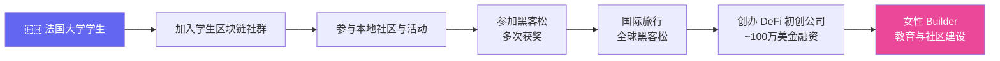
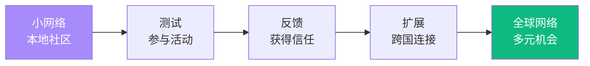
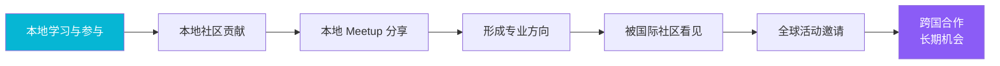

# Women Builders in AI × Web3：女性 Builder 如何进入全球 AI × Web3 网络

## 本场核心主题概述

本场分享围绕"女性 Builder 如何在 AI × Web3 领域建立长期机会"展开。嘉宾强调，学习技术和做项目只是进入生态的第一步，真正能帮助一个 Builder 长期成长的，是可信任的全球网络、持续贡献记录和被看见的个人品牌。她结合自己从法国学生区块链社群起步、参与黑客松、创办 DeFi 初创公司并融资、再到建设女性开发者社区的经历，说明 Web3 的机会往往来自社区、开源、黑客松、线下活动和跨国连接。

> *学习和构建只是起点，真正帮助 Builder 长期成长的是网络、信任和持续贡献。*

---

## 一、嘉宾背景与个人路径

### 1. 从学生社区进入 Web3

嘉宾最初在法国巴黎读书期间，通过大学里的学生区块链社群进入 Web3，已深度参与六年以上。早期路径：法国大学学生 → 加入学生区块链社群 → 参与本地社区与活动 → 参加黑客松并多次获奖 → 开始国际旅行与全球黑客松 → 创办 DeFi 初创公司 → 完成约 100 万美元融资 → 转向女性 Builder 教育与社区建设。

> *这里的重点不是"英语好就能成功"，而是 Web3 / AI 的核心信息流、项目合作和国际活动大多发生在英语语境中。英语能力本质上是扩大机会半径。*

### 2. 黑客松、创业与社区工作的积累

嘉宾曾参与大量黑客松并多次获奖，后来创办一家 DeFi 初创公司并完成约 100 万美元融资。也曾获得 Ledger 实习机会、担任多个生态 Ambassador、深度参与社区建设。

### 3. 当前项目：面向女性 Builder 的全球社区

嘉宾目前运营的社区（Dev3pack / Web3 Backpack）核心定位是支持女性进入 Web3 / AI × Web3，面向学生和年轻 Builder，提供教育、项目实践、黑客松、加速器、线下社区和国际连接。

社区目前主要包含四类活动：

| 模块 | 内容 |
|------|------|
| Bootcamp | 在线或线下训练营，帮助新人系统学习 |
| Hackathon | 黑客松，推动成员真正做项目 |
| Accelerator | 加速器，帮助项目进一步成长 |
| Popup Village / Residency | 线下驻留、主题城市活动，促进深度连接与合作 |

---

## 二、核心观点：网络才是长期杠杆

### 1. 学习与构建是基础，但不是全部

很多优秀开发者存在的问题是：缺少 founder mindset；不知道如何从项目走向产品；不懂如何 scale 一个项目；不知道如何找到合作伙伴、投资人或早期用户。生态中的合作、投资和机会，往往不是先押注项目，而是先押注人——看你的履历、信誉和连接。

> *早期项目大多不确定，技术方向也可能变化，但人的履历、信誉和连接会持续积累。*

### 2. Network is everything：网络就是分发能力

嘉宾反复强调 **network is everything**。网络不是"认识很多人"这么简单，而是你能够在某个具体语境中找到用户、合作者、联合创始人、投资人、技术伙伴、招聘机会、社区支持、全球活动入口。

### 3. 技术会被快速颠覆，网络和经验更稳定

AI 和 Web3 的创新周期非常快，今天学到的东西可能一个月后就被新工具打破。相比之下更稳定的是：你的个人经验、积累的信任、做过的项目、参与过的社区、和谁建立了长期关系。

> *她不是否定技术学习，而是在提醒：技术能力需要不断更新，但关系网络和可信记录是复利资产。*

---

## 三、Builder 的成长路径

### 1. Onboarding：先进入正确的信息场

新人可以通过线上 Bootcamp、本地 Meetup、学校区块链社团、女性开发者社区、中文或区域性 Web3 社区、AI × Web3 学习小组、黑客松预备营等方式进入生态。

### 2. Learning：学习之后要马上实践

不要只停留在学习阶段。学完以后应尽快做出实际贡献：参与开源项目、在黑客松中提交 Demo、成为某个项目的 Ambassador、写教程或经验贴、帮社区组织活动、做一个最小可运行产品。

### 3. Contributing：贡献记录会成为你的可信履历

贡献可以小，但必须真实、持续。尤其在 Web3 生态里，开源贡献、GitHub 记录、黑客松项目、链上交互和公开内容，都可能成为别人判断你的依据。

### 4. Becoming Builder：不要一开始只盯着"找工作"

很多人进入生态第一反应是找工作，但市场已经非常饱和。更现实的路径是：先以 Builder 心态构建项目，尽量像 founder 一样思考，用作品和贡献证明自己，再通过网络获得工作、合作或创业机会。

> *不要把"投简历"当作唯一入口，Web3 的很多机会反而来自"先做出来、先贡献、先被看见"。*

---

## 四、如何建立自己的第一批全球网络

### Step 1：优先学习英语

大量项目信息以英语发布；全球活动、黑客松、资助计划多用英语沟通；X/Twitter 上的核心讨论以英语为主；英语能帮助你跳出本地信息茧房。可行学习方式：看英文剧集、阅读英文技术内容、找平台进行一对一英语口语练习、每天用英文写短帖、在社区中尝试用英语发问和介绍自己。

### Step 2：建立并经营 X/Twitter 账号

X/Twitter 的作用：连接项目方、认识 Builder、追踪生态动态、公开展示作品、参与讨论、建立个人品牌。建议先创建账号、关注正确的人、学习平台内容风格、不要把 X 当成 LinkedIn 来发、围绕具体方向持续输出。

> *X 的价值不只是"发动态"，而是让你的学习和构建过程变成可被搜索、可被信任、可被转发的公开履历。*

### Step 3：加入与你身份和兴趣相关的社区

| 维度 | 可加入的社区类型 |
|------|----------------|
| 身份 | 女性开发者、学生开发者、亚洲 Builder、中文 Web3 社区 |
| 兴趣 | DeFi、AI Agent、Solana、Ethereum、ZK、NFT、DAO |
| 地域 | 中国社区、上海 / 北京 Meetup、亚洲开发者社区 |
| 技术方向 | 开源社区、黑客松社区、开发者工具社区 |

### Step 4：参加 Meetup，即使不知道会发生什么

越是在你不知道会发生什么的场合，越可能出现意外机会——未来联合创始人、招聘机会、投资人、项目合作方、国际活动入口。

### Step 5：申请 Fellowship Program

Fellowship 通常比普通训练营更结构化，可能持续 1 个月到 1 年，包含系统课程、导师、项目实践、社区连接、Demo 展示、合作伙伴资源。但较好的 Fellowship 往往需要一定基础和网络。

### Step 6：参加 Residency / Popup City

Residency 或 Popup City 的价值在于"带语境的社交"——大家天然共享活动主题、学习目标、技术方向、时间安排、项目场景，让交流更自然、更有效。

### Step 7：加入 Ambassador Program

Ambassador Program 能直接给你项目方背书，也能给你创造活动和展示空间。一些公司会优先从 Ambassador 社群中招人。但不要随便加入低质量项目的 Ambassador Program，否则可能损害自己的信誉。

### Step 8：贡献开源

开源贡献的好处：展示真实技术能力、建立 GitHub 履历、被项目方看到、获得 Fellowship 或 Grant 机会、进入核心开发者网络。技术招聘者常常会先看 GitHub，而不是 LinkedIn。对于不喜欢黑客松压力的人，开源尤其适合。

### Step 9：成为本地 Meetup 的 Speaker

即使项目还处于很早期，也可以尝试在本地 Meetup 做分享。成为 Speaker 能增加可信度、为项目获得曝光、认识更多同领域的人、可能找到用户、导师、合作者或投资人。

### Step 10：先在本地做出成绩，再走向国际

路径：本地学习与参与 → 本地社区贡献 → 本地 Meetup 分享 → 形成专业方向 → 被国际社区看见 → 获得全球活动邀请 → 跨国合作与长期机会。

### Step 11：在国际活动中做志愿者

志愿者身份的好处：比普通参会者更容易融入、有明确任务不会尴尬、能认识组织者、项目方和核心参与者。对于害羞的人，志愿者身份反而能降低社交压力。

### Step 12：持续输出内容，建设个人品牌

可输出内容：学习笔记、项目进展、黑客松复盘、开源贡献记录、技术教程、社区观察、Demo 视频、产品思考。核心不是包装自己，而是让别人看到你在持续做事。

---

## 五、案例：网络、开源与公开构建如何改变机会

### 1. Diana：通过 Build in Public 获得新机会

Diana 曾被裁员，但因为她长期在公开平台上 build in public，后来获得了 WalletConnect 的工作机会。公开构建能扩大可见度，内容输出会积累信任，个人品牌可能成为职业转折点。

### 2. Maje：从 Web2 转向 Web3，靠开源打开机会

通过贡献 Starknet 生态开源项目，逐步获得以太坊协议相关 Fellowship、Paradigm、a16z 等机会。开源贡献可以帮助一个人从原有行业迁移到 Web3。

### 3. Sebastian Samson：从缺少设备到创建本地学生区块链社区

来自哥斯达黎加，起初没有笔记本电脑，公开发帖说明情况后 Celestia 团队给他提供了一台。后来他领导了很多开源项目，并在哥斯达黎加创建学生区块链社区。

> *这里不是鸡汤，而是 Web3 社区文化中的一个核心机制：获得资源后继续贡献，生态才会可持续。*

---

## 六、嘉宾对 AI × Web3 的判断

### 为什么选择 AI + Web3

嘉宾明确表示会选择 AI + Web3。理由：Web3 允许在开放网络上构建，不依赖封闭系统；可以通过组合不同协议、模块和链上基础设施做出新项目；AI 能显著加速构建过程；未来十年 Agentic Economy 可能非常重要；AI Agent 可能比人类更高频地使用 Web3。

> *她的判断重点是"开放基础设施 + 智能体自动化"。Web3 提供开放结算和可组合协议，AI 提供自动化执行和生产力，两者结合会产生新型应用空间。*

### Agent 经济中的潜在方向

| 方向 | 含义 |
|------|------|
| Agent 使用链上协议 | AI Agent 自动完成交易、支付、治理、资产管理 |
| 面向 Agent 的应用 | 产品用户不一定是人，也可能是自动化代理 |
| 链上身份与信誉 | Agent 需要可验证身份、权限和行为记录 |
| 开放金融基础设施 | DeFi 可作为 Agent 的金融执行层 |
| AI 加速开发 | Builder 用 AI 工具更快完成原型、Demo 和项目迭代 |

---

## 七、Q&A 整理

### Q1：如果今天重新开始职业生涯，会选择 AI、Web3，还是 AI + Web3？

选择 AI + Web3。Web3 的优势在于开放协议上构建，不必依赖封闭系统。AI 的作用是加速构建。未来 Agentic Economy 中，AI Agent 可能会大量使用 Web3。

### Q2：早期 Builder 的个人品牌有多重要？

加入有结构化项目的社区 → 参与项目 → 构建真实项目 → 贡献开源 → 维护 GitHub → 持续输出内容 → 通过社区连接到更多机会。

### Q3：冷启动联系陌生导师或 BD 对象时，对方不回复怎么办？

取决于对方是否和你处在同一个社区或共同网络里。可尝试：找共同好友介绍、通过同一社区建立上下文、先在公开内容下互动、让自己的 X / GitHub / 项目主页看起来可信。

### Q4：艺术背景想成为全栈 Builder，如何补足工程能力？

先使用 vibe coding 工具把自己的设计能力结合进去。最有"taste"的项目往往不是完全由 AI 自动生成设计，而是设计师先做好设计再接入项目。先用 AI coding 工具快速做原型，在真实问题中补工程能力。

### Q5：Dev3pack 下一步是什么？

从 9 月开始扩展约 20 个以上本地分部（秘鲁、玻利维亚、阿根廷、肯尼亚、尼日利亚、印度等），每个 Chapter 组织大学项目、本地活动并连接到全球黑客松和加速器。

---

## 八、可执行清单

### 一周内完成

- [ ] 创建或整理 X/Twitter 账号
- [ ] 更新 GitHub 头像、简介和 pinned repositories
- [ ] 找 3-5 个 AI × Web3 方向的优质账号关注
- [ ] 加入一个中文社区和一个英文社区
- [ ] 用英文写一条自我介绍帖
- [ ] 选择一个方向：DeFi、AI Agent、Solana、Ethereum、开源工具等

### 一个月内完成

- [ ] 参加至少一次线上 Workshop 或 Meetup
- [ ] 完成一个小 Demo
- [ ] 写一篇项目复盘或学习笔记
- [ ] 给一个开源项目提 issue、文档修正或小 PR
- [ ] 主动联系 3 位同方向 Builder
- [ ] 申请一个黑客松或训练营

### 三个月内完成

- [ ] 参加一次黑客松并提交项目
- [ ] 在 X 上持续记录构建过程
- [ ] 在本地社区做一次小分享
- [ ] 尝试申请 Ambassador Program
- [ ] 维护一个可展示的 GitHub 项目
- [ ] 找到至少一位长期交流的 mentor 或 peer

### 半年到一年内完成

- [ ] 形成一个明确方向
- [ ] 有持续更新的公开作品集
- [ ] 参与开源或社区核心贡献
- [ ] 进入更高质量 Fellowship / Accelerator
- [ ] 尝试国际活动、志愿者或 Residency
- [ ] 建立跨国网络，而不只停留在本地圈层

---

## 视频章节摘要

| # | 章节 | 时间段 | 要点 |
|---|------|--------|------|
| 1 | 全球视野：为什么英语和国际网络是必须 | 00:00–08:00 | 从法国学生社区起步，经历黑客松、DeFi 创业到全球女性 Builder 社区；英语是扩大机会半径的工具，不是门槛 |
| 2 | Builder 路径：从学习到创始人 | 08:00–18:00 | Onboarding → Learning → Contributing → Builder → Founder 五步成长路径；先做出来、先贡献、先被看见 |
| 3 | 网络构建：12 个具体步骤 | 18:00–35:00 | X/Twitter 经营、社区加入、Meetup、Fellowship、Residency、Ambassador、开源贡献、本地 Speaker、国际志愿者、内容输出 |
| 4 | 案例分析：Diana / Maje / Sebastian | 35:00–48:00 | Build in Public 获得 WalletConnect 机会；开源贡献从 Web2 迁移到 Web3；社区文化中的资源→贡献循环 |
| 5 | Q&A：AI + Web3 方向与 Dev3pack 未来 | 48:00–59:42 | AI + Web3 是最优选择；冷启动联系技巧；艺术背景补工程能力；Dev3pack 扩展 20+ 本地分部 |

---

> *清洗说明：biliGPT 原始输出结构基本规范。清洗动作：补全 YAML frontmatter（url / duration / speaker）、表格格式统一、列表缩进修正。Mermaid 代码块（4 处）和视频章节摘要已恢复还原。未改写表述。*

#BibiGPT https://bibigpt.co
