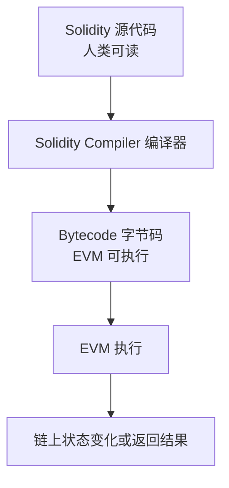
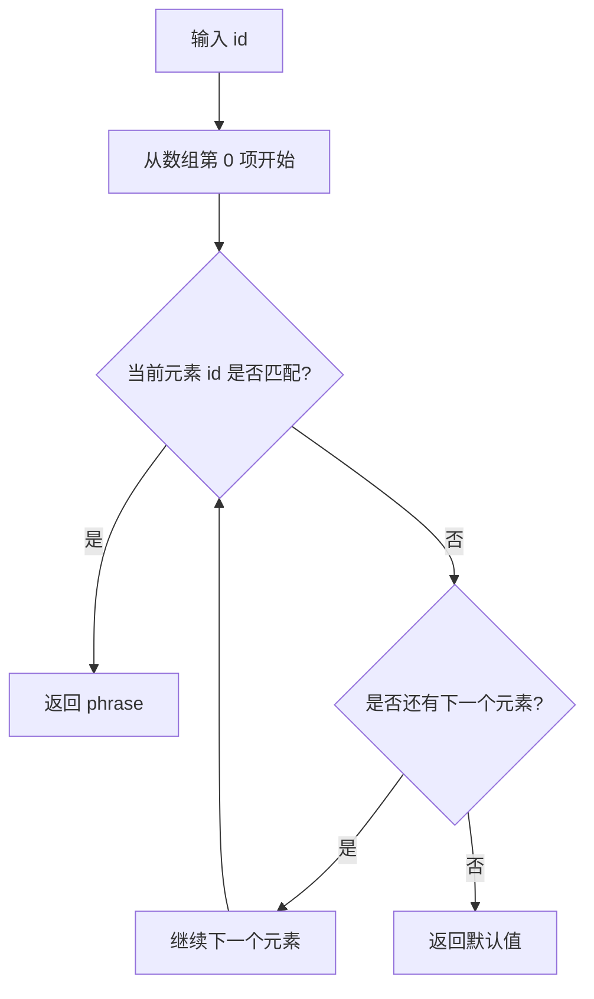
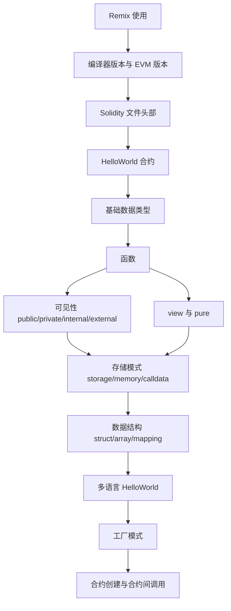

# 第二课：Solidity 基础 — Hello World


### 本课核心摘要
- 这一课以 `Hello World` 合约为主线，从 Remix 在线 IDE 的使用讲起，逐步覆盖 Solidity 智能合约开发的基础流程：编写、编译、部署、调用与修改状态。课程先解释了 Solidity 编译器版本和 EVM 版本的区别：编译器负责理解 Solidity 语法并生成字节码，EVM 负责执行字节码，因此两者版本不匹配时可能导致部署或执行失败。随后介绍合约文件的基本头部，包括开源协议 `SPDX-License-Identifier` 和编译器版本声明 `pragma solidity`。
- 在语法层面，本课讲解了 Solidity 的基础数据类型，如 `bool`、`uint256`、`int256`、`bytes`、`string`、`address`，并通过函数引入了读取、修改、计算三类操作。接着重点解释了函数可见性 `public`、`private`、`internal`、`external`，以及 `view`、`pure` 的区别。
- 课程后半部分进入更实用的合约设计：先讲解 `storage`、`memory`、`calldata` 三种主要存储模式，再通过多语言 `Hello World` 的需求引入 `struct`、`array`、`mapping` 三种数据结构。最后通过工厂模式演示合约之间的互操作：一个工厂合约可以创建多个 `HelloWorld` 合约实例，并统一存储、查询和调用它们。

> *批注：这一课不是单纯写一个"Hello World"，而是借这个极小合约，把 Solidity 开发里最常遇到的概念都串了一遍：版本、类型、函数、存储、数据结构、合约交互。后面学 ERC20、NFT、Hardhat 时，这些都是底层地基。*

---


### 核心步骤


#### Step 1：理解 Remix 的编译配置
- Remix 是一个在线 Solidity IDE，可以用来编写、编译、部署和测试智能合约。
- 在 Remix 的 Solidity Compiler 选项卡中，主要关注两个配置：
  1. **Compiler Version：Solidity 编译器版本**
  2. **Advanced Configuration：高级配置**
     - Language：编程语言
     - EVM Version：EVM 版本

---


#### 1.1 Solidity 编译器版本
- Solidity 编译器版本从很早的 `0.1.x` 到当前较新的 `0.8.x` 系列不断演进。
- 课程中使用的是 `0.8.x` 版本，例如：

```solidity
pragma solidity ^0.8.20;
```

- 编译器的主要作用是：
  把人类能读懂的 Solidity 高级语言代码，转换成 EVM 可以执行的字节码。



- Solidity 编译器通常有一定的向前兼容能力：
  - 较新的编译器通常可以编译较旧语法写出的代码。
  - 较旧的编译器不一定能编译较新语法写出的代码。
  - 新语法往往只有新版本编译器才能识别。

> *批注：这里要注意一个细节：`^0.8.20` 在 Solidity 中并不是"所有高于 0.8.20 的版本都可以"，更准确地说是 `>=0.8.20` 且 `<0.9.0`。它允许同一主版本内的兼容升级，但不会自动跨到 `0.9.x`。*

---


#### 1.2 Language：Solidity 与 Yul
- Remix 虽然主要用于 Solidity 开发，但也支持其他智能合约语言，例如 `Yul`。
- 课程选择 Solidity 的原因：
  - Solidity 生态最大。
  - 工具、库、框架支持最完善。
  - 大多数 EVM 智能合约开发岗位使用 Solidity。
  - Hardhat、Foundry、OpenZeppelin 等主流工具链都围绕 Solidity 建设。
- 其他语言可能在某些执行效率或底层控制上有优势，但入门和主流开发更推荐 Solidity。

---


#### 1.3 EVM Version：以太坊虚拟机版本
- EVM Version 指的是目标 EVM 的版本，例如：
  - Berlin
  - London
  - Paris
  - Shanghai
  - Cancun
- 这些名称通常对应以太坊的重要升级。
- EVM 版本决定的是：
  当前虚拟机支持哪些底层指令，也就是 opcode 指令集。
- 例如从 Paris 到 Shanghai 的升级中，增加了 `PUSH0` 相关指令。如果编译时选择了较新的 EVM 版本，但实际部署的链仍是旧 EVM 版本，就可能出现部署失败或执行失败。


##### Compiler Version 与 EVM Version 的区别

| 项目 | 作用 | 决定什么 | 举例 |
|---|---|---|---|
| Solidity Compiler Version | 编译器版本 | 哪些 Solidity 语法可以被识别并编译 | 新语法旧编译器可能不认识 |
| EVM Version | 虚拟机版本 | 字节码中哪些底层指令可以被执行 | 旧 EVM 可能不支持 `PUSH0` |

> *批注：编译器管"你怎么写代码"，EVM 管"链能不能执行这段字节码"。多链部署时，如果某条链 EVM 版本较旧，哪怕 Solidity 代码没问题，也可能部署失败。*

---


### Step 2：理解 Remix 的部署环境
- Remix 的 Deploy & Run Transactions 面板中，最重要的是 `Environment`。
- 常见选项包括：

| Environment | 含义 | 适用场景 |
|---|---|---|
| Remix VM Shanghai | 本地模拟的 Shanghai EVM 环境 | 学习、测试、快速验证 |
| Remix VM London / Berlin 等 | 本地模拟不同 EVM 版本 | 测试不同 EVM 兼容性 |
| Injected Provider | 使用浏览器钱包注入的网络环境 | 连接 MetaMask，部署到测试网或主网 |

- 如果选择 `Injected Provider`：
  - MetaMask 当前连的是以太坊主网，合约就会部署到以太坊主网。
  - MetaMask 当前连的是 Polygon 测试网，合约就会部署到 Polygon 测试网。
  - 真实链上部署会消耗真实或测试网 Gas。
- 本课使用：

```text
Remix VM Shanghai
```

- 这是 Remix 提供的本地测试环境，不会真正部署到公共区块链上。

---


#### 2.1 Account、Gas Limit、Value

| 配置项 | 含义 |
|---|---|
| Account | Remix 提供的本地测试账户，每个账户通常会有测试 ETH |
| Gas Limit | 当前交易最多能消耗的 Gas 数量 |
| Value | 调用合约时随交易发送的 ETH 数量 |

- `Value` 常用于调用 `payable` 函数。普通函数调用一般保持为 `0`。

---


### Step 3：创建 Solidity 文件基本头部
- 一个 Solidity 文件开头通常包括两部分：
  1. 开源协议声明
  2. Solidity 编译器版本声明

```solidity
// SPDX-License-Identifier: MIT
pragma solidity ^0.8.20;
```

---


#### 3.1 SPDX-License-Identifier
- 如果不写开源协议，Remix 会给出 warning：

```text
SPDX license identifier not provided in source file
```

- 常见写法：

```solidity
// SPDX-License-Identifier: MIT
```

- `MIT` 是一种较宽松的开源协议。大致含义是：
  - 他人可以使用、修改、分发代码。
  - 可以用于商业用途。
  - 作者通常不承担因使用代码产生的问题责任。
- 如果不想声明开源协议，也可以写：

```solidity
// SPDX-License-Identifier: UNLICENSED
```

> *批注：课程里对 MIT 协议的解释是入门级理解。真正发布商业项目时，开源协议不是随便选的，最好认真阅读协议原文或咨询专业人士。*

---


#### 3.2 pragma solidity
- 如果不声明编译器版本，Remix 也会给 warning：

```text
Source file does not specify required compiler version
```

- 推荐写法：

```solidity
pragma solidity ^0.8.20;
```

- 表示当前合约应使用 Solidity `0.8.20` 及以上、但不跨 `0.9.0` 的兼容版本进行编译。

---


### Step 4：编写第一个 HelloWorld 合约
- 合约使用 `contract` 关键字声明：

```solidity
// SPDX-License-Identifier: MIT
pragma solidity ^0.8.20;

contract HelloWorld {

}
```

- `contract HelloWorld {}` 中的花括号内部，用于编写：
  - 状态变量
  - 函数
  - 结构体
  - 映射
  - 事件
  - 修饰器
  - 构造函数等

---


### Step 5：Solidity 基础数据类型
- Solidity 中常见基础数据类型包括：

| 类型 | 说明 | 示例 |
|---|---|---|
| `bool` | 布尔值，只能是 `true` 或 `false` | `bool flag = true;` |
| `uint` / `uint256` | 无符号整数，只能表示非负整数 | `uint256 count = 100;` |
| `int` / `int256` | 有符号整数，可以表示正数和负数 | `int256 num = -1;` |
| `bytesN` | 固定长度字节数组，`N` 最大为 32 | `bytes32 data;` |
| `bytes` | 动态字节数组 | `bytes data;` |
| `string` | 字符串，本质上可理解为动态字节数组 | `string name = "hello";` |
| `address` | 地址类型，用于保存钱包地址或合约地址 | `address owner;` |

---


#### 5.1 bool：布尔类型

```solidity
bool boolVariable1 = true;
bool boolVariable2 = false;
```

- Solidity 中布尔值只能写 `true` 或 `false`，不能用 `1`、`0`、非零值来代替。
- 错误示例：

```solidity
bool flag = 1; // 错误
```

> *批注：Solidity 的类型系统比很多脚本语言更严格。这和智能合约部署后难以修改有关：链上代码一旦出错，代价通常比传统后端高得多。*

---


#### 5.2 uint：无符号整数
- `uint` 表示 unsigned integer，即无符号整数，只能存储非负整数。
- 常见写法：

```solidity
uint256 number = 100;
```

- `uint` 默认等价于 `uint256`：

```solidity
uint a = 1;
uint256 b = 1;
```

- 虽然二者等价，但更推荐显式写成 `uint256`，可读性更好。

---


#### 5.3 uint8 的范围
- `uint8` 表示 8 位无符号整数，能存储的范围是：

```text
0 ~ 2^8 - 1
也就是 0 ~ 255
```

- 示例：

```solidity
uint8 a = 255; // 正确
uint8 b = 256; // 错误，超出范围
```

- 如果赋值超过范围，编译器会报错：

```text
Literal is too large to fit in uint8
```

---


#### 5.4 int：有符号整数
- 如果需要保存负数，使用 `int` 或 `int256`：

```solidity
int256 intVariable = -1;
```

- `int` 默认等价于 `int256`，但仍建议显式写 `int256`。

---


#### 5.5 bytes、bytesN 与 string


##### 固定长度 bytes

```solidity
bytes32 bytesVariable = "hello world";
```

- `bytes8`、`bytes16`、`bytes32` 等表示固定长度字节数组。最大是 `bytes32`，没有 `bytes64`。
- 如果字符串长度超过固定字节长度，会报错：

```solidity
bytes8 data = "hello world"; // 可能超出 bytes8 容量
```


##### string

```solidity
string strVariable = "hello world";
```

- `string` 是动态长度字符串，不需要提前指定字节长度，编译器会根据实际内容处理。


##### bytes 与 bytesN 的区别

| 类型 | 含义 |
|---|---|
| `bytes1` ~ `bytes32` | 固定长度字节数组 |
| `bytes` | 动态字节数组 |
| `string` | 动态字符串，可理解为特殊的动态 bytes |

> *批注：如果确定内容长度固定且较短，使用 `bytesN` 可能更节省存储；如果内容长度不确定，使用 `string` 更方便。链上开发里，"方便"和"Gas 成本"经常要做权衡。*

---


#### 5.6 address：地址类型
- `address` 用于保存钱包地址或合约地址。

```solidity
address addr = 0x1234567890123456789012345678901234567890;
```

- 注意：
  - 地址不是字符串。
  - 地址不需要双引号。
  - 字符串地址 `"0x123..."` 和 `address` 类型不是一回事。

---


### Step 6：函数基础：读取、修改与计算
- Solidity 中，函数用于实现合约逻辑。函数可以：
  - 读取状态变量
  - 修改状态变量
  - 进行计算
  - 返回结果
  - 调用其他函数
  - 调用其他合约

---


#### 6.1 函数基本结构

```solidity
function 函数名(参数列表) 可见性 修饰关键字 returns (返回类型) {
    函数逻辑
}
```

- 例如：

```solidity
string stringVariable = "hello world";

function sayHello() public view returns (string memory) {
    return stringVariable;
}
```

- 这个函数表示：
  - 函数名：`sayHello`
  - 可见性：`public`
  - 类型：`view`，只读取状态，不修改状态
  - 返回值：`string memory`
  - 逻辑：返回 `stringVariable`

---


### Step 7：函数可见性
- Solidity 中常见可见性有四种：

| 可见性 | 当前合约内部 | 子合约 | 外部合约 | 外部账户 |
|---|---:|---:|---:|---:|
| `public` | ✅ | ✅ | ✅ | ✅ |
| `private` | ✅ | ❌ | ❌ | ❌ |
| `internal` | ✅ | ✅ | ❌ | ❌ |
| `external` | ❌* | ❌* | ✅ | ✅ |

- 说明：
  - `public`：最开放，内部和外部都可以访问。
  - `private`：仅当前合约内部可访问，子合约也不能访问。
  - `internal`：当前合约和子合约可访问，外部不能访问。
  - `external`：主要给外部调用，合约内部不能直接像内部函数一样调用。

> *批注：`external` 函数并不是绝对不能从合约内部调用，而是不能直接用 `foo()` 这种内部调用形式，需要通过 `this.foo()` 走外部调用。但入门阶段可以先记成"external 面向外部"。*

---


### Step 8：view 与 pure


#### 8.1 view：只读取状态
- 如果函数只读取链上状态变量，不修改状态，可以加 `view`。

```solidity
function sayHello() public view returns (string memory) {
    return stringVariable;
}
```

- `view` 函数不能修改状态变量。

---


#### 8.2 pure：不读取也不修改状态
- 如果函数既不读取状态变量，也不修改状态变量，只基于参数做计算，可以加 `pure`。

```solidity
function addInfo(string memory helloWorldString)
    internal
    pure
    returns (string memory)
{
    return string.concat(helloWorldString, " from Frank's contract");
}
```

- `pure` 函数适合纯计算逻辑。

---


### Step 9：完整 HelloWorld 初版

```solidity
// SPDX-License-Identifier: MIT
pragma solidity ^0.8.20;

contract HelloWorld {
    string stringVariable = "hello world";

    function sayHello() public view returns (string memory) {
        return stringVariable;
    }

    function setHelloWorld(string memory newString) public {
        stringVariable = newString;
    }

    function addInfo(string memory helloWorldString)
        internal
        pure
        returns (string memory)
    {
        return string.concat(helloWorldString, " from Frank's contract");
    }
}
```

- 如果希望 `sayHello()` 返回拼接后的信息，可以改成：

```solidity
function sayHello() public view returns (string memory) {
    return addInfo(stringVariable);
}
```

- 这样返回结果会类似：

```text
hello world from Frank's contract
```

---


### Step 10：在 Remix 中部署与调用
- 部署流程：
  1. 在 Solidity Compiler 面板点击 Compile。
  2. 切换到 Deploy & Run Transactions 面板。
  3. Environment 选择 `Remix VM Shanghai`。
  4. Account 使用默认测试账户。
  5. Gas Limit 使用默认值。
  6. Value 保持 `0`。
  7. Contract 选择 `HelloWorld`。
  8. 点击 `Deploy`。
- 部署后，在 `Deployed Contracts` 区域可以看到合约实例。
- 不同颜色按钮含义通常是：

| 按钮颜色 | 含义 |
|---|---|
| 蓝色 | `view` / `pure` 这类只读调用 |
| 橙色 | 会修改链上状态，需要发送交易 |

- 例如：
  - `sayHello` 是蓝色按钮，因为它只是读取。
  - `setHelloWorld` 是橙色按钮，因为它会修改状态变量。

---


#### 10.1 Remix 控制台中的信息
- 部署或调用合约后，Remix 控制台会显示交易细节：

| 字段 | 含义 |
|---|---|
| status | 交易执行状态 |
| transaction hash | 交易哈希，可理解为交易身份证 |
| block hash | 区块哈希，可理解为区块身份证 |
| block number | 区块高度 |
| from | 交易发送方 |
| to | 交易接收方 |
| contract address | 新部署合约地址 |
| gas | Gas 消耗相关信息 |

- 本地 Remix VM 中的 block number 可能很小，因为它只是本地模拟链。

> *批注：Remix 里删除 deployed contract 只是从 UI 上移除显示，不是从区块链上删除合约。真实链上合约一旦部署，通常不能被直接删除。*

---


#### 10.2 修改代码后必须重新编译
- 如果修改了 Solidity 源码，必须重新编译后再部署。
- 否则即使点击 `Deploy`，部署的也可能还是旧字节码。
- 常见编译方式：

```text
Ctrl + S
```

- Mac：

```text
Command + S
```

- 或者点击 Remix 的 Compile 按钮。

---


### Step 11：Solidity 存储模式
- Solidity 中数据有不同的存储位置。课程中列出了六种：
  1. `storage`
  2. `memory`
  3. `calldata`
  4. `stack`
  5. `codes`
  6. `logs`
- 本课重点理解前三种：

| 存储位置 | 类型 | 生命周期 | 是否可修改 | 常见用途 |
|---|---|---|---|---|
| `storage` | 永久性存储 | 永久存在链上 | 可修改 | 状态变量 |
| `memory` | 临时存储 | 函数执行期间 | 可修改 | 函数参数、临时变量 |
| `calldata` | 临时存储 | 函数调用期间 | 不可修改 | 外部函数参数 |

---


#### 11.1 storage
- 定义在合约里的状态变量默认是 `storage`。

```solidity
string stringVariable = "hello world";
```

- 它会永久保存在链上，除非通过函数修改。
- 不需要显式写：

```solidity
string storage stringVariable = "hello world"; // 错误写法
```

- 编译器会自动识别合约状态变量是 `storage`。

---


#### 11.2 memory
- `memory` 是临时存储，函数执行完后数据就消失。

```solidity
function setHelloWorld(string memory newString) public {
    stringVariable = newString;
}
```

- `memory` 中的变量在运行过程中可以被修改。

---


#### 11.3 calldata
- `calldata` 也是临时存储，但它是只读的。

```solidity
function setHelloWorld(string calldata newString) public {
    stringVariable = newString;
}
```

- 如果尝试修改 `calldata` 参数，会报错：

```solidity
function setHelloWorld(string calldata newString) public {
    newString = "hi world"; // 错误，calldata 不可修改
}
```

- 如果使用 `memory`，则可以修改临时变量：

```solidity
function setHelloWorld(string memory newString) public {
    newString = "hi world"; // 可以修改 memory 变量
    stringVariable = newString;
}
```

---


#### 11.4 什么时候必须写 memory 或 calldata？
- 对于复杂数据类型，通常需要显式声明存储位置，例如：
  - `string`
  - `bytes`
  - array
  - struct
  - mapping 相关引用类型
- 对于简单基础类型，例如：
  - `uint256`
  - `int256`
  - `bool`
  - `address`
- 通常不需要写 `memory` 或 `calldata`，编译器可以自动判断。

> *批注：入门时可以记一条实用规则：函数参数里只要看到 `string`、数组、结构体，大概率就要考虑写 `memory` 或 `calldata`。如果参数不会被修改，优先考虑 `calldata`；需要修改临时副本时用 `memory`。*

---


### Step 12：Solidity 数据结构
- 本课讲了三种基础数据结构：
  1. `struct`：结构体
  2. `array`：数组
  3. `mapping`：映射

---


### 12.1 struct：结构体
- 结构体用于把多个不同类型的数据组合在一起。
- 例如，要表示一条多语言问候语，可以包含：
  - 短语内容：`string`
  - ID：`uint256`
  - 创建者地址：`address`

```solidity
struct Info {
    string phrase;
    uint256 id;
    address addr;
}
```

- 结构体适合表达"一个复杂对象"。
- 例如：

```text
Info = {
  phrase: "你好世界",
  id: 666,
  addr: 0x...
}
```

---


### 12.2 array：数组
- 数组用于存储多个相同类型的元素。
- 例如存储多个 `Info`：

```solidity
Info[] infos;
```

- 添加元素：

```solidity
infos.push(info);
```

- 数组中的元素可以通过下标访问：

```solidity
infos[0]
infos[1]
infos[2]
```

- 数组下标从 `0` 开始。

---


#### 12.2.1 使用数组实现多语言 HelloWorld
- 需求：
  - 用户可以提交不同语言版本的 `Hello World`。
  - 每条短语有一个 ID。
  - 调用 `sayHello(id)` 时，根据 ID 返回对应短语。
  - 如果找不到对应 ID，则返回默认值。
- 示例代码：

```solidity
// SPDX-License-Identifier: MIT
pragma solidity ^0.8.20;

contract HelloWorld {
    string stringVariable = "hello world";

    struct Info {
        string phrase;
        uint256 id;
        address addr;
    }

    Info[] infos;

    function setHelloWorld(string memory newString, uint256 _id) public {
        Info memory info = Info(newString, _id, msg.sender);
        infos.push(info);
    }

    function sayHello(uint256 _id) public view returns (string memory) {
        for (uint256 i = 0; i < infos.length; i++) {
            if (infos[i].id == _id) {
                return addInfo(infos[i].phrase);
            }
        }

        return addInfo(stringVariable);
    }

    function addInfo(string memory helloWorldString)
        internal
        pure
        returns (string memory)
    {
        return string.concat(helloWorldString, " from Frank's contract");
    }
}
```

---


#### 12.2.2 for 循环

```solidity
for (uint256 i = 0; i < infos.length; i++) {
    // 循环逻辑
}
```

- 三部分含义：

| 部分 | 含义 |
|---|---|
| `uint256 i = 0` | 从第 0 个元素开始 |
| `i < infos.length` | 只要没有超过数组长度就继续 |
| `i++` | 每轮循环后，`i` 自增 1 |

- 判断两个值是否相等时使用：

```solidity
==
```

- 赋值时使用：

```solidity
=
```

- 示例：

```solidity
if (infos[i].id == _id) {
    return infos[i].phrase;
}
```

> *批注：数组遍历很直观，但在链上要谨慎。数组越长，循环越多，Gas 越高；如果数据量无限增长，某些函数未来可能因为 Gas 太高而不可用。*

---


### 12.3 mapping：映射
- `mapping` 用于存储键值对，也就是：

```text
key => value
```

- 如果知道 key，可以高效找到 value。
- 声明方式：

```solidity
mapping(uint256 => Info) infoMapping;
```

- 含义：

```text
uint256 id => Info 信息
```

- 也就是通过 `id` 直接找到对应的 `Info` 结构体。

---


#### 12.3.1 使用 mapping 优化数组查询
- 数组查询需要遍历：



- mapping 查询更直接：

```mermaid
flowchart TD
    A[输入 id] --> B[infoMapping[id]]
    B --> C{addr 是否为空地址?}
    C -- 是 --> D[返回默认值]
    C -- 否 --> E[返回对应 phrase]
```

- mapping 版本示例：

```solidity
// SPDX-License-Identifier: MIT
pragma solidity ^0.8.20;

contract HelloWorld {
    string stringVariable = "hello world";

    struct Info {
        string phrase;
        uint256 id;
        address addr;
    }

    mapping(uint256 => Info) infoMapping;

    function setHelloWorld(string memory newString, uint256 _id) public {
        Info memory info = Info(newString, _id, msg.sender);
        infoMapping[_id] = info;
    }

    function sayHello(uint256 _id) public view returns (string memory) {
        if (infoMapping[_id].addr == address(0)) {
            return addInfo(stringVariable);
        } else {
            return addInfo(infoMapping[_id].phrase);
        }
    }

    function addInfo(string memory helloWorldString)
        internal
        pure
        returns (string memory)
    {
        return string.concat(helloWorldString, " from Frank's contract");
    }
}
```

- 这里用：

```solidity
address(0)
```

- 表示空地址。
- 如果 `infoMapping[_id].addr == address(0)`，说明该 ID 没有对应有效数据，于是返回默认值。

---


#### 12.3.2 struct、array、mapping 对比

| 数据结构 | 用途 | 适合场景 |
|---|---|---|
| `struct` | 把多个不同类型字段组合成一个对象 | 用户信息、订单信息、提案信息 |
| `array` | 存储多个相同类型元素 | 列表、集合、可遍历数据 |
| `mapping` | 通过 key 快速查找 value | ID 查对象、地址查余额、权限表 |

> *批注：在 Solidity 里，`mapping` 是极常用的数据结构。ERC20 余额本质上就是 `mapping(address => uint256)`，NFT 所有权、授权关系也大量依赖 mapping。*

---


### Step 13：合约间互操作与工厂模式
- 本课最后用工厂模式讲解合约之间如何互相操作。
- 合约间互操作主要包括：
  1. 在 A 合约中创建 B 合约。
  2. 在 A 合约中调用 B 合约的函数。
  3. 在 A 合约中保存多个 B 合约实例。
  4. 通过 A 合约统一管理这些 B 合约。

---


### 13.1 什么是工厂模式？
- 工厂模式的核心思想：

> 用一个工厂合约负责创建和管理其他同类型合约。

- 例如：

```text
HelloWorldFactory
    ├── HelloWorld 合约 1
    ├── HelloWorld 合约 2
    ├── HelloWorld 合约 3
    └── ...
```

- 适用场景：

| 场景 | 说明 |
|---|---|
| 创建多个 Token | 一个项目需要生成多个 ERC20 |
| 创建多个 NFT 合约 | 使用同一套模板批量生成 NFT |
| DAO 提案 | 每个 Proposal 可以是一个独立实例 |
| DEX 交易池 | 不同资产对创建不同 Pool |
| Web3 游戏物品 | 批量生成装备、道具、角色等合约实例 |

- 工厂模式的价值：
  - 快速创建同类型合约。
  - 统一跟踪和管理合约地址。
  - 提升应用扩展性。
  - 可以按需部署，避免一次性部署大量无用合约。

---


### 13.2 Solidity 中的 import
- 如果一个合约要使用另一个文件里的合约，需要 `import`。


#### 方式一：引入同一文件系统下的合约

```solidity
import { HelloWorld } from "./Test.sol";
```

- 含义：
  - 从当前目录下的 `Test.sol` 文件中
  - 精确引入 `HelloWorld` 合约
- 也可以写成：

```solidity
import "./Test.sol";
```

- 但这会引入文件中的所有合约，不如精确引入清晰。

---


#### 方式二：引入 GitHub 上的合约
- Remix 支持通过 URL 引入公开 GitHub 文件，例如：

```solidity
import { AutomationBase } from "https://github.com/smartcontractkit/chainlink/blob/develop/contracts/src/v0.8/automation/AutomationBase.sol";
```

- 注意：
  - GitHub 仓库或文件必须可公开访问。
  - 如果仓库是 private，Remix 无法直接读取。
  - 实际开发中更推荐使用稳定版本，而不是随意引用开发分支文件。

---


#### 方式三：通过包引入
- 后续使用 Hardhat 或 Foundry 时，常见写法类似：

```solidity
import { SomeContract } from "@company/package/contracts/SomeContract.sol";
```

- 例如 OpenZeppelin 常见写法：

```solidity
import { ERC20 } from "@openzeppelin/contracts/token/ERC20/ERC20.sol";
```

> *批注：Remix 阶段用相对路径最直观；真正工程化开发时，包管理会更重要，尤其是 OpenZeppelin、Chainlink 这类标准库和基础设施库。*

---


### 13.3 工厂合约：创建 HelloWorld 实例
- 假设 `Test.sol` 中已经有 `HelloWorld` 合约。
- 新建文件：

```text
HelloWorldFactory.sol
```

- 代码示例：

```solidity
// SPDX-License-Identifier: MIT
pragma solidity ^0.8.20;

import { HelloWorld } from "./Test.sol";

contract HelloWorldFactory {
    HelloWorld[] hws;

    function createHelloWorld() public {
        HelloWorld hw = new HelloWorld();
        hws.push(hw);
    }

    function getHelloWorldByIndex(uint256 _index)
        public
        view
        returns (HelloWorld)
    {
        return hws[_index];
    }
}
```

- 关键点：

```solidity
HelloWorld hw = new HelloWorld();
```

- 这行代码表示在工厂合约中创建一个新的 `HelloWorld` 合约实例。

```solidity
hws.push(hw);
```

- 表示把新创建的合约保存到数组中。

---


### 13.4 通过工厂合约读取子合约
- 如果 `HelloWorld` 合约中有：

```solidity
function sayHello(uint256 _id) public view returns (string memory)
```

- 那么工厂合约可以这样调用：

```solidity
function callSayHelloFromFactory(uint256 _index, uint256 _id)
    public
    view
    returns (string memory)
{
    return hws[_index].sayHello(_id);
}
```

- 含义：
  1. 通过 `_index` 找到某个 `HelloWorld` 合约。
  2. 调用它的 `sayHello(_id)` 函数。
  3. 返回子合约中的结果。

---


### 13.5 通过工厂合约修改子合约状态
- 如果 `HelloWorld` 合约中有：

```solidity
function setHelloWorld(string memory newString, uint256 _id) public
```

- 工厂合约可以这样调用：

```solidity
function callSetHelloWorldFromFactory(
    uint256 _index,
    string memory newString,
    uint256 _id
) public {
    hws[_index].setHelloWorld(newString, _id);
}
```

- 含义：
  1. 找到第 `_index` 个 `HelloWorld` 合约。
  2. 调用它的 `setHelloWorld` 函数。
  3. 修改该子合约中的状态。
- 完整工厂合约：

```solidity
// SPDX-License-Identifier: MIT
pragma solidity ^0.8.20;

import { HelloWorld } from "./Test.sol";

contract HelloWorldFactory {
    HelloWorld[] hws;

    function createHelloWorld() public {
        HelloWorld hw = new HelloWorld();
        hws.push(hw);
    }

    function getHelloWorldByIndex(uint256 _index)
        public
        view
        returns (HelloWorld)
    {
        return hws[_index];
    }

    function callSayHelloFromFactory(uint256 _index, uint256 _id)
        public
        view
        returns (string memory)
    {
        return hws[_index].sayHello(_id);
    }

    function callSetHelloWorldFromFactory(
        uint256 _index,
        string memory newString,
        uint256 _id
    ) public {
        hws[_index].setHelloWorld(newString, _id);
    }
}
```

> *批注：通过工厂合约调用子合约时，要特别注意 `msg.sender`。在子合约里，`msg.sender` 通常会变成工厂合约地址，而不是最初点击按钮的钱包地址。后续做权限控制时，这是非常关键的坑点。*

---


### 13.6 工厂模式调用流程

```mermaid
flowchart TD
    A[用户调用 HelloWorldFactory] --> B{调用哪个函数?}

    B --> C[createHelloWorld]
    C --> D[new HelloWorld]
    D --> E[保存到 hws 数组]

    B --> F[getHelloWorldByIndex]
    F --> G[根据 index 返回合约地址]

    B --> H[callSayHelloFromFactory]
    H --> I[找到 hws[index]]
    I --> J[调用子合约 sayHello]

    B --> K[callSetHelloWorldFromFactory]
    K --> L[找到 hws[index]]
    L --> M[调用子合约 setHelloWorld]
    M --> N[修改子合约状态]
```

---


### 本课关键代码汇总


#### HelloWorld 最终示例

```solidity
// SPDX-License-Identifier: MIT
pragma solidity ^0.8.20;

contract HelloWorld {
    string stringVariable = "hello world";

    struct Info {
        string phrase;
        uint256 id;
        address addr;
    }

    mapping(uint256 => Info) infoMapping;

    function setHelloWorld(string memory newString, uint256 _id) public {
        Info memory info = Info(newString, _id, msg.sender);
        infoMapping[_id] = info;
    }

    function sayHello(uint256 _id) public view returns (string memory) {
        if (infoMapping[_id].addr == address(0)) {
            return addInfo(stringVariable);
        }

        return addInfo(infoMapping[_id].phrase);
    }

    function addInfo(string memory helloWorldString)
        internal
        pure
        returns (string memory)
    {
        return string.concat(helloWorldString, " from Frank's contract");
    }
}
```

---


#### HelloWorldFactory 示例

```solidity
// SPDX-License-Identifier: MIT
pragma solidity ^0.8.20;

import { HelloWorld } from "./Test.sol";

contract HelloWorldFactory {
    HelloWorld[] hws;

    function createHelloWorld() public {
        HelloWorld hw = new HelloWorld();
        hws.push(hw);
    }

    function getHelloWorldByIndex(uint256 _index)
        public
        view
        returns (HelloWorld)
    {
        return hws[_index];
    }

    function callSayHelloFromFactory(uint256 _index, uint256 _id)
        public
        view
        returns (string memory)
    {
        return hws[_index].sayHello(_id);
    }

    function callSetHelloWorldFromFactory(
        uint256 _index,
        string memory newString,
        uint256 _id
    ) public {
        hws[_index].setHelloWorld(newString, _id);
    }
}
```

---


### 易错点整理

| 易错点 | 正确理解 |
|---|---|
| 修改代码后直接 Deploy | 必须先重新 Compile |
| Remix 删除合约实例 | 只是 UI 隐藏，不是链上删除 |
| `=` 和 `==` 混用 | `=` 是赋值，`==` 是判断相等 |
| `uint8` 赋值 256 | `uint8` 最大只能到 255 |
| `bool` 用 0/1 | Solidity 中只能用 `true` / `false` |
| `bytes` 等同于 `bytes32` | 不等同，`bytes` 是动态字节数组 |
| `string` 忘记写 `memory` / `calldata` | 函数参数中常需要显式声明 |
| 数组遍历查询大量数据 | Gas 成本会随数组长度上升 |
| mapping 不存在时怎么判断 | 可通过结构体里的地址字段是否为 `address(0)` 判断 |
| 工厂合约调用子合约 | 子合约中的 `msg.sender` 可能是工厂合约 |

---


### 本课知识脉络



---


### 最后总结
- 这一课完成了 Solidity 入门的核心闭环：从 Remix 配置开始，到合约文件声明、基础类型、函数、存储模式、数据结构，再到合约间调用和工厂模式。学完这一课后，已经可以独立写出简单的智能合约，并理解合约从源码到部署再到交互的完整路径。
- 真正需要重点掌握的不是 `Hello World` 本身，而是它背后的几条主线：
  1. 编译器把 Solidity 转成字节码，EVM 执行字节码。
  2. 状态变量永久存在链上，函数参数通常是临时数据。
  3. `view` 只读，`pure` 纯计算，普通函数可以改状态。
  4. `struct` 组织复杂对象，`array` 存列表，`mapping` 做高效查询。
  5. 工厂合约可以批量创建和管理同类型合约，是后续复杂 DApp 的常见设计模式。

---

> *清洗说明：格式问题约 90 处（顶部 BibiGPT 标题与非 YAML frontmatter 替换为标准 frontmatter+干净标题；`- ---` 列表内横线统一为顶层 `---`，约 30 处；嵌套在列表项里的 mermaid 代码块（共 4 个）提到顶层并补空行；嵌套在列表项里的 Markdown 表格（约 15 个）提到顶层；`- - bullet` 错乱嵌套 bullet 修正为 `  - bullet`，约 10 处；多段 Solidity 代码块里被 biliGPT 误插入的 `- ` 行首前缀（破坏代码块连续性）剥离，约 30 处）。未发现 BibiGPT 搜索锚链接，未发现 `{{...}}` 模板占位，未发现明显错别字。中文引号统一保留原文（直引号 `"`）。未改写原文表述。*
