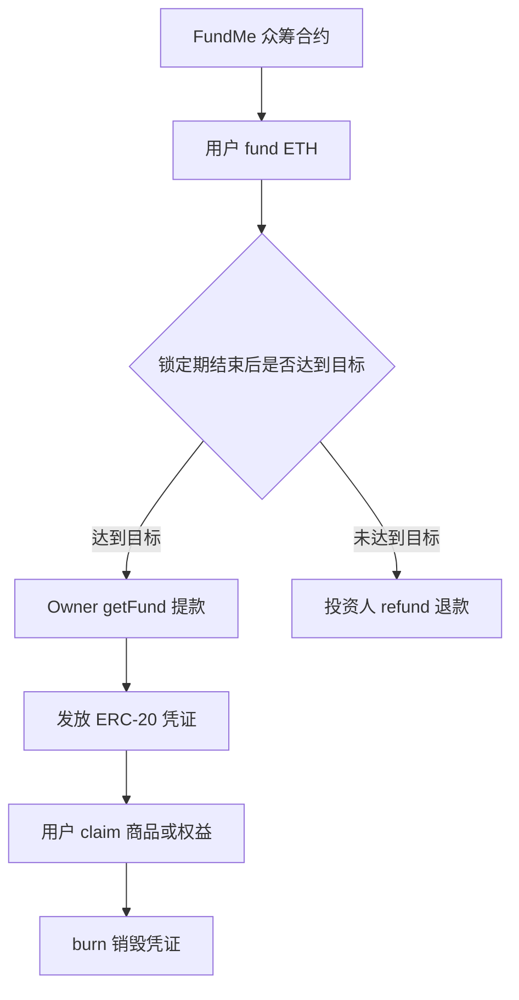
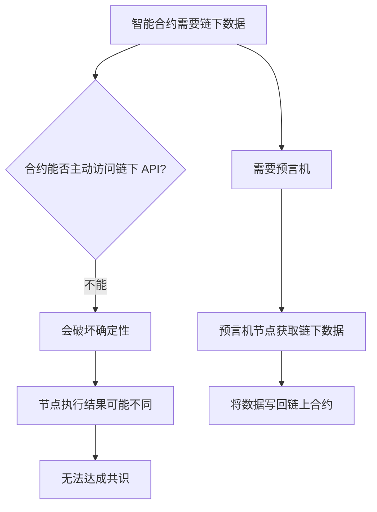
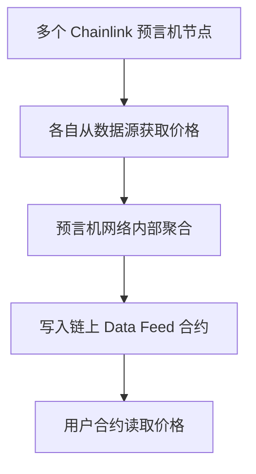
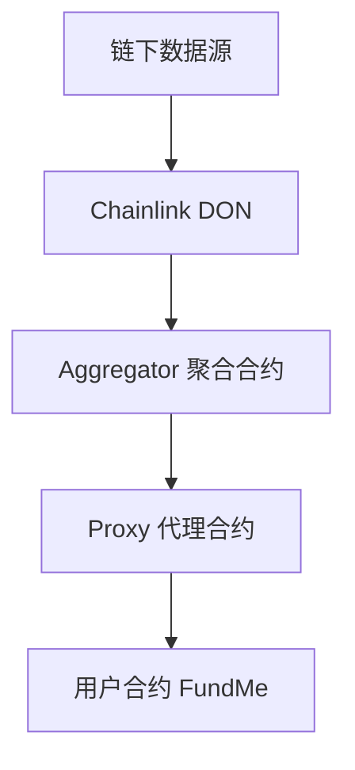

# 第三课：Solidity 进阶 — FundMe & ERC-20

### 本课核心脉络
- 本课围绕一个真实的 Web3 众筹场景展开：用户在限定时间内向智能合约打入 ETH，如果筹款达到目标，项目发起人可以提款；如果没有达到目标，参与者可以退款。随后进一步引入 ERC-20 通证，把众筹参与凭证通证化，用于后续领取商品或权益。



> *批注：这一课不是单纯讲 Solidity 语法，而是把 payable、mapping、require、预言机、时间锁、权限控制、ERC-20、继承、合约验证串成了一个完整业务闭环。*

---


### 一、FundMe 众筹合约：业务模型与基础结构


#### 1. 众筹场景
- 本节设定的业务类似"反向供应链"：
1. 生产商或创作者不确定商品是否有足够需求。
2. 用户先行众筹，表达购买意向并支付资金。
3. 如果筹款达到目标，生产商提款并生产。
4. 如果筹款未达标，参与者可以退款。
5. 生产完成后，参与者可凭借某种凭证领取商品。
- 在传统中心化平台中，众筹数据、资金托管、目标判断、退款权限都依赖平台。使用智能合约后：
  - 合约余额公开可查；
  - 达标与否由代码判断；
  - 提款与退款由函数约束；
  - 中间无需中心化机构手动干预。

> *批注：这类场景很适合用来理解智能合约的价值：不是"把所有业务都上链"，而是把资金流、状态判断、权限边界这些关键部分上链。*

---


### 二、核心步骤：实现 FundMe 合约


### 核心步骤


#### Step 1：创建 FundMe 合约文件
- 在 Remix 中创建新 workspace，例如：

```text
lesson3
```

- 新建合约文件：

```text
FundMe.sol
```

- 基础结构：

```solidity
// SPDX-License-Identifier: MIT
pragma solidity ^0.8.20;

contract FundMe {
}
```

---


#### Step 2：实现收款函数 fund()
- 如果一个函数要接收链上的原生通证，例如 Ethereum 上的 ETH、Polygon 上的 MATIC，就必须加 `payable`。

```solidity
function fund() external payable {
}
```


##### payable 的作用

| 关键词 | 作用 |
|---|---|
| `payable` | 允许函数接收 native token |
| 无 `payable` | 函数不能随交易接收 ETH，否则交易失败 |

- Remix 中函数按钮颜色通常可以帮助判断函数类型：

| 按钮颜色 | 含义 |
|---|---|
| 蓝色 | 只读函数 |
| 橙色 | 会修改状态的函数 |
| 红色 | payable 函数，可接收 ETH |

---


#### Step 3：理解 ETH 单位
- Solidity 内部通常以 `wei` 为最小单位处理 ETH。

| 单位 | 换算关系 |
|---|---|
| `wei` | 最小单位 |
| `gwei` | `10^9 wei` |
| `finney` | `10^15 wei`，即 `0.001 ether` |
| `ether` | `10^18 wei` |

- 例如：

```solidity
1 ether == 1 * 10 ** 18 wei
```

- Solidity 没有浮点数类型，因此不能直接表示 `0.1 ether` 这样的浮点计算，而是通过整数精度处理：

```solidity
0.1 ether == 1 * 10 ** 17 wei
```

> *批注：Solidity 中"没有小数"是非常关键的基础点。所有金额计算都要用整数和精度来表达，否则很容易写出错误的金融逻辑。*

---


#### Step 4：记录投资人及投资金额
- 需要记录两个信息：
1. 投资人的地址；
2. 投资人投入的金额。
- 使用 `mapping`：

```solidity
mapping(address => uint256) public fundersToAmount;
```

- 在 `fund()` 中记录：

```solidity
function fund() external payable {
    fundersToAmount[msg.sender] += msg.value;
}
```

- 这里应使用 `+=`，而不是 `=`。

```solidity
fundersToAmount[msg.sender] += msg.value;
```

- 原因是同一个地址可能多次参与众筹，如果使用 `=`，后一次会覆盖前一次金额。

---


#### Step 5：用 require 设置最小投资额
- 先用 ETH 计价，例如最小值为 `1 ether`：

```solidity
uint256 public constant MINIMUM_VALUE = 1 * 10 ** 18;

function fund() external payable {
    require(msg.value >= MINIMUM_VALUE, "Send more ETH");
    fundersToAmount[msg.sender] += msg.value;
}
```


##### require 的作用

```solidity
require(condition, "error message");
```

| 参数 | 含义 |
|---|---|
| `condition` | 必须为 true |
| `"error message"` | 条件不满足时的错误信息 |

- 如果条件不成立，交易会 `revert`，即回滚。

---


### 三、接入 Chainlink Data Feed：用美元限制最小投资额


#### 1. **为什么不能只用 ETH 计价？**
- 如果最小投资额写死为 `1 ETH`，用户体验会受到 ETH 价格波动影响：
  - ETH = 1000 USD 时，1 ETH 是 1000 美元；
  - ETH = 3000 USD 时，1 ETH 是 3000 美元。
- 更合理的方式是：用稳定的法币单位，例如 USD，设定最小投资额。
- 这就需要合约知道当前 ETH/USD 价格。

---


### 核心概念：预言机 Oracle


#### 1. 预言机问题
- 智能合约不能主动获取链下数据，例如：
  - ETH/USD 价格；
  - 股票、商品价格；
  - 天气数据；
  - 交通数据；
  - 游戏服务器数据；
  - 随机数。
- 根本原因是区块链需要共识。每个节点执行同一笔交易时，必须得到相同结果。

| 类型 | 含义 | 能否直接上链 |
|---|---|---|
| 确定性交易 | 不同节点、不同时间执行，结果一致 | 可以 |
| 非确定性交易 | 不同节点或不同时间执行，结果可能不同 | 不可以 |

- 链下价格、随机数等数据都属于非确定性数据，不能由智能合约主动请求，否则不同节点可能得到不同结果，无法达成共识。



---


#### 2. 去中心化预言机网络 DON
- 单个预言机节点存在单点故障问题：
  - 服务宕机；
  - 被攻击；
  - 数据作恶；
  - 数据源异常。
- Chainlink 使用去中心化预言机网络，即 DON：



> *批注：预言机不是"让合约访问互联网"，而是由链下节点把结果写到链上，合约再读取链上结果。这个方向不能反。*

---


#### 3. Chainlink Data Feed 架构
- Chainlink Data Feed 通常通过代理合约读取价格。



- 用户合约通常不直接调用 Aggregator，而是调用 Proxy。这样底层 Aggregator 升级时，用户合约不需要改动。

---


#### Step 6：引入 Chainlink AggregatorV3Interface
- 从 Chainlink 文档中引入接口：

```solidity
import {AggregatorV3Interface} from "@chainlink/contracts/src/v0.8/shared/interfaces/AggregatorV3Interface.sol";
```

- 声明 Data Feed 变量：

```solidity
AggregatorV3Interface internal dataFeed;
```

- 在构造函数中初始化。以 Sepolia ETH/USD Data Feed 地址为例，具体地址应以 Chainlink 官方文档为准：

```solidity
constructor() {
    dataFeed = AggregatorV3Interface(
        0x694AA1769357215DE4FAC081bf1f309aDC325306
    );
}
```

> *批注：不同网络的 Data Feed 地址不同。主网、Sepolia、Polygon、Arbitrum 等网络不能混用地址。*

---


#### Step 7：读取 ETH/USD 价格
- Chainlink 示例函数：

```solidity
function getChainlinkDataFeedLatestAnswer() public view returns (int) {
    (
        ,
        int answer,
        ,
        ,
        
    ) = dataFeed.latestRoundData();

    return answer;
}
```

- `answer` 即价格数据。
- ETH/USD Data Feed 通常有 `8` 位精度。也就是说，如果返回：

```text
350000000000
```

- 实际价格是：

```text
3500.00000000 USD
```

---


#### Step 8：将 ETH 金额转换为 USD

```solidity
function convertEthToUsd(uint256 ethAmount) internal view returns (uint256) {
    uint256 ethPrice = uint256(getChainlinkDataFeedLatestAnswer());

    return ethAmount * ethPrice / (10 ** 8);
}
```

- 因为：
  - `ethAmount` 单位是 wei，带 `10^18` 精度；
  - ETH/USD 价格带 `10^8` 精度；
  - 需要除以 `10^8`，让结果仍保持与 wei 类似的 `10^18` 精度。
- 设置最小投资额为 100 USD：

```solidity
uint256 public constant MINIMUM_VALUE = 100 * 10 ** 18;
```

- 然后在 `fund()` 中限制：

```solidity
function fund() external payable {
    require(convertEthToUsd(msg.value) >= MINIMUM_VALUE, "Send more ETH");
    fundersToAmount[msg.sender] += msg.value;
}
```

---


### 四、实现提款 getFund 与退款 refund


#### Step 9：设置目标金额 TARGET
- 众筹需要一个目标金额，例如 1000 USD：

```solidity
uint256 public constant TARGET = 1000 * 10 ** 18;
```

- 如果合约余额折算成美元后达到 `TARGET`，项目发起人可以提款。

---


#### Step 10：设置 owner
- 只有合约创建者或指定 owner 能提款。

```solidity
address public owner;

constructor() {
    owner = msg.sender;
}
```

- 还可以实现所有权转移：

```solidity
function transferOwnership(address newOwner) public {
    require(msg.sender == owner, "This function can only be called by owner");
    owner = newOwner;
}
```

---


#### Step 11：getFund 提款逻辑
- 提款需要满足：
1. 众筹金额达到目标；
2. 调用者是 owner；
3. 后续还会加入锁定期结束条件。

```solidity
function getFund() external {
    require(
        convertEthToUsd(address(this).balance) >= TARGET,
        "Target is not reached"
    );

    require(
        msg.sender == owner,
        "This function can only be called by owner"
    );

    // 转账逻辑
}
```

- `address(this).balance` 表示当前合约的 ETH 余额。

---


### 核心概念：Solidity 中三种转账方式

| 方法 | 是否推荐 | 失败时行为 | 是否能携带 data | 返回值 |
|---|---|---|---|---|
| `transfer` | 旧方式，不推荐新项目优先使用 | 自动 revert | 否 | 无 |
| `send` | 旧方式 | 不自动 revert | 否 | `bool` |
| `call` | 官方更推荐 | 不自动 revert，需要手动检查 | 是 | `(bool, bytes)` |

---


#### 1. transfer

```solidity
payable(msg.sender).transfer(address(this).balance);
```

- 特点：
  - 只能纯转账；
  - 失败会自动 revert；
  - 灵活性较弱。

---


#### 2. send

```solidity
bool success = payable(msg.sender).send(address(this).balance);
require(success, "Transaction failed");
```

- 特点：
  - 只能纯转账；
  - 返回 `bool`；
  - 需要手动 `require(success)`。

---


#### 3. call

```solidity
(bool success, ) = payable(msg.sender).call{value: address(this).balance}("");
require(success, "Transfer transaction failed");
```

- 特点：
  - 可以纯转账；
  - 也可以携带 data 调用目标函数；
  - 返回是否成功；
  - 更灵活，是当前更推荐的写法。

> *批注：课程后续采用 call 是合理选择，但 call 也更灵活、更危险，实际项目中还要关注重入攻击等安全问题。*

---


#### Step 12：refund 退款逻辑
- 退款需要满足：
1. 众筹目标未达成；
2. 调用者之前确实参与过众筹；
3. 只能退自己投入的金额；
4. 退款后必须清零记录。

```solidity
function refund() external {
    require(
        convertEthToUsd(address(this).balance) < TARGET,
        "Target is reached"
    );

    require(
        fundersToAmount[msg.sender] != 0,
        "There is no fund for you"
    );

    uint256 amount = fundersToAmount[msg.sender];

    (bool success, ) = payable(msg.sender).call{value: amount}("");
    require(success, "Transfer transaction failed");

    fundersToAmount[msg.sender] = 0;
}
```

---


#### 关键漏洞：退款后没有清零
- 如果退款后不执行：

```solidity
fundersToAmount[msg.sender] = 0;
```

- 攻击者可以反复调用 `refund()`，多次提走合约余额。
- 错误逻辑示意：

```solidity
function refund() external {
    uint256 amount = fundersToAmount[msg.sender];

    (bool success, ) = payable(msg.sender).call{value: amount}("");
    require(success, "Transfer transaction failed");

    // 缺少清零操作
}
```

- 正确逻辑：

```solidity
fundersToAmount[msg.sender] = 0;
```

> *批注：这是非常典型的状态更新问题。只要资金转移和状态记录同时存在，就必须严肃考虑状态何时更新、是否会被重复调用。*

---


### 五、加入锁定期：时间窗口控制


#### Step 13：为什么需要锁定期？
- 如果没有锁定期，会出现几个问题：
1. 用户可以任何时间继续投入；
2. owner 可以任何时间提款；
3. 用户可以反复 fund / refund；
4. 众筹无法形成明确结算点。
- 因此需要一个窗口期：
  - 窗口期内：只允许 `fund()`；
  - 窗口期结束后：根据结果允许 `getFund()` 或 `refund()`。

---


#### Step 14：使用 Unix 时间戳
- Solidity 没有 `Date` 类型，时间通常用 Unix 时间戳表示。
- Unix 时间戳含义：

```text
从 1970-01-01 00:00:00 UTC 到当前时间经过的秒数
```

- Solidity 中可通过：

```solidity
block.timestamp
```

- 获取当前区块时间戳。

---


#### Step 15：声明部署时间和锁定时长

```solidity
uint256 public deploymentTimestamp;
uint256 public lockTime;
```

- 在构造函数中初始化：

```solidity
constructor(uint256 _lockTime) {
    owner = msg.sender;
    deploymentTimestamp = block.timestamp;
    lockTime = _lockTime;

    dataFeed = AggregatorV3Interface(
        0x694AA1769357215DE4FAC081bf1f309aDC325306
    );
}
```

---


#### Step 16：限制 fund 只能在窗口期内调用

```solidity
function fund() external payable {
    require(
        block.timestamp < deploymentTimestamp + lockTime,
        "Window is closed"
    );

    require(convertEthToUsd(msg.value) >= MINIMUM_VALUE, "Send more ETH");

    fundersToAmount[msg.sender] += msg.value;
}
```

---


#### Step 17：限制 getFund / refund 只能在窗口期后调用

```solidity
require(
    block.timestamp >= deploymentTimestamp + lockTime,
    "Window is not closed"
);
```

---


### 六、使用 modifier 简化重复 require


#### 1. windowClosed 修改器

```solidity
modifier windowClosed() {
    require(
        block.timestamp >= deploymentTimestamp + lockTime,
        "Window is not closed"
    );
    _;
}
```

- 使用：

```solidity
function getFund() external windowClosed {
    // ...
}

function refund() external windowClosed {
    // ...
}
```

- `_;` 表示函数主体执行的位置。通常放在 require 后面，让交易尽早失败，减少无效 gas 消耗。

---


#### 2. onlyOwner 修改器

```solidity
modifier onlyOwner() {
    require(msg.sender == owner, "This function can only be called by owner");
    _;
}
```

- 使用：

```solidity
function getFund() external windowClosed onlyOwner {
    // ...
}

function transferOwnership(address newOwner) public onlyOwner {
    owner = newOwner;
}
```

> *批注：modifier 的价值不只是少写几行代码，更重要的是把权限、时间窗口等横切逻辑显式放在函数签名处，读代码时更清楚。*

---


### 七、FundMe 合约核心结构汇总

```solidity
// SPDX-License-Identifier: MIT
pragma solidity ^0.8.20;

import {AggregatorV3Interface} from
    "@chainlink/contracts/src/v0.8/shared/interfaces/AggregatorV3Interface.sol";

contract FundMe {
    mapping(address => uint256) public fundersToAmount;

    uint256 public constant MINIMUM_VALUE = 100 * 10 ** 18;
    uint256 public constant TARGET = 1000 * 10 ** 18;

    address public owner;
    uint256 public deploymentTimestamp;
    uint256 public lockTime;

    bool public getFundSuccess = false;
    address public erc20Addr;

    AggregatorV3Interface internal dataFeed;

    constructor(uint256 _lockTime) {
        owner = msg.sender;
        deploymentTimestamp = block.timestamp;
        lockTime = _lockTime;

        dataFeed = AggregatorV3Interface(
            0x694AA1769357215DE4FAC081bf1f309aDC325306
        );
    }

    modifier onlyOwner() {
        require(msg.sender == owner, "This function can only be called by owner");
        _;
    }

    modifier windowClosed() {
        require(
            block.timestamp >= deploymentTimestamp + lockTime,
            "Window is not closed"
        );
        _;
    }

    function fund() external payable {
        require(
            block.timestamp < deploymentTimestamp + lockTime,
            "Window is closed"
        );

        require(convertEthToUsd(msg.value) >= MINIMUM_VALUE, "Send more ETH");

        fundersToAmount[msg.sender] += msg.value;
    }

    function getChainlinkDataFeedLatestAnswer() public view returns (int) {
        (
            ,
            int answer,
            ,
            ,
            
        ) = dataFeed.latestRoundData();

        return answer;
    }

    function convertEthToUsd(uint256 ethAmount) internal view returns (uint256) {
        uint256 ethPrice = uint256(getChainlinkDataFeedLatestAnswer());
        return ethAmount * ethPrice / (10 ** 8);
    }

    function getFund() external windowClosed onlyOwner {
        require(
            convertEthToUsd(address(this).balance) >= TARGET,
            "Target is not reached"
        );

        (bool success, ) = payable(msg.sender).call{
            value: address(this).balance
        }("");

        require(success, "Transfer transaction failed");

        getFundSuccess = true;
    }

    function refund() external windowClosed {
        require(
            convertEthToUsd(address(this).balance) < TARGET,
            "Target is reached"
        );

        require(
            fundersToAmount[msg.sender] != 0,
            "There is no fund for you"
        );

        uint256 amount = fundersToAmount[msg.sender];

        (bool success, ) = payable(msg.sender).call{value: amount}("");
        require(success, "Transfer transaction failed");

        fundersToAmount[msg.sender] = 0;
    }

    function transferOwnership(address newOwner) public onlyOwner {
        owner = newOwner;
    }

    function setErc20Addr(address _erc20Addr) public onlyOwner {
        erc20Addr = _erc20Addr;
    }

    function setFundersToAmount(
        address funder,
        uint256 amountToUpdate
    ) external {
        require(
            msg.sender == erc20Addr,
            "You do not have permission to call this function"
        );

        fundersToAmount[funder] = amountToUpdate;
    }
}
```

---

## 八、ERC-20 通证部分


### 核心概念：Coin 与 Token 的区别


#### 1. Coin
- Coin 是某条区块链自己的原生资产。
- 例如：

| 区块链 | Coin |
|---|---|
| Bitcoin | BTC |
| Ethereum | ETH |
| Polygon | MATIC |

- 特点：
  - 每条链通常只有一个原生 coin；
  - 用于支付 gas；
  - 由链或协议本身定义；
  - 属于区块链协议层资产。

---


#### 2. Token
- Token 是部署在某条链上的智能合约资产。
- 特点：
  - 一条链上可以有无数个 token；
  - 不能直接支付 gas；
  - 通常由项目方、应用方创建；
  - 属于应用层资产；
  - 由合约逻辑维护余额、转账、授权等状态。

| 对比项 | Coin | Token |
|---|---|---|
| 所属层级 | 区块链协议层 | 应用合约层 |
| 是否有独立链 | 有 | 无 |
| 是否可支付 gas | 可以 | 通常不可以 |
| 数量 | 一条链通常一个 | 一条链可以无数个 |
| 示例 | ETH、BTC、MATIC | USDT、UNI、项目积分 |

> *批注：从开发角度看，Coin 的余额由链本身维护；Token 的余额由某个智能合约里的 mapping 维护。这是理解二者差异的关键。*

---


### 九、从零实现一个最简 Token 合约


#### Step 18：声明通证基础变量
- 新建文件：

```text
FundToken.sol
```

- 基础代码：

```solidity
// SPDX-License-Identifier: MIT
pragma solidity ^0.8.20;

contract FundToken {
    string public tokenName;
    string public tokenSymbol;
    uint256 public totalSupply;
    address public owner;

    mapping(address => uint256) public balances;

    constructor(
        string memory _tokenName,
        string memory _tokenSymbol
    ) {
        tokenName = _tokenName;
        tokenSymbol = _tokenSymbol;
        owner = msg.sender;
    }
}
```

---


#### Step 19：实现 mint

```solidity
function mint(uint256 amountToMint) public {
    balances[msg.sender] += amountToMint;
    totalSupply += amountToMint;
}
```

- 这里的 mint 并没有真的"从链底层转账"，而是在 token 合约内部修改 `balances`。

---


#### Step 20：实现 transfer

```solidity
function transfer(address payee, uint256 amount) public {
    require(
        balances[msg.sender] >= amount,
        "You do not have enough balance to transfer"
    );

    balances[msg.sender] -= amount;
    balances[payee] += amount;
}
```

---


#### Step 21：实现 balanceOf

```solidity
function balanceOf(address addr) public view returns (uint256) {
    return balances[addr];
}
```

- 这个最简 token 合约具备：
1. 铸造；
2. 转账；
3. 查询余额；
4. 查询总供应量。
- 但它仍然不是完整 ERC-20 标准。

---

## 十、Solidity 继承


### 核心概念：继承是什么？
- 继承可以让一个子合约直接拥有父合约的变量和函数。
- 示例：

```solidity
contract Parent {
    uint256 public a;

    function addOne() public {
        a++;
    }
}

contract Child is Parent {
    function addTwo() public {
        a += 2;
    }
}
```

- `Child` 虽然没有自己写 `a` 和 `addOne()`，但由于继承了 `Parent`，部署后仍然可以调用。

---


### 可见性与继承

| 可见性 | 是否可被子合约继承 |
|---|---|
| `public` | 可以 |
| `internal` | 可以 |
| `external` | 特殊场景可调用，但不是内部直接调用方式 |
| `private` | 不可以 |

---


### abstract、virtual、override


#### 1. virtual 虚函数
- 父合约中希望子合约可重写的函数，可以加 `virtual`：

```solidity
function addTwo() public virtual {
    a += 2;
}
```


#### 2. override 重写
- 子合约重写父合约函数：

```solidity
function addTwo() public override {
    a += 3;
}
```


#### 3. abstract 抽象合约
- 如果合约中有未实现函数，合约必须声明为 `abstract`：

```solidity
abstract contract Parent {
    function addTwo() public virtual;
}
```

- 子合约继承后必须实现：

```solidity
contract Child is Parent {
    uint256 public a;

    function addTwo() public override {
        a += 2;
    }
}
```

- 如果父合约的 `virtual` 函数已经有函数体，则子合约可以选择重写，也可以不重写。

---

## 十一、继承 OpenZeppelin ERC-20 标准合约


### 核心工具：OpenZeppelin
- OpenZeppelin 是 Web3 中非常常用的合约库，提供大量经过审计的标准合约，包括：
  - ERC-20；
  - ERC-721；
  - Ownable；
  - AccessControl；
  - Pausable；
  - ReentrancyGuard 等。
- 本课使用 OpenZeppelin ERC-20 标准合约。
- 资源：

```text
https://docs.openzeppelin.com/contracts/
https://github.com/OpenZeppelin/openzeppelin-contracts
```

---


### ERC-20 与 ERC-721

| 标准 | 类型 | 特点 | 典型场景 |
|---|---|---|---|
| ERC-20 | Fungible Token，同质化通证 | 每个 token 等价，可拆分 | 积分、稳定币、治理通证 |
| ERC-721 | Non-Fungible Token，非同质化通证 | 每个 token 独一无二，不可拆分 | NFT、门票、会员卡、艺术品 |

- 本课实现的是 ERC-20，因为众筹凭证是可拆分、可交换的。

---


#### Step 22：创建 FundTokenERC20 合约
- 新建文件：

```text
FundTokenERC20.sol
```

- 引入 OpenZeppelin ERC20：

```solidity
// SPDX-License-Identifier: MIT
pragma solidity ^0.8.20;

import {ERC20} from "@openzeppelin/contracts/token/ERC20/ERC20.sol";
import {FundMe} from "./FundMe.sol";

contract FundTokenERC20 is ERC20 {
    FundMe fundMe;

    constructor(address fundMeAddr) ERC20("FundTokenERC20", "FT") {
        fundMe = FundMe(fundMeAddr);
    }
}
```

- 这里：

```solidity
ERC20("FundTokenERC20", "FT")
```

- 是在调用父合约 `ERC20` 的构造函数，传入：
1. token name；
2. token symbol。

---


### 十二、定制 ERC-20：与 FundMe 联动


#### 目标功能
- 本节 ERC-20 不是孤立存在的，而是配合 FundMe 使用：

| 功能 | 说明 |
|---|---|
| mint | FundMe 参与者根据投入金额领取 ERC-20 凭证 |
| transfer | 参与者可以转移凭证 |
| claim | 使用凭证兑换商品或权益 |
| burn | claim 后销毁凭证，防止重复领取 |

---


#### Step 23：mint 逻辑
- 用户只能根据自己在 FundMe 中记录的金额来 mint。

```solidity
function mint(uint256 amountToMint) public {
    require(
        fundMe.fundersToAmount(msg.sender) >= amountToMint,
        "You cannot mint this many tokens"
    );

    _mint(msg.sender, amountToMint);

    fundMe.setFundersToAmount(
        msg.sender,
        fundMe.fundersToAmount(msg.sender) - amountToMint
    );
}
```

- 这里调用了 OpenZeppelin ERC20 内部函数：

```solidity
_mint(address account, uint256 value)
```

- 注意：`_mint` 是 `internal`，所以子合约可以调用，但外部用户不能直接调用。

---


#### Step 24：限制 mint 的时间窗口
- 用户只有在 FundMe 众筹成功、owner 已经提款后，才可以 mint 凭证。
- FundMe 中增加状态标记：

```solidity
bool public getFundSuccess = false;
```

- 在 `getFund()` 成功后设置：

```solidity
getFundSuccess = true;
```

- ERC-20 中限制：

```solidity
require(
    fundMe.getFundSuccess(),
    "The fund me is not completed yet"
);
```

---


#### Step 25：claim 与 burn

```solidity
function claim(uint256 amountToClaim) public {
    require(
        fundMe.getFundSuccess(),
        "The fund me is not completed yet"
    );

    require(
        balanceOf(msg.sender) >= amountToClaim,
        "You don't have enough ERC20 tokens"
    );

    // 这里可以加入实际业务逻辑：
    // 例如记录已领取、触发链下发货、发放权益等

    _burn(msg.sender, amountToClaim);
}
```

- OpenZeppelin ERC20 内置：

```solidity
_burn(address account, uint256 value)
```

- 用于销毁指定账户的 ERC-20 数量。

---


#### FundTokenERC20 核心代码汇总

```solidity
// SPDX-License-Identifier: MIT
pragma solidity ^0.8.20;

import {ERC20} from "@openzeppelin/contracts/token/ERC20/ERC20.sol";
import {FundMe} from "./FundMe.sol";

contract FundTokenERC20 is ERC20 {
    FundMe fundMe;

    constructor(address fundMeAddr) ERC20("FundTokenERC20", "FT") {
        fundMe = FundMe(fundMeAddr);
    }

    function mint(uint256 amountToMint) public {
        require(
            fundMe.getFundSuccess(),
            "The fund me is not completed yet"
        );

        require(
            fundMe.fundersToAmount(msg.sender) >= amountToMint,
            "You cannot mint this many tokens"
        );

        _mint(msg.sender, amountToMint);

        fundMe.setFundersToAmount(
            msg.sender,
            fundMe.fundersToAmount(msg.sender) - amountToMint
        );
    }

    function claim(uint256 amountToClaim) public {
        require(
            fundMe.getFundSuccess(),
            "The fund me is not completed yet"
        );

        require(
            balanceOf(msg.sender) >= amountToClaim,
            "You don't have enough ERC20 tokens"
        );

        // 商品或权益兑换逻辑可在这里扩展

        _burn(msg.sender, amountToClaim);
    }
}
```

---

## 十三、部署与测试流程


### Step 26：部署 FundMe
- 在 Remix 中选择：

```text
Injected Provider - MetaMask
```

- 网络选择 Sepolia 测试网。
- 部署时传入锁定时长，例如：

```text
120
```

- 表示 120 秒。

---


### Step 27：用户参与 fund
- 切换到参与者账户，设置 value，例如：

```text
1 ether
```

- 调用：

```solidity
fund()
```

- 检查合约 `balance` 是否增加。

---


### Step 28：部署 FundTokenERC20
- 复制 FundMe 合约地址，作为构造函数参数部署 FundTokenERC20：

```text
constructor 参数：FundMe 合约地址
```

---


### Step 29：在 FundMe 中设置 ERC-20 合约地址
- 复制 FundTokenERC20 地址，调用 FundMe：

```solidity
setErc20Addr(address _erc20Addr)
```

- 该函数应由 owner 调用。

---


### Step 30：众筹成功后 owner 提款
- 锁定期结束后，owner 调用：

```solidity
getFund()
```

- 成功后：

```solidity
getFundSuccess == true
```

---


### Step 31：参与者 mint ERC-20 凭证
- 切回参与者账户，调用 FundTokenERC20：

```solidity
mint(amountToMint)
```

- 如果用户参与众筹金额足够，mint 成功。

---


### Step 32：用户 claim 并 burn
- 调用：

```solidity
claim(amountToClaim)
```

- 成功后：
  - 用户 ERC-20 余额减少；
  - 对应 token 被 burn；
  - 可扩展实际兑换商品或权益的业务逻辑。

---

## 十四、合约验证：在区块链浏览器上公开源码


### 为什么要验证合约？
- 合约验证有两个主要目的：
1. 公开源码，让用户确认合约没有黑箱逻辑；
2. 让普通用户可以通过区块链浏览器直接调用合约函数，而不必使用 Remix。

---


### Step 33：进入区块链浏览器
- 以 Sepolia 为例：

```text
https://sepolia.etherscan.io/
```

- 搜索已部署的合约地址。
- 如果未验证，`Contract` 页面通常只能看到 bytecode，用户无法阅读源码。

---


### Step 34：Verify and Publish
- 点击：

```text
Verify and Publish
```

- 选择：

| 选项 | 设置 |
|---|---|
| Compiler Type | Solidity Single File |
| Compiler Version | 与 Remix 编译版本一致，例如 0.8.24 |
| License | MIT |

---


### Step 35：Flatten 合约
- 如果合约中有 import，需要将依赖合约 flatten 成一个文件。
- 在 Remix 文件上右键：

```text
Flatten
```

- 生成类似：

```text
FundTokenERC20_flattened.sol
```

- 复制 flatten 后的完整代码到浏览器验证页面。

---


### 常见问题：多个 SPDX License 报错
- Flatten 后可能出现多个：

```solidity
// SPDX-License-Identifier: MIT
```

- 验证时报错：

```text
Multiple SPDX license identifiers found in source file
```

- 解决方法：
- 只保留文件顶部一个 SPDX：

```solidity
// SPDX-License-Identifier: MIT
```

- 删除其他重复 SPDX。

---


### Step 36：使用 Read Contract / Write Contract
- 验证成功后，区块链浏览器会出现：

| 页面 | 功能 |
|---|---|
| Read Contract | 调用只读函数，例如 `balanceOf`、`name`、`symbol` |
| Write Contract | 调用写入函数，例如 `mint`、`claim` |

- 调用写入函数前需要连接钱包：

```text
Connect to Web3
```

- 连接 MetaMask 后即可发起交易。

> *批注：合约验证既是透明性要求，也是基本用户体验。没有验证的合约，对普通用户来说几乎不可读、不可交互。*

---

## 十五、本课关键知识点总表

| 模块 | 核心知识 |
|---|---|
| 收款函数 | `payable`、`msg.value`、native token |
| 金额单位 | `wei`、`gwei`、`finney`、`ether` |
| 投资记录 | `mapping(address => uint256)` |
| 条件限制 | `require`、`revert` |
| 美元计价 | Chainlink Data Feed |
| 预言机 | Oracle、DON、Aggregator、Proxy |
| 提款退款 | `getFund()`、`refund()` |
| 权限控制 | `owner`、`onlyOwner` |
| 转账方式 | `transfer`、`send`、`call` |
| 时间锁 | `block.timestamp`、Unix 时间戳 |
| 代码复用 | `modifier` |
| 通证基础 | Coin 与 Token 区别 |
| ERC-20 | `mint`、`transfer`、`balanceOf`、`burn` |
| 继承 | `is`、`abstract`、`virtual`、`override` |
| 标准库 | OpenZeppelin ERC20 |
| 合约验证 | Flatten、SPDX、Etherscan Verify |

---

## 十六、容易踩坑的点
1. **payable 忘写**  
   函数无法接收 ETH，交易会失败。
2. **ETH 单位混乱**  
   Solidity 内部按 wei 处理，不要直接把 `1` 当成 `1 ether`。
3. **Chainlink 精度未处理**  
   ETH/USD 通常是 8 位精度，需要除以 `10 ** 8`。
4. **Data Feed 地址用错网络**  
   Sepolia、主网、Polygon 等网络地址不同。
5. **退款后未清零 mapping**  
   会导致重复退款漏洞。
6. **权限函数未限制 owner**  
   任意用户可能调用提款或关键配置函数。
7. **窗口期逻辑写反**  
   `fund()` 应在窗口期内；`getFund()` 和 `refund()` 应在窗口期结束后。
8. **Flatten 后 SPDX 重复**  
   合约验证时常见报错，保留一个 SPDX 即可。
9. **ERC-20 mint 没有限制**  
   如果任何人都能随意 mint，通证凭证会失去意义。
10. **claim 后未 burn**  
    用户可能重复领取商品或权益。

---

## 十七、相关资源

| 资源 | 链接 |
|---|---|
| Chainlink 文档 | https://docs.chain.link/ |
| Chainlink Data Feeds | https://docs.chain.link/data-feeds |
| OpenZeppelin Contracts | https://docs.openzeppelin.com/contracts/ |
| OpenZeppelin GitHub | https://github.com/OpenZeppelin/openzeppelin-contracts |
| Sepolia Etherscan | https://sepolia.etherscan.io/ |
| Unix Timestamp | https://www.unixtimestamp.com/ |
| Remix IDE | https://remix.ethereum.org/ |
| Chainlink Faucet | https://faucets.chain.link/ |

---


### 最终总结
- 本课以 FundMe 众筹合约为主线，完成了一个较完整的 Solidity 应用：用户在锁定期内投入 ETH，合约通过 Chainlink Data Feed 将 ETH 换算成 USD，判断是否达到目标；目标达成后 owner 提款，未达成则用户退款。过程中引入了 `payable`、`mapping`、`require`、`call`、`block.timestamp`、`modifier` 等关键语法与安全注意点。
- 下半部分进一步把众筹凭证抽象成 ERC-20 通证，先手写最简 token，再通过继承 OpenZeppelin ERC20 标准合约实现更安全、更规范的通证逻辑。最后讲解了如何在区块链浏览器验证合约源码，使合约具备透明性，并允许普通用户通过浏览器直接读写合约。整节课已经从语法学习进入了较完整的 Web3 应用开发流程。

---

> *清洗说明：格式问题约 60 处（biliGPT 错误将 5 处 mermaid 代码块嵌套在列表项内、约 40 处代码块被 `- ` 列表前缀污染导致 Solidity 语法断裂、约 15 处 `- ---` 水平分割线缩在列表内、若干处嵌套 bullet 用 `- - ` 写法、1 处 biliGPT 搜索锚链接 `[文本](bibigpt.co/search?q=...)`、文件首行 BibiGPT 标题与封面图、原 frontmatter 字段松散）。未发现明显错别字。未改写原文表述。*
