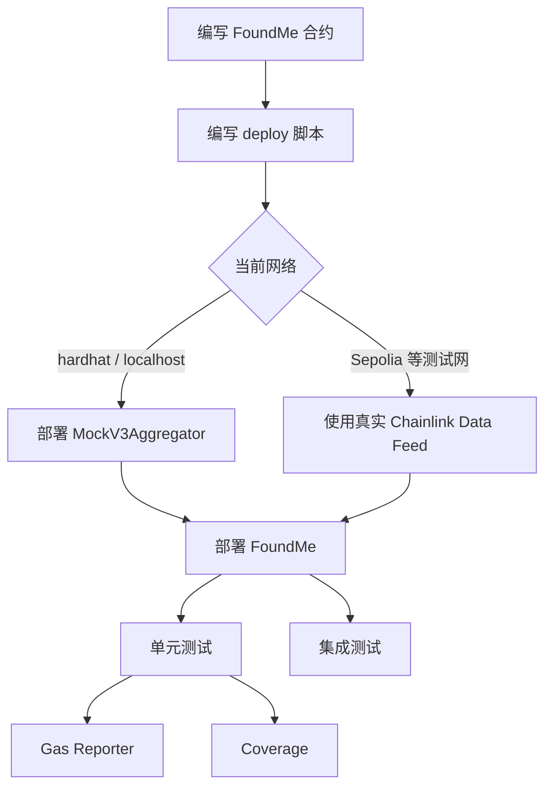

# 第五课：Hardhat 开发框架 — 合约测试


- 本课围绕 **Hardhat 中的智能合约测试体系** 展开，核心是给 `FoundMe` 合约建立一套较完整的测试流程：先理解 Mocha / Chai 的测试语法，再引入 `hardhat-deploy` 和 fixture 简化部署，随后用 Mock 合约解决本地测试无法访问 Chainlink Data Feed 的问题，最后分别编写单元测试、集成测试，并补充 Gas 消耗分析与代码覆盖率工具。

> *这一课的重点不是"会跑一个测试命令"，而是建立一套 Web3 项目里比较标准的测试工程结构：部署脚本、Mock、单元测试、集成测试、Gas 报告、覆盖率报告都要串起来。*

---


### 核心步骤


#### Step 1：理解 Hardhat 默认测试结构

- Hardhat 新建项目时，默认会生成一个示例合约 `Lock.sol`，以及对应的测试文件。
- 测试文件中常见的关键字包括：

| 关键字 | 来源 | 作用 |
|---|---|---|
| `describe` | Mocha | 描述一组测试，一般对应一个合约或一个模块 |
| `it` | Mocha | 描述一个具体测试用例 |
| `expect` | Chai | 断言某个结果是否符合预期 |
| `assert` | Chai | 另一种断言风格 |
| `to.equal` | Chai | 判断两个值是否相等 |

- Hardhat 的测试底层主要依赖两个 JavaScript 生态工具：

1. **Mocha**
   - JavaScript 测试框架。
   - 提供 `describe`、`it` 等测试组织能力。
   - 可运行在 Node.js 或浏览器中。
2. **Chai**
   - JavaScript 断言库。
   - 提供 `should`、`expect`、`assert` 三种断言风格。
   - 常与 Mocha 搭配使用。

- 例如：

```js
const { assert, expect } = require("chai");

describe("Test FoundMe", async function () {
  it("test if owner is msg.sender", async function () {
    // 测试逻辑
  });
});
```

> *Mocha 管"测试怎么组织"，Chai 管"结果怎么判断"。这两个角色要分清，不然以后看到 `describe / it / expect` 很容易混成一团。*

---


#### Step 2：编写最基础的 FoundMe 构造函数测试

- 本课最开始测试的是 `FoundMe` 合约的 `constructor`。
- 构造函数里主要做了两件事：

1. 将合约 `owner` 设置为部署合约交易的发送者。
2. 将 Chainlink Data Feed 地址赋值给 `dataFeed`。


##### 2.1 新建测试文件

- 在 `test` 文件夹下新建：

```txt
test/FoundMe.test.js
```

- 基础结构：

```js
const { assert } = require("chai");

describe("Test FoundMe", async function () {
  it("test if owner is msg.sender", async function () {
    // 测试逻辑
  });
});
```


##### 2.2 测试 owner 是否为部署者

- 部署合约的逻辑与脚本部署类似：

```js
const { assert } = require("chai");
const { ethers } = require("hardhat");

describe("Test FoundMe", async function () {
  it("test if owner is msg.sender", async function () {
    const [firstAccount] = await ethers.getSigners();

    const foundMeFactory = await ethers.getContractFactory("FoundMe");
    const foundMe = await foundMeFactory.deploy(180);

    await foundMe.waitForDeployment();

    assert.equal(await foundMe.owner(), firstAccount.address);
  });
});
```

- 运行测试：

```bash
npx hardhat test
```

- 如果报错：

```txt
assert is not defined
```

- 说明忘记引入 Chai：

```js
const { assert } = require("chai");
```

- 如果比较 signer 对象和字符串地址，需要注意：

```js
firstAccount.address
```

- 而不是直接使用：

```js
firstAccount
```

> *智能合约测试里经常会遇到"对象"和"地址字符串"的区别。`Signer` 是一个账户对象，真正参与比较的通常是它的 `.address`。*


##### 2.3 测试 dataFeed 是否赋值成功

- 如果合约中的 `dataFeed` 是 `internal`，测试脚本不能直接读取，需要改成：

```solidity
AggregatorV3Interface public dataFeed;
```

- 测试示例：

```js
it("test if dataFeed assigned correctly", async function () {
  const foundMeFactory = await ethers.getContractFactory("FoundMe");
  const foundMe = await foundMeFactory.deploy(180);

  await foundMe.waitForDeployment();

  assert.equal(
    await foundMe.dataFeed(),
    "Sepolia 上 ETH/USD Data Feed 地址"
  );
});
```

> *这里暴露出一个问题：如果每个 `it` 都手动部署一次合约，测试代码会越来越重复。因此后面要引入 `hardhat-deploy` 和 fixture。*

---


### Step 3：引入 hardhat-deploy 简化部署


#### 3.1 为什么要使用 hardhat-deploy？

- 原来通过 `scripts/deploy.js` 部署合约，虽然灵活，但存在几个问题：

1. 部署逻辑无法很好复用到测试文件。
2. 每个测试都重复写部署代码，效率低。
3. 部署记录、网络环境、fixture 管理不够方便。

- `hardhat-deploy` 提供的能力：

- 用统一的 `deploy` 文件夹管理部署脚本。
- 自动跟踪已部署合约。
- 可通过 fixture 在测试中复用部署逻辑。
- 可按 tag 执行指定部署脚本。


#### 3.2 安装 hardhat-deploy

```bash
npm install --save-dev hardhat-deploy
```

- 或者简写：

```bash
npm install -D hardhat-deploy
```

- 在 `hardhat.config.js` 中引入：

```js
require("hardhat-deploy");
```

- 检查是否新增 `deploy` task：

```bash
npx hardhat help
```

- 如果配置成功，会看到：

```txt
deploy
```

---


### Step 4：编写 deploy 部署脚本


#### 4.1 新建 deploy 文件夹

- 项目根目录下新建：

```txt
deploy/
```

- 新建部署脚本：

```txt
deploy/01-deploy-foundme.js
```


#### 4.2 hardhat-deploy 的脚本结构

- 基本写法：

```js
module.exports = async ({ getNamedAccounts, deployments }) => {
  // 部署逻辑
};
```

- `hardhat-deploy` 会自动执行导出的函数。
- 常用对象：

| 对象 / 函数 | 作用 |
|---|---|
| `getNamedAccounts` | 根据配置好的账户名称获取地址 |
| `deployments` | 访问部署相关方法和历史部署信息 |
| `deployments.deploy` | 部署合约 |
| `deployments.get` | 获取已经部署过的合约信息 |
| `deployments.fixture` | 在测试中执行指定 tag 的部署脚本 |


#### 4.3 配置 namedAccounts

- 在 `hardhat.config.js` 中添加：

```js
namedAccounts: {
  firstAccount: {
    default: 0,
  },
  secondAccount: {
    default: 1,
  },
},
```

- 含义：

- `firstAccount` 默认对应 `accounts[0]`
- `secondAccount` 默认对应 `accounts[1]`

- 之后可以通过名称获取地址，而不是靠数组下标：

```js
const { firstAccount } = await getNamedAccounts();
```

> *这个设计很实用。多人协作或者多网络部署时，直接用 `firstAccount / deployer / user` 这类语义化名字，比到处写 `accounts[0]` 稳定得多。*


#### 4.4 编写 FoundMe 部署脚本

- 基础版本：

```js
module.exports = async ({ getNamedAccounts, deployments }) => {
  const { firstAccount } = await getNamedAccounts();
  const { deploy } = deployments;

  await deploy("FoundMe", {
    from: firstAccount,
    args: [180],
    log: true,
  });
};

module.exports.tags = ["all", "foundme"];
```

- 运行部署：

```bash
npx hardhat deploy
```

- 按 tag 部署：

```bash
npx hardhat deploy --tags foundme
```

- 如果 tag 不存在，例如：

```bash
npx hardhat deploy --tags frank
```

- 对应脚本不会执行。

---


### Step 5：在测试中使用 fixture 复用部署脚本


#### 5.1 beforeEach 的作用

- `beforeEach` 会在每一个 `it` 执行之前运行一次。
- 适合放：

- 部署合约
- 获取账户
- 初始化测试状态

- 示例：

```js
beforeEach(async function () {
  await deployments.fixture(["all"]);
});
```


#### 5.2 重构测试文件

- 为了让每个测试都能访问 `foundMe` 和 `firstAccount`，需要把变量声明在外层作用域：

```js
const { assert } = require("chai");
const { deployments, ethers, getNamedAccounts } = require("hardhat");

describe("Test FoundMe", async function () {
  let foundMe;
  let firstAccount;

  beforeEach(async function () {
    await deployments.fixture(["all"]);

    firstAccount = (await getNamedAccounts()).firstAccount;

    const foundMeDeployment = await deployments.get("FoundMe");

    foundMe = await ethers.getContractAt(
      "FoundMe",
      foundMeDeployment.address
    );
  });

  it("test if owner is msg.sender", async function () {
    assert.equal(await foundMe.owner(), firstAccount);
  });
});
```

- 注意：

- `getNamedAccounts()` 返回的是地址字符串。
- 不需要再写 `.address`。

- 错误写法：

```js
firstAccount.address
```

- 正确写法：

```js
firstAccount
```

---


### Step 6：使用 Mock 合约解决本地测试的 Data Feed 问题


#### 6.1 为什么需要 Mock 合约？

- `FoundMe` 合约里的 `fund` 函数依赖 Chainlink Data Feed 获取 ETH/USD 价格。
- 在本地 Hardhat 网络中：

- 没有真实的 Chainlink Data Feed 合约。
- 无法直接调用 Sepolia 上的预言机。
- 因此依赖价格数据的函数无法完整测试。

- 解决方案：使用 Mock 合约。
- Mock 合约的本质：

> 创建一个行为类似目标合约的假合约，用可控的假数据模拟第三方服务。

- 在本课场景中：

- 用 `MockV3Aggregator` 模拟 Chainlink ETH/USD Data Feed。
- 手动设置一个固定价格，例如 ETH = 3000 USD。
- 本地测试时使用 Mock 地址。
- 测试网部署时使用真实 Chainlink Data Feed 地址。


#### 6.2 新建 Mock 合约文件

- 新建目录：

```txt
contracts/mocks/
```

- 新建文件：

```txt
contracts/mocks/MockV3Aggregator.sol
```

- 内容：

```solidity
// SPDX-License-Identifier: MIT
pragma solidity ^0.8.20;

import "@chainlink/contracts/src/v0.8/tests/MockV3Aggregator.sol";
```

- 编译：

```bash
npx hardhat compile
```

> *这个文件本身没有重新实现逻辑，只是把 Chainlink 官方提供的 Mock 合约引入项目。*

---


### Step 7：编写 Mock 合约部署脚本


#### 7.1 新建 Mock 部署脚本

- 新建：

```txt
deploy/00-deploy-mock.js
```

- 之所以序号是 `00`，是因为 Mock 需要先于 `FoundMe` 部署。


#### 7.2 MockV3Aggregator 构造函数参数

- `MockV3Aggregator` 构造函数需要两个参数：

| 参数 | 含义 |
|---|---|
| `_decimals` | 价格数据的小数位 |
| `_initialAnswer` | 初始价格 |

- Chainlink 常见精度：

| 价格对 | 小数位 |
|---|---|
| Token / USD | 8 位 |
| Token / ETH | 18 位 |

- 本课设置：

```js
decimals = 8;
initialAnswer = 300000000000; // 3000 * 10^8
```

- 即模拟：

```txt
1 ETH = 3000 USD
```


#### 7.3 抽离 helper 配置文件

- 为了避免硬编码，新建：

```txt
helper-hardhat-config.js
```

- 示例：

```js
const DECIMALS = 8;
const INITIAL_ANSWER = 300000000000;
const LOCK_TIME = 180;
const CONFIRMATIONS = 5;

const developmentChains = ["hardhat", "localhost"];

const networkConfig = {
  11155111: {
    ethUsdDataFeed: "Sepolia ETH/USD Data Feed 地址",
  },
  97: {
    ethUsdDataFeed: "BNB Chain Testnet ETH/USD Data Feed 地址",
  },
};

module.exports = {
  DECIMALS,
  INITIAL_ANSWER,
  LOCK_TIME,
  CONFIRMATIONS,
  developmentChains,
  networkConfig,
};
```

> *部署参数、Data Feed 地址、等待确认数这类配置，不建议散落在各个脚本里。统一放到 helper 配置文件，后期换网络或改参数会省很多事。*


#### 7.4 Mock 部署脚本

```js
const {
  DECIMALS,
  INITIAL_ANSWER,
  developmentChains,
} = require("../helper-hardhat-config");

module.exports = async ({ getNamedAccounts, deployments, network }) => {
  const { firstAccount } = await getNamedAccounts();
  const { deploy } = deployments;

  if (developmentChains.includes(network.name)) {
    await deploy("MockV3Aggregator", {
      from: firstAccount,
      args: [DECIMALS, INITIAL_ANSWER],
      log: true,
    });
  } else {
    console.log("It's not local, mock contract deployment is skipped.");
  }
};

module.exports.tags = ["all", "mock"];
```

- 本地部署 Mock：

```bash
npx hardhat deploy --tags mock
```

---


### Step 8：根据网络动态选择 Data Feed 地址


#### 8.1 修改 FoundMe 构造函数

- 原来如果在合约里硬编码 Sepolia Data Feed 地址，会导致本地测试不灵活。
- 应改成通过构造函数传入：

```solidity
constructor(uint256 _lockTime, address dataFeedAddr) {
    owner = msg.sender;
    lockTime = _lockTime;
    dataFeed = AggregatorV3Interface(dataFeedAddr);
}
```


#### 8.2 在部署脚本中动态选择地址

- 部署 `FoundMe` 时：

- 如果是本地网络：使用刚部署的 `MockV3Aggregator` 地址。
- 如果是测试网：使用配置文件中的真实 Chainlink Data Feed 地址。

- 示例：

```js
const {
  LOCK_TIME,
  CONFIRMATIONS,
  developmentChains,
  networkConfig,
} = require("../helper-hardhat-config");

module.exports = async ({
  getNamedAccounts,
  deployments,
  network,
}) => {
  const { firstAccount } = await getNamedAccounts();
  const { deploy } = deployments;

  let dataFeedAddress;
  let confirmations;

  if (developmentChains.includes(network.name)) {
    const mockV3Aggregator = await deployments.get("MockV3Aggregator");
    dataFeedAddress = mockV3Aggregator.address;
    confirmations = 0;
  } else {
    const chainId = network.config.chainId;
    dataFeedAddress = networkConfig[chainId].ethUsdDataFeed;
    confirmations = CONFIRMATIONS;
  }

  const foundMe = await deploy("FoundMe", {
    from: firstAccount,
    args: [LOCK_TIME, dataFeedAddress],
    log: true,
    waitConfirmations: confirmations,
  });

  // verify 逻辑可放在这里
};

module.exports.tags = ["all", "foundme"];
```

> *这里还有一个很关键的坑：本地 Hardhat 网络不会自动持续出块。如果在本地设置 `waitConfirmations: 5`，测试可能一直卡住。所以本地应设置为 `0`，测试网再设置为 `5`。*

---


### Step 9：合约验证 verify

- 如果部署到 Sepolia，可以在部署脚本中调用 verify。
- 逻辑大致为：

```js
if (network.config.chainId === 11155111 && process.env.ETHERSCAN_API_KEY) {
  await verify(foundMe.address, [LOCK_TIME, dataFeedAddress]);
} else {
  console.log("Network is not Sepolia, verification skipped.");
}
```

- 如果重新部署合约，需要注意 `hardhat-deploy` 会复用之前的部署记录。
- 重新部署有两种方式：

- 方式一：删除 `deployments` 文件夹。
- 方式二：加 `--reset` 参数：

```bash
npx hardhat deploy --network sepolia --reset
```

> *`hardhat-deploy` 会把已部署合约记录在 `deployments/网络名` 下。它默认会复用已有部署，这对稳定部署很好，但如果你想强制重发，就必须 `--reset` 或删除记录。*

---


### 测试体系总览



---

## 单元测试：Unit Test

- 单元测试主要在本地网络运行，目标是验证合约中关键函数的各种合法与非法路径。
- 本课重点测试三个涉及资产流转的函数：

| 函数 | 作用 | 为什么重要 |
|---|---|---|
| `fund` | 用户向合约打款 | 涉及资金进入 |
| `getFund` | owner 在募资成功后提款 | 涉及资金转出 |
| `refund` | 募资失败后用户退款 | 涉及资金返还 |

> *判断函数是否值得重点测试，一个简单原则是：只要涉及资产转移，就必须重点测。*

---


### Step 10：调整测试目录结构

- 新建：

```txt
test/unit/
```

- 将原测试文件移动到：

```txt
test/unit/FoundMe.test.js
```

---


### Step 11：为 fund 函数编写单元测试


#### 11.1 fund 函数核心逻辑

- `fund` 函数主要有三类逻辑：

1. 时间窗口必须是开启状态。
2. 发送价值必须大于最小值。
3. 成功 fund 后，`fundersToAmount` mapping 要正确记录金额。

- 伪逻辑：

```solidity
require(msg.value.convertEthToUsd(dataFeed) >= MINIMUM_VALUE, "Send more ETH");
require(block.timestamp < deploymentTimestamp + lockTime, "Window is closed");

fundersToAmount[msg.sender] += msg.value;
```


#### 11.2 测试：window closed 时 fund 失败

- 需要模拟时间流逝。
- 引入 Hardhat network helpers：

```js
const helpers = require("@nomicfoundation/hardhat-network-helpers");
```

- 测试代码：

```js
it("window closed, value is greater than minimum, fund failed", async function () {
  await helpers.time.increase(200);
  await helpers.mine();

  await expect(
    foundMe.fund({
      value: ethers.parseEther("0.1"),
    })
  ).to.be.revertedWith("Window is closed");
});
```

- 这里：

- `LOCK_TIME = 180`
- 测试中让时间增加 `200` 秒
- 因此窗口关闭
- 即使发送金额足够，也应失败


#### 11.3 测试：value 小于 minimum 时 fund 失败

```js
it("window open, value is less than minimum, fund failed", async function () {
  await expect(
    foundMe.fund({
      value: ethers.parseEther("0.01"),
    })
  ).to.be.revertedWith("Send more ETH");
});
```


#### 11.4 测试：条件满足时 fund 成功，并记录余额

```js
it("window open, value is greater than minimum, fund success", async function () {
  await foundMe.fund({
    value: ethers.parseEther("0.1"),
  });

  const balance = await foundMe.fundersToAmount(firstAccount);

  expect(balance).to.equal(ethers.parseEther("0.1"));
});
```

---


### Step 12：为 getFund 函数编写单元测试


#### 12.1 getFund 函数核心逻辑

- `getFund` 函数需要满足：

1. 只能由 owner 调用。
2. 时间窗口必须关闭。
3. 募资目标必须达成。
4. 成功后将合约余额转给 owner。
5. 成功后 emit 一个事件。


#### 12.2 安装 hardhat-deploy-ethers 相关扩展

- 为了使用 `ethers.getContract` 等与 `hardhat-deploy` 配合的功能，需要安装并引入扩展。

```bash
npm install --save-dev @nomicfoundation/hardhat-ethers ethers hardhat-deploy-ethers
```

- 在 `hardhat.config.js` 中引入：

```js
require("@nomicfoundation/hardhat-ethers");
require("hardhat-deploy-ethers");
```

> *如果 `ethers.getContract` 报 "is not a function"，通常就是相关插件没有安装或没有在 config 中 require。*


#### 12.3 获取 secondAccount 连接的合约对象

- 在 `beforeEach` 中：

```js
let foundMeSecondAccount;
let secondAccount;

beforeEach(async function () {
  await deployments.fixture(["all"]);

  firstAccount = (await getNamedAccounts()).firstAccount;
  secondAccount = (await getNamedAccounts()).secondAccount;

  const foundMeDeployment = await deployments.get("FoundMe");

  foundMe = await ethers.getContractAt(
    "FoundMe",
    foundMeDeployment.address
  );

  foundMeSecondAccount = await ethers.getContract(
    "FoundMe",
    secondAccount
  );
});
```


#### 12.4 测试：非 owner 调用 getFund 失败

```js
it("not owner, window closed, target reached, getFund failed", async function () {
  await foundMe.fund({
    value: ethers.parseEther("1"),
  });

  await helpers.time.increase(200);
  await helpers.mine();

  await expect(
    foundMeSecondAccount.getFund()
  ).to.be.revertedWith("This function can only be called by owner");
});
```

- 注意顺序：

1. 先 `fund`
2. 再模拟时间流逝
3. 再调用 `getFund`

- 如果先关闭窗口，再调用 `fund`，`fund` 会先失败。


#### 12.5 测试：window 未关闭时 getFund 失败

```js
it("owner, window open, target reached, getFund failed", async function () {
  await foundMe.fund({
    value: ethers.parseEther("1"),
  });

  await expect(
    foundMe.getFund()
  ).to.be.revertedWith("Window is not closed");
});
```


#### 12.6 测试：target 未达成时 getFund 失败

```js
it("owner, window closed, target not reached, getFund failed", async function () {
  await foundMe.fund({
    value: ethers.parseEther("0.1"),
  });

  await helpers.time.increase(200);
  await helpers.mine();

  await expect(
    foundMe.getFund()
  ).to.be.revertedWith("Target is not reached");
});
```


#### 12.7 成功路径：emit FundWithdrawByOwner

- 为了更方便判断 `getFund` 成功，合约中增加事件：

```solidity
event FundWithdrawByOwner(uint256 amount);
```

- 在 `getFund` 成功转账后触发：

```solidity
uint256 balance = address(this).balance;

bool success = payable(owner).send(balance);
require(success, "Transfer failed");

emit FundWithdrawByOwner(balance);
```

- 测试：

```js
it("owner, window closed, target reached, getFund success", async function () {
  await foundMe.fund({
    value: ethers.parseEther("1"),
  });

  await helpers.time.increase(200);
  await helpers.mine();

  await expect(foundMe.getFund())
    .to.emit(foundMe, "FundWithdrawByOwner")
    .withArgs(ethers.parseEther("1"));
});
```

> *用事件判断成功路径，比直接计算 owner 的余额更干净。因为 owner 原本就有余额，还涉及 gas 消耗，直接断言余额变化会更复杂。*

---


### Step 13：为 refund 函数编写单元测试


#### 13.1 refund 函数核心逻辑

- `refund` 函数需要满足：

1. 时间窗口必须关闭。
2. 募资目标不能达成。
3. 调用者必须有可退款余额。
4. 成功后退回用户资金。
5. 成功后 emit 一个事件。


#### 13.2 测试：window 未关闭时 refund 失败

```js
it("window open, target not reached, founder has balance, refund failed", async function () {
  await foundMe.fund({
    value: ethers.parseEther("0.1"),
  });

  await expect(
    foundMe.refund()
  ).to.be.revertedWith("Window is not closed");
});
```


#### 13.3 测试：target 已达成时 refund 失败

```js
it("window closed, target reached, founder has balance, refund failed", async function () {
  await foundMe.fund({
    value: ethers.parseEther("1"),
  });

  await helpers.time.increase(200);
  await helpers.mine();

  await expect(
    foundMe.refund()
  ).to.be.revertedWith("Target is reached");
});
```


#### 13.4 测试：调用者没有余额时 refund 失败

- 使用 `secondAccount` 调用退款，因为它没有参与 fund。

```js
it("window closed, target not reached, founder has no balance, refund failed", async function () {
  await foundMe.fund({
    value: ethers.parseEther("0.1"),
  });

  await helpers.time.increase(200);
  await helpers.mine();

  await expect(
    foundMeSecondAccount.refund()
  ).to.be.revertedWith("There is no fund for you");
});
```


#### 13.5 成功路径：emit RefundByFounder

- 合约中增加事件：

```solidity
event RefundByFounder(address founder, uint256 amount);
```

- 在 `refund` 成功时触发：

```solidity
uint256 balance = fundersToAmount[msg.sender];

fundersToAmount[msg.sender] = 0;

bool success = payable(msg.sender).send(balance);
require(success, "Transfer failed");

emit RefundByFounder(msg.sender, balance);
```

- 测试：

```js
it("window closed, target not reached, founder has balance, refund success", async function () {
  await foundMe.fund({
    value: ethers.parseEther("0.1"),
  });

  await helpers.time.increase(200);
  await helpers.mine();

  await expect(foundMe.refund())
    .to.emit(foundMe, "RefundByFounder")
    .withArgs(firstAccount, ethers.parseEther("0.1"));
});
```

---

## 集成测试：Staging Test


### Step 14：为什么需要集成测试？

- 单元测试主要依赖本地网络和 Mock 合约，速度快、可控，但不能覆盖真实环境中的两类问题：

1. **第三方服务真实交互**
   - 本地使用的是 `MockV3Aggregator`
   - 测试网使用的是真实 Chainlink Data Feed
   - 需要验证真实 Data Feed 与合约配合是否正常
2. **真实网络延迟**
   - 本地测试中交易几乎立即确认
   - 测试网上存在出块延迟、交易确认时间、网络波动
   - 需要确认合约在真实网络环境下仍然可用

> *单元测试解决"代码逻辑是否正确"，集成测试解决"真实环境下是否能跑通"。两者不是替代关系。*

---


### Step 15：新建 staging 测试文件

- 新建：

```txt
test/staging/
```

- 新建：

```txt
test/staging/FoundMe.staging.test.js
```

- 集成测试复用部署逻辑，但测试用例更少，只测关键业务闭环：

1. `fund` 后 target 达成，能够 `getFund`
2. `fund` 后 target 未达成，能够 `refund`

---


### Step 16：集成测试中等待真实时间流逝

- 在本地单元测试中，可以用：

```js
await helpers.time.increase(200);
await helpers.mine();
```

- 但在 Sepolia 这类真实测试网上不能这样做。
- 需要用 JS 的 `Promise` 等待真实时间：

```js
await new Promise((resolve) => {
  setTimeout(resolve, 181 * 1000);
});
```

- 因为 `LOCK_TIME = 180` 秒，所以等待 `181` 秒确保窗口关闭。

---


### Step 17：编写 fund + getFund 集成测试

```js
it("fund and getFund successfully", async function () {
  await foundMe.fund({
    value: ethers.parseEther("0.5"),
  });

  await new Promise((resolve) => {
    setTimeout(resolve, 181 * 1000);
  });

  const getFundTx = await foundMe.getFund();
  const getFundReceipt = await getFundTx.wait();

  expect(getFundReceipt)
    .to.emit(foundMe, "FundWithdrawByOwner")
    .withArgs(ethers.parseEther("0.5"));
});
```

- 这里需要注意：

```js
await foundMe.getFund()
```

- 只能说明交易发送成功，不一定已经上链确认。
- 所以集成测试中要显式等待回执：

```js
const tx = await foundMe.getFund();
const receipt = await tx.wait();
```

> *本地单元测试里很多异步细节被 Hardhat 网络"抹平"了，但到了真实测试网，交易发送和交易确认必须区分清楚。*

---


### Step 18：编写 fund + refund 集成测试

```js
it("fund and refund successfully", async function () {
  await foundMe.fund({
    value: ethers.parseEther("0.1"),
  });

  await new Promise((resolve) => {
    setTimeout(resolve, 181 * 1000);
  });

  const refundTx = await foundMe.refund();
  const refundReceipt = await refundTx.wait();

  expect(refundReceipt)
    .to.emit(foundMe, "RefundByFounder")
    .withArgs(firstAccount, ethers.parseEther("0.1"));
});
```

---


### Step 19：根据网络自动跳过 unit / staging 测试


#### 19.1 本地只跑单元测试

- 在单元测试文件中：

```js
const { developmentChains } = require("../../helper-hardhat-config");
const { network } = require("hardhat");

developmentChains.includes(network.name)
  ? describe("FoundMe Unit Test", function () {
      // unit tests
    })
  : describe.skip;
```

- 更完整的写法通常是：

```js
!developmentChains.includes(network.name)
  ? describe.skip
  : describe("FoundMe Unit Test", function () {
      // unit tests
    });
```


#### 19.2 测试网只跑集成测试

- 在 staging 测试文件中：

```js
developmentChains.includes(network.name)
  ? describe.skip
  : describe("FoundMe Staging Test", function () {
      // staging tests
    });
```


#### 19.3 运行 Sepolia 集成测试

```bash
npx hardhat test --network sepolia
```

---


### Step 20：配置 Mocha timeout

- 集成测试会真实等待 `181` 秒，加上交易发送、确认、部署、验证等时间，默认 Mocha 超时时间不够。
- 如果报错：

```txt
Timeout of 40000ms exceeded
```

- 说明 Mocha 默认超时限制太短。
- 在 `hardhat.config.js` 中添加：

```js
mocha: {
  timeout: 300000,
},
```

- 这里 `300000` 表示 300 秒。

> *如果集成测试里一个用例要等待 181 秒，那么 timeout 不能只设置 200 秒。交易确认、部署、事件检查都会额外耗时。视频里最后改到 300 秒后测试通过。*

---

## 辅助工具一：Hardhat Gas Reporter


### Step 21：安装 Gas Reporter

```bash
npm install --save-dev hardhat-gas-reporter
```

- 在 `hardhat.config.js` 中引入：

```js
require("hardhat-gas-reporter");
```

- 配置：

```js
gasReporter: {
  enabled: true,
},
```

- 运行测试：

```bash
npx hardhat test
```

- 测试结束后会输出每个函数的 Gas 消耗统计。
- 示例关注项：

| 项目 | 含义 |
|---|---|
| `Methods` | 被测试调用过的合约函数 |
| `Calls` | 调用次数 |
| `Avg` | 平均 Gas 消耗 |
| `Deployments` | 部署合约消耗的 Gas |

- 本课中关注的函数包括：

- `fund`
- `getFund`
- `refund`

- 通常：

- `getFund` 消耗较高
- `fund` 次之
- `refund` 相对较低

- 关闭 Gas Reporter：

```js
gasReporter: {
  enabled: false,
},
```

> *智能合约里的"性能优化"，很多时候不是指运行时间更短，而是指调用函数时消耗的 Gas 更少。Gas Reporter 的作用就是帮你发现异常高 Gas 的函数。*

---

## 辅助工具二：Solidity Coverage


### Step 22：查看代码测试覆盖率

- Hardhat 中可以通过 coverage task 生成覆盖率报告：

```bash
npx hardhat coverage
```

- 输出表格会包含：

| 字段 | 含义 |
|---|---|
| `% Stmts` | 语句覆盖率 |
| `% Branch` | 分支覆盖率 |
| `% Funcs` | 函数覆盖率 |
| `% Lines` | 行覆盖率 |

- 本课中：

- `FoundMe.sol` 函数覆盖率约为 88%
- `MockV3Aggregator` 因为只是引入 Mock，覆盖率显示较高
- 默认示例合约 `Lock.sol` 如果没删除，也会被纳入统计

> *覆盖率不是越高越安全，但低覆盖率一定值得警惕。尤其是涉及资金流转的函数，不能只看"跑过一次"，还要覆盖成功路径和失败路径。*

---

## 本课项目结构参考

```txt
contracts/
  FoundMe.sol
  mocks/
    MockV3Aggregator.sol

deploy/
  00-deploy-mock.js
  01-deploy-foundme.js

test/
  unit/
    FoundMe.test.js
  staging/
    FoundMe.staging.test.js

helper-hardhat-config.js
hardhat.config.js
```

---

## 本课关键命令汇总


### 测试

```bash
npx hardhat test
```

- 指定网络测试：

```bash
npx hardhat test --network sepolia
```


### 部署

```bash
npx hardhat deploy
```

- 按 tag 部署：

```bash
npx hardhat deploy --tags mock
```

```bash
npx hardhat deploy --tags foundme
```

- 部署到 Sepolia：

```bash
npx hardhat deploy --network sepolia
```

- 强制重新部署：

```bash
npx hardhat deploy --network sepolia --reset
```


### 编译

```bash
npx hardhat compile
```


### 查看 Hardhat task

```bash
npx hardhat help
```


### 覆盖率

```bash
npx hardhat coverage
```


### Git 提交

```bash
git status
git add .
git commit -m "code for lesson five"
git push
```

---

## 易错点整理

| 问题 | 原因 | 解决 |
|---|---|---|
| `assert is not defined` | 没有从 Chai 引入 | `const { assert } = require("chai")` |
| 比较 signer 和地址失败 | `Signer` 是对象，不是地址字符串 | 使用 `signer.address` |
| `dataFeed is not a function` | 合约变量是 `internal` | 改成 `public` 或写 getter |
| 本地测试卡住 | 本地网络没有自动持续出块，但设置了 `waitConfirmations: 5` | 本地 confirmations 设置为 `0` |
| `ethers.getContract is not a function` | 缺少 hardhat-deploy-ethers 扩展 | 安装并在 config 引入 |
| 集成测试超时 | Mocha 默认 timeout 太短 | 设置 `mocha.timeout = 300000` |
| 重新部署时复用旧合约 | `hardhat-deploy` 使用 deployments 缓存 | 删除 deployments 或加 `--reset` |
| 真实测试网事件断言不稳定 | 没有等待交易 receipt | 使用 `const receipt = await tx.wait()` |

---

## 本课核心收获

- 这一课完整建立了 Hardhat 项目中的测试体系：

1. 用 **Mocha + Chai** 编写基础测试。
2. 用 **hardhat-deploy** 统一管理部署脚本。
3. 用 **fixture** 在测试中复用部署逻辑。
4. 用 **MockV3Aggregator** 模拟 Chainlink Data Feed，解决本地测试依赖第三方合约的问题。
5. 用 **单元测试** 覆盖 `fund`、`getFund`、`refund` 的成功路径和失败路径。
6. 用 **集成测试** 在 Sepolia 上验证真实 Chainlink Data Feed 和真实网络延迟下的表现。
7. 用 **Gas Reporter** 分析函数 Gas 消耗。
8. 用 **Coverage** 检查测试覆盖率。
9. 最后将代码通过 Git 提交并推送到 GitHub，便于后续协作。

> *这节课其实是在把"写一个能跑的合约"推进到"写一个能被验证、能被协作、能被维护的合约工程"。Web3 开发里，测试不是附加项，而是安全边界的一部分。*

---

## 视频章节总结 ｜ Hardhat 实战：Web3 合约开发测试与部署全面指南

本视频深入解析了 Hardhat 开发框架下的智能合约测试流程，是Web3全栈开发课程的核心章节。主要内容涵盖了测试环境的构建、测试框架 Mocha 和断言库 Chai 的使用方法。通过构建 FoundMe 合约的单元测试，演示了如何通过 Mocha 的 describe 和 it 语法进行逻辑验证。视频还详细讲解了使用 hardhat-deploy 插件进行合约部署与测试环境配置，以及利用 Mock 合约（模拟预言机）在本地环境中测试复杂合约逻辑的技巧。最后，介绍了 gas-reporter 和 solidity-coverage 两个辅助工具，用于优化 gas 消耗和确保代码覆盖率，为编写高质量、高安全性的智能合约提供了完整的方法论。

### 00:00 - 🧪 测试基础与框架入门
本章节介绍了在 Hardhat 环境中进行合约测试的基本工具。重点讲解了 JS 生态中的 Mocha 测试框架和 Chai 断言库，并演示了如何使用 describe 和 it 语法编写单元测试。通过分析预装的示例合约，解释了这些工具在验证合约行为中的基础作用，并说明了为什么 Hardhat 选择这些主流 JS 测试工具以提升测试的易用性。

### 05:55 - 📝 编写合约单元测试
本章节实战演练了如何对 FoundMe 合约进行单元测试。详细展示了从创建测试文件到编写异步测试函数的全过程，包括合约部署、获取签名者（signer）以及使用断言库对比合约状态。特别说明了如何通过 npx hardhat test 命令运行测试，并展示了如何通过引入 assert 和处理地址格式来修复常见的测试运行错误，确保测试准确覆盖构造函数逻辑。

### 15:16 - 🚀 使用 Hardhat Deploy 优化部署
本章节介绍了如何利用 hardhat-deploy 插件简化合约部署流程。通过引入 fixture 和 deploy 脚本，实现了测试环境与部署逻辑的解耦，从而提升开发效率。讲解了如何将部署脚本导出函数，以及如何使用 named accounts 通过名称而非下标访问地址，使得多账号测试更加直观。这些配置极大地增强了项目开发过程中的可维护性。

### 35:01 - 🛠️ 模拟合约（Mock）与复杂环境测试
本章节探讨了如何在本地环境测试依赖外部预言机（如 Chainlink）的复杂合约。引入了 Mock 合约的概念，通过创建一个模拟 Aggregator 合约，在本地实现了对外部数据的控制，解决了无法在本地获取链上数据的难题。详细说明了如何配置配置文件来区分本地与测试网环境，并展示了如何根据不同链的 ID 自动选择相应的部署逻辑，保证了测试的一致性。

### 01:06:00 - 🔍 集成测试与测试质量提升
本章节聚焦于合约的集成测试及质量评估工具。首先对比了集成测试与单元测试的区别，强调了集成测试在验证真实网络环境（如 Sepolia）中合约与第三方服务交互的重要性。此外，引入了 gas-reporter 和 solidity-coverage 工具。通过 gas-reporter 可以精确监控各函数的 gas 消耗，帮助开发者优化成本；而 solidity-coverage 则能生成代码覆盖率报告，确保测试套件对合约代码的有效覆盖，从而提高整体项目的稳健性。

---

> *清洗说明：格式问题约 90 处（biliGPT 错把正文/代码块/mermaid/表格全部塞进列表项导致结构破坏 — 去掉 `- ` 前缀让代码块和段落回到顶层；列表项 `- ---` → 标准水平分割线 `---`；表格前的 `- ` 已去除；mermaid 块提到顶层并补空行；biliGPT 锚链接 `[文本](https://bibigpt.co/search?q=...)` 仅保留文本；顶部 `# 【BibiGPT】AI 一键总结：...` 替换为干净标题，URL 写入 frontmatter；视频章节总结里 `[时间戳](https://bibigpt.co/...)` 链接保留时间戳数字、去掉 URL）。错别字未发现明显问题，未改写原文表述。*
</content>
</invoke>