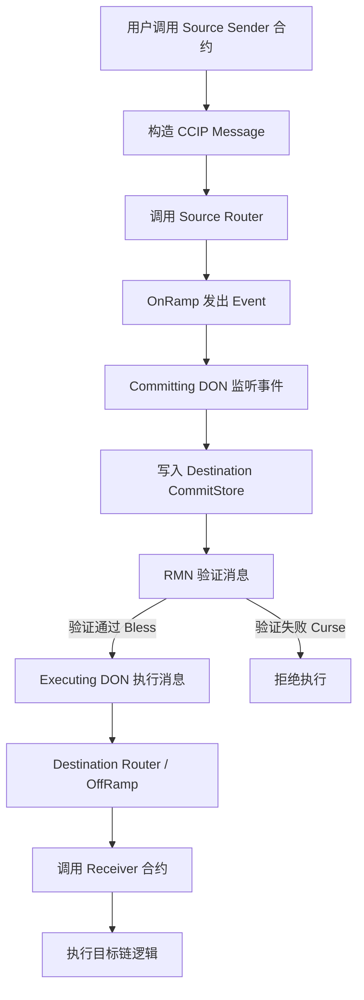
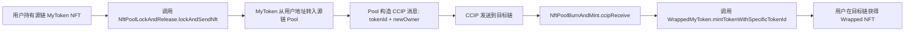
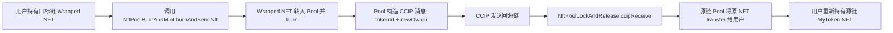
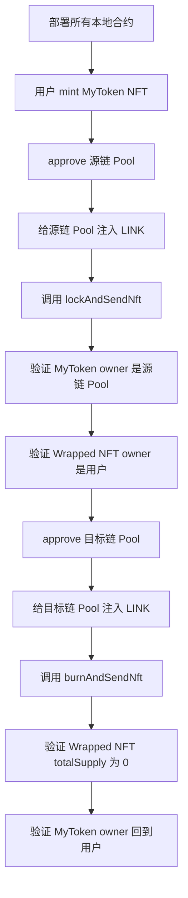

# 第六课：跨链应用 — CCIP

### 本课核心主题

- 这一课围绕“跨链应用”展开：先解释为什么 Web3 开发越来越需要跨链能力，再从 NFT 的基本概念切入，编写一个符合 ERC721 标准的 NFT 合约，并通过 Chainlink CCIP 实现 NFT 在两条链之间的跨链流转。
- 本课最终实现的是一个典型的 **Lock and Mint / Burn and Release** 跨链 NFT 架构：
  - 在源链上部署原生 NFT 合约；
  - 用户将 NFT 锁定到源链的 NFT Pool 中；
  - 通过 CCIP 发送跨链消息；
  - 目标链接收消息后，铸造一个 Wrapped NFT；
  - 用户若要跨回源链，则在目标链烧毁 Wrapped NFT；
  - 再通过 CCIP 通知源链释放原 NFT。

> *批注：这一课的重点不是“做一个 NFT”，而是借 NFT 这个载体，把跨链资产流转的通用方法讲清楚。掌握后，ERC20、NFT 甚至更复杂的资产逻辑都可以迁移到类似架构中。*

---

### 一、为什么现在必须重视跨链

- 早期区块链生态中，开发者主要围绕以太坊主网开发，用户和资产相对集中。但到 2024 年，EVM 生态链数量已经大幅增加。
- 例如通过 Chainlist 可以看到大量 EVM 兼容链，主网加测试网数量非常庞大。
- 资源网站：
  - Chainlist：`https://chainlist.org`
  - Chainlink Docs：`https://docs.chain.link`
  - CCIP Explorer：`https://ccip.chain.link`

#### 1. 多链生态带来的两个核心问题

| 问题 | 说明 | 影响 |
|---|---|---|
| 用户分散 | 用户不再集中在单一主网，而是分布在以太坊、Polygon、Avalanche、Layer2 等不同链上 | 应用如果只部署在一条链，天然只能触达部分用户 |
| 流动性碎片化 | 用户资产分散在不同链，某一条链上的可用资产不足 | DeFi 等依赖流动性的应用更难形成规模 |

- 跨链能力的价值在于：
  - 让不同链上的用户访问同一个应用；
  - 让资产可以在不同链之间流动；
  - 让应用逻辑不被单链环境限制；
  - 降低多链部署和管理的复杂度。

> *批注：跨链从过去的“加分项”逐渐变成 Web3 应用的“基础能力”。尤其是金融、游戏、会员、身份类应用，天然会遇到多链用户和多链资产问题。*

---

### 二、NFT 基础概念

### 核心概念

#### 1. NFT 是什么

- NFT 全称是 **Non-Fungible Token**，即非同质化通证。
- 它和 ERC20 这类同质化通证的区别在于：

| 类型 | 中文 | 特点 | 示例 |
|---|---|---|---|
| FT | 同质化通证 | 可拆分、可等价交换 | ETH、BTC、USDC、积分 |
| NFT | 非同质化通证 | 不可随意拆分、每个 Token 独一无二 | 房产证明、头像、门票、游戏道具 |

- 同质化通证的典型例子是 1 美元、1 个 ETH、1 袋同规格大米。你和别人交换后，资产本质没有差异。
- 非同质化通证则不同。例如一套房子、一幅画、一个游戏角色、一个会议参会证明，它们都有独特属性，不能无差别交换。

#### 2. NFT 的常见使用场景

| 场景 | 说明 |
|---|---|
| 社区身份 | 俱乐部会员、DAO 成员身份、社区通行证 |
| 游戏道具 | 角色、武器、装备、药水等 GameFi 资产 |
| 参会证明 | 会议、活动、课程参与凭证 |
| 资产质押证明 | DeFi 中记录用户质押金额、时间、收益率等差异化信息 |
| 会员卡 / 门票 | 权益凭证、入场凭证、消费权益 |

> *批注：NFT 的核心不在“图片”，而在“唯一性”和“权属证明”。图片只是最容易被用户感知的一层表现。*

---

### 三、ERC721 与 ERC1155

- NFT 合约常见标准主要有两个：

| 标准 | 特点 | 适合场景 |
|---|---|---|
| ERC721 | 每次处理一个 NFT，专注非同质化资产 | PFP 头像、个人收藏、C 端 NFT 项目 |
| ERC1155 | 可同时支持同质化与非同质化资产，并支持批量处理 | 游戏道具、大规模品牌发行、B 端批量资产 |

- 本课选择 **ERC721**，原因是：
  - 使用更广泛；
  - 逻辑更直观；
  - 更适合教学演示；
  - 大部分常见 NFT 项目都基于 ERC721。

---

### 四、NFT Metadata：NFT 为什么能显示图片和属性

- 一个 NFT 不只是链上的 Token ID。它还需要 Metadata 来描述：
  - 名称；
  - 描述；
  - 图片；
  - 外部链接；
  - 属性 traits；
  - 其他展示信息。
- OpenSea 等 NFT 市场会读取 NFT 的 `tokenURI`，再根据该 URI 指向的 JSON 文件渲染 NFT 页面。

#### Metadata JSON 示例

```json
{
  "description": "A cute Shiba Inu NFT",
  "external_url": "https://example.com",
  "image": "ipfs://<image-cid>",
  "name": "Shiba Inu",
  "attributes": [
    {
      "trait_type": "Breed",
      "value": "Shiba"
    },
    {
      "trait_type": "Temperature",
      "value": "Warm"
    }
  ]
}
```

#### Metadata 可以存在哪里

| 存储方式 | 特点 |
|---|---|
| 中心化服务器 | 部署简单，但存在被修改、下线、审查的风险 |
| IPFS | 去中心化内容寻址，适合存储 NFT 图片和 JSON |
| Arweave | 更偏永久存储，成本和使用方式不同 |

- 本课使用 IPFS，并通过 Filebase 简化上传流程。
- 相关资源：
  - OpenSea Metadata Standard：`https://docs.opensea.io/docs/metadata-standards`
  - IPFS 官网：`https://ipfs.tech`
  - Filebase：`https://filebase.com`
  - OpenSea 测试网：`https://testnets.opensea.io`

> *批注：实际项目里，Metadata 的稳定性非常重要。如果图片或 JSON 丢失，链上的 NFT 还在，但用户看到的资产展示会“塌掉”。*

---

## 核心步骤

### Step 1：创建 Hardhat 项目

#### 初始化项目

```bash
cd ~
mkdir cross-chain-nft
cd cross-chain-nft

npm init -y
npm install hardhat --save-dev
npx hardhat init
```

- 选择 JavaScript 项目。

#### 安装 OpenZeppelin

```bash
npm install @openzeppelin/contracts --save-dev
```

#### 删除示例合约

- 删除默认生成的：

```text
contracts/Lock.sol
```

- 新建：

```text
contracts/MyToken.sol
```

---

### Step 2：编写 ERC721 NFT 合约

- 使用 OpenZeppelin Wizard 生成 ERC721 合约：
  - 标准：ERC721；
  - 功能：
    - Mintable；
    - Auto Increment IDs；
    - Burnable；
    - Enumerable；
    - URI Storage。
- 资源：
  - OpenZeppelin Contracts Wizard：`https://wizard.openzeppelin.com`

#### MyToken 合约核心逻辑

- 合约目标：
  - 支持铸造 NFT；
  - 每次铸造 Token ID 自动递增；
  - 每个 NFT 默认绑定同一个 IPFS Metadata；
  - 支持枚举、URI 查询、销毁等 ERC721 扩展能力。
- 关键点：

```solidity
string public constant METADATA_URI = "ipfs://<metadata-cid>";
```

- 铸造时设置 Token URI：

```solidity
function safeMint(address to) public {
    uint256 tokenId = _nextTokenId++;
    _safeMint(to, tokenId);
    _setTokenURI(tokenId, METADATA_URI);
}
```

- 构造函数可以改成更灵活的形式：

```solidity
constructor(
    string memory tokenName,
    string memory tokenSymbol
) ERC721(tokenName, tokenSymbol) Ownable(msg.sender) {}
```

- 这样部署时可以传入 NFT 名称和 Symbol。

---

### Step 3：用 Remix 快速验证 NFT 展示效果

- 为了快速看到 NFT 是否能被 OpenSea 测试网识别，可以先把合约复制到 Remix 中部署。
- 流程：
  1. 打开 Remix；
  2. 新建 `MyToken.sol`；
  3. 粘贴合约；
  4. 编译；
  5. 使用 Injected Provider 连接 MetaMask；
  6. 部署到测试网；
  7. 调用 `safeMint`；
  8. 到 OpenSea Testnets 查看 NFT。
- 验证点：
  - `totalSupply()` 是否从 0 变成 1；
  - `tokenURI(0)` 是否返回 IPFS Metadata URI；
  - OpenSea 是否展示图片、名称、属性。

> *批注：Remix 适合快速验证合约效果，但不适合复杂项目管理。真正项目仍然应该用 Hardhat/Foundry 管理部署、测试和脚本。*

---

## 五、跨链原理

### 核心概念

#### 1. 跨链本质：移动的是“信息”

- 常见说法有：
  - 通证跨链；
  - 可编程通证跨链；
  - 任意消息跨链。
- 但从抽象层面看，跨链本质都是：

```text
把源链上的某个状态或指令，安全地传递到目标链，并在目标链执行对应操作。
```

- 例如 NFT 跨链中，真正传递的信息不是 NFT 本体，而是：
  - 源链上的 NFT 已经被锁定；
  - Token ID 是多少；
  - 目标链上应该给哪个地址铸造 Wrapped NFT；
  - 目标链接收合约是谁。

#### 2. 跨链最大的难点：消息可信

- 跨链协议必须回答几个问题：
  - 谁负责读取源链数据？
  - 谁负责把数据写入目标链？
  - 如何证明消息没有被篡改？
  - 如何防止伪造消息？
  - 如何确保目标链执行的是合法请求？
- 因此大多数项目不会从零写跨链基础设施，而是使用成熟协议，例如 Chainlink CCIP。

---

### 六、Chainlink CCIP 工作机制

- CCIP 是 Chainlink 提供的跨链通信协议，支持任意消息跨链、代币跨链等能力。

#### 1. CCIP 三个核心区域

| 区域 | 说明 |
|---|---|
| Source Chain | 源链，跨链消息发起地 |
| Destination Chain | 目标链，跨链消息执行地 |
| Off-chain Infrastructure | 链下预言机网络，负责监听、验证、执行跨链消息 |

#### 2. CCIP 链下网络组成

| 组件 | 作用 |
|---|---|
| Committing DON | 监听源链事件，把消息提交到目标链 |
| Risk Management Network / RMN | 风险管理网络，验证消息是否可信 |
| Executing DON | 在目标链执行已经验证的消息 |

#### 3. CCIP 链上合约

| 合约 | 作用 |
|---|---|
| Router | 用户发送跨链消息时主要交互的路由合约 |
| OnRamp | 源链侧处理消息封装和事件发出 |
| CommitStore | 目标链侧存储已提交消息 |
| OffRamp | 目标链侧处理消息执行 |
| Receiver | 用户自己编写的接收合约 |

#### 4. CCIP 跨链流程图



> *批注：CCIP 的优势在于把“跨链消息传递、验证、执行”这套复杂基础设施封装好了。开发者主要关注 Sender 和 Receiver 两端业务逻辑。*

---

## 七、跨链资产的几种模式

### 1. Burn and Mint

- 源链烧毁资产，目标链铸造等量资产。

```text
Source Chain: burn
Destination Chain: mint
```

- 优点：
  - 资本效率最高；
  - 不需要锁定资产。
- 缺点：
  - 要求资产在多链都有原生部署；
  - 跨链协议或桥必须有权限调用资产合约的 `burn` / `mint`；
  - 普通开发者通常拿不到这种权限。
- 适合：
  - USDC 等官方多链部署资产；
  - 项目方自己完全控制多链资产合约。

### 2. Lock and Mint

- 源链锁定原生资产，目标链铸造包装资产。

```text
Source Chain: lock original token
Destination Chain: mint wrapped token
```

- 优点：
  - 不要求原资产官方部署到多条链；
  - 不需要调用原资产的 `burn` / `mint` 权限；
  - 普通开发者更容易实现。
- 缺点：
  - 需要锁定原资产；
  - 目标链上的资产是 Wrapped Asset，不是原生资产。

### 3. Burn and Release

- 目标链烧毁包装资产，源链释放原资产。

```text
Destination Chain: burn wrapped token
Source Chain: release original token
```

- 本课采用的完整模式是：

```text
去程：Lock and Mint
返程：Burn and Release
```

---

## 八、本课 NFT 跨链架构

### 1. 合约角色

| 合约 | 部署位置 | 作用 |
|---|---|---|
| `MyToken` | 源链 | 原生 ERC721 NFT |
| `WrappedMyToken` | 目标链 | 源链 NFT 的包装资产 |
| `NftPoolLockAndRelease` | 源链 | 锁定 / 释放原生 NFT，并发送 / 接收 CCIP 消息 |
| `NftPoolBurnAndMint` | 目标链 | 铸造 / 销毁 Wrapped NFT，并发送 / 接收 CCIP 消息 |

### 2. NFT 从源链跨到目标链



### 3. NFT 从目标链跨回源链



---

## 九、编写 Wrapped NFT 合约

- 新建：

```text
contracts/WrappedMyToken.sol
```

- 它继承 `MyToken`，但额外增加一个按指定 Token ID 铸造的函数。
- 为什么需要这个函数？
- 原生 `safeMint` 使用自增 Token ID：

```text
第一个 NFT: tokenId = 0
第二个 NFT: tokenId = 1
第三个 NFT: tokenId = 2
```

- 但跨链时，用户可能跨的是任意 Token ID，例如 `tokenId = 10`。目标链 Wrapped NFT 必须保持相同 Token ID，因此需要指定 Token ID 铸造。
- 核心函数：

```solidity
function mintTokenWithSpecificTokenId(
    address to,
    uint256 tokenId
) public {
    _safeMint(to, tokenId);
}
```

> *批注：真实项目中，这个函数必须加权限控制。否则任何人都可以任意铸造 Wrapped NFT，风险极高。*

---

## 十、编写源链 Pool：Lock and Release

- 新建：

```text
contracts/NftPoolLockAndRelease.sol
```

- 它负责：
  1. 接收用户 NFT；
  2. 锁定 NFT；
  3. 发送 CCIP 消息；
  4. 接收目标链返回消息；
  5. 释放原 NFT。

### 关键函数：锁定并发送跨链消息

```solidity
function lockAndSendNft(
    uint256 tokenId,
    address newOwner,
    uint64 chainSelector,
    address receiver
) public returns (bytes32 messageId) {
    nft.transferFrom(msg.sender, address(this), tokenId);

    bytes memory payload = abi.encode(tokenId, newOwner);

    messageId = sendMessagePayLink(
        chainSelector,
        receiver,
        payload
    );

    return messageId;
}
```

- 关键点：
  - `transferFrom(msg.sender, address(this), tokenId)` 把 NFT 转入 Pool；
  - `payload` 中包含：
    - `tokenId`；
    - 目标链 NFT 接收人 `newOwner`；
  - 通过 CCIP 发送到目标链 Receiver。

### 接收返程消息并释放 NFT

- 当目标链 Wrapped NFT 被 burn 后，源链 Pool 收到 CCIP 消息：

```solidity
function _ccipReceive(
    Client.Any2EVMMessage memory any2EvmMessage
) internal override {
    RequestData memory requestData = abi.decode(
        any2EvmMessage.data,
        (RequestData)
    );

    uint256 tokenId = requestData.tokenId;
    address newOwner = requestData.newOwner;

    nft.transferFrom(address(this), newOwner, tokenId);

    emit TokenUnlocked(tokenId, newOwner);
}
```

- 这里不需要额外维护 `tokenLocked` mapping，因为 ERC721 的 `transferFrom` 本身会校验当前合约是否拥有该 NFT。

---

## 十一、编写目标链 Pool：Burn and Mint

- 新建：

```text
contracts/NftPoolBurnAndMint.sol
```

- 它负责：
  1. 接收源链 CCIP 消息；
  2. 铸造 Wrapped NFT；
  3. 用户跨回时销毁 Wrapped NFT；
  4. 发送 CCIP 消息回源链。

### 接收消息并 mint Wrapped NFT

```solidity
function _ccipReceive(
    Client.Any2EVMMessage memory any2EvmMessage
) internal override {
    RequestData memory requestData = abi.decode(
        any2EvmMessage.data,
        (RequestData)
    );

    uint256 tokenId = requestData.tokenId;
    address newOwner = requestData.newOwner;

    wrappedNft.mintTokenWithSpecificTokenId(newOwner, tokenId);

    emit TokenMinted(tokenId, newOwner);
}
```

### burn Wrapped NFT 并发送返程消息

```solidity
function burnAndSendNft(
    uint256 tokenId,
    address newOwner,
    uint64 chainSelector,
    address receiver
) public returns (bytes32 messageId) {
    wrappedNft.transferFrom(msg.sender, address(this), tokenId);
    wrappedNft.burn(tokenId);

    bytes memory payload = abi.encode(tokenId, newOwner);

    messageId = sendMessagePayLink(
        chainSelector,
        receiver,
        payload
    );

    return messageId;
}
```

> *批注：这里的 burn 逻辑成立，是因为 Wrapped NFT 先被转入 Pool，Pool 成为所有者后再执行 burn。*

---

## 十二、安装 Chainlink CCIP 与 Chainlink Local

### 安装 CCIP 合约包

```bash
npm install @chainlink/contracts-ccip --save-dev
```

### 安装 Chainlink Local

```bash
npm install @chainlink/local --save-dev
```

- Chainlink Local 提供本地 CCIP 模拟器，方便在 Hardhat 本地环境中测试跨链逻辑。
- 新建：

```text
contracts/CCIPSimulator.sol
```

- 引入：

```solidity
// SPDX-License-Identifier: MIT
pragma solidity ^0.8.20;

import {CCIPLocalSimulator} from "@chainlink/local/src/ccip/CCIPLocalSimulator.sol";
```

> *批注：跨链测试如果完全依赖测试网，会非常慢。本课后面真实测试中，Sepolia 跨到 Polygon Amoy 等待了约 20 分钟。本地模拟器是开发阶段必须要用的工具。*

---

## 十三、部署脚本

- 新建：

```text
deploy/
```

- 部署脚本规划：

| 文件 | 作用 | 部署位置 |
|---|---|---|
| `00_deploy_ccip_simulator.js` | 部署本地 CCIP 模拟器 | 本地 |
| `01_deploy_nft.js` | 部署原生 NFT | 源链 |
| `02_deploy_pool_lock_and_release.js` | 部署源链 Pool | 源链 |
| `03_deploy_wrapped_nft.js` | 部署 Wrapped NFT | 目标链 |
| `04_deploy_pool_burn_and_mint.js` | 部署目标链 Pool | 目标链 |

### 安装 hardhat-deploy

```bash
npm install hardhat-deploy hardhat-deploy-ethers --save-dev
```

- 在 `hardhat.config.js` 中引入：

```javascript
require("hardhat-deploy");
require("hardhat-deploy-ethers");
```

### namedAccounts 配置

```javascript
namedAccounts: {
  firstAccount: {
    default: 0
  }
}
```

- 这样部署脚本可以统一使用：

```javascript
const { firstAccount } = await getNamedAccounts();
```

---

## 十四、本地单元测试

- 新建：

```text
test/cross-chain-nft.test.js
```

### 测试目标

| 测试项 | 验证内容 |
|---|---|
| 用户能否 mint 原生 NFT | `MyToken.safeMint` 是否正常 |
| 用户能否锁定 NFT | NFT 是否从用户地址转入源链 Pool |
| 目标链能否收到 Wrapped NFT | CCIP 消息是否触发目标链 mint |
| 用户能否 burn Wrapped NFT | 目标链 Wrapped NFT 是否被销毁 |
| 源链 NFT 能否解锁 | 原 NFT 是否回到用户地址 |

### 测试流程



### 关键测试逻辑

#### 1. mint NFT

```javascript
await nft.safeMint(firstAccount);

const owner = await nft.ownerOf(0);
expect(owner).to.equal(firstAccount);
```

#### 2. approve 源链 Pool

```javascript
await nft.approve(nftPoolLockAndRelease.target, 0);
```

- 原因：
- Pool 合约内部会调用 NFT 合约的 `transferFrom`。对 NFT 合约来说，真正调用 `transferFrom` 的是 Pool 合约地址，而不是用户地址，所以用户必须提前授权。

#### 3. 给 Pool 注入 LINK

```javascript
await ccipSimulator.requestLinkFromFaucet(
  nftPoolLockAndRelease.target,
  ethers.parseEther("10")
);
```

- 因为发送 CCIP 消息需要支付费用，本课使用 LINK 支付。

#### 4. 调用跨链锁定

```javascript
await nftPoolLockAndRelease.lockAndSendNft(
  0,
  firstAccount,
  chainSelector,
  nftPoolBurnAndMint.target
);
```

#### 5. 验证源链 NFT 已锁定

```javascript
const owner = await nft.ownerOf(0);
expect(owner).to.equal(nftPoolLockAndRelease.target);
```

#### 6. 验证目标链 Wrapped NFT 已 mint

```javascript
const owner = await wrappedNft.ownerOf(0);
expect(owner).to.equal(firstAccount);
```

#### 7. burn Wrapped NFT 并跨回

```javascript
await wrappedNft.approve(nftPoolBurnAndMint.target, 0);

await ccipSimulator.requestLinkFromFaucet(
  nftPoolBurnAndMint.target,
  ethers.parseEther("10")
);

await nftPoolBurnAndMint.burnAndSendNft(
  0,
  firstAccount,
  chainSelector,
  nftPoolLockAndRelease.target
);
```

#### 8. 验证 Wrapped NFT 被销毁

```javascript
const totalSupply = await wrappedNft.totalSupply();
expect(totalSupply).to.equal(0);
```

#### 9. 验证原生 NFT 回到用户

```javascript
const owner = await nft.ownerOf(0);
expect(owner).to.equal(firstAccount);
```

- 运行测试：

```bash
npx hardhat test
```

---

## 十五、配置测试网部署

### 安装加密环境变量工具

```bash
npm install @chainlink/env-enc --save-dev
```

- 设置密码：

```bash
npx env-enc set-pw
```

- 添加私钥和 RPC：

```bash
npx env-enc set PRIVATE_KEY
npx env-enc set SEPOLIA_RPC_URL
npx env-enc set AMOY_RPC_URL
```

- 查看：

```bash
npx env-enc view
```

- 在 `hardhat.config.js` 中引入：

```javascript
require("@chainlink/env-enc").config();

const PRIVATE_KEY = process.env.PRIVATE_KEY;
const SEPOLIA_RPC_URL = process.env.SEPOLIA_RPC_URL;
const AMOY_RPC_URL = process.env.AMOY_RPC_URL;
```

### 网络配置

```javascript
networks: {
  sepolia: {
    url: SEPOLIA_RPC_URL,
    accounts: [PRIVATE_KEY],
    chainId: 11155111,
    blockConfirmations: 6,
    companionNetworks: {
      destChain: "amoy"
    }
  },
  amoy: {
    url: AMOY_RPC_URL,
    accounts: [PRIVATE_KEY],
    chainId: 80002,
    blockConfirmations: 6,
    companionNetworks: {
      destChain: "sepolia"
    }
  }
}
```

### helper-hardhat-config.js

- 配置内容包括：
  - 本地开发链；
  - Sepolia 的 Router、LINK、目标链 selector；
  - Amoy 的 Router、LINK、目标链 selector。
- 示意：

```javascript
const developmentChains = ["hardhat", "localhost"];

const networkConfig = {
  11155111: {
    name: "sepolia",
    router: "<Sepolia CCIP Router>",
    linkToken: "<Sepolia LINK Token>",
    companionChainSelector: "<Amoy Chain Selector>"
  },
  80002: {
    name: "amoy",
    router: "<Amoy CCIP Router>",
    linkToken: "<Amoy LINK Token>",
    companionChainSelector: "<Sepolia Chain Selector>"
  }
};

module.exports = {
  developmentChains,
  networkConfig
};
```

- CCIP 支持网络与 Router 地址可查：

```text
https://docs.chain.link/ccip/supported-networks
```

---

## 十六、部署到测试网

### 部署源链合约到 Sepolia

```bash
npx hardhat deploy --network sepolia --tags sourcechain
```

- 部署内容：
  - `MyToken`
  - `NftPoolLockAndRelease`

### 部署目标链合约到 Polygon Amoy

```bash
npx hardhat deploy --network amoy --tags destchain
```

- 部署内容：
  - `WrappedMyToken`
  - `NftPoolBurnAndMint`
- 部署后可分别在区块浏览器查看：
  - Sepolia Etherscan：`https://sepolia.etherscan.io`
  - Polygon Amoy Explorer：可通过 PolygonScan 测试网入口查看

---

## 十七、编写 Hardhat Tasks

- Tasks 的作用是把常用交互封装成命令，方便开发者和用户调用。
- 新建：

```text
tasks/
```

### 1. check-nft

- 用于查看源链原生 NFT 的状态。

```bash
npx hardhat check-nft --network sepolia
```

- 输出示例：

```text
Checking status of MyToken...
Token ID: 0, Owner: 0x...
Token ID: 1, Owner: 0x...
```

- 核心逻辑：

```javascript
const totalSupply = await nft.totalSupply();

for (let tokenId = 0; tokenId < totalSupply; tokenId++) {
  const owner = await nft.ownerOf(tokenId);
  console.log(`Token ID: ${tokenId}, Owner: ${owner}`);
}
```

### 2. mint-nft

- 用于在源链 mint 一个 NFT。

```bash
npx hardhat mint-nft --network sepolia
```

- 核心逻辑：

```javascript
const mintTx = await nft.safeMint(firstAccount);
await mintTx.wait(6);
```

### 3. lock-and-cross

- 用于把源链 NFT 锁定，并跨链到目标链。

```bash
npx hardhat lock-and-cross \
  --tokenid 0 \
  --network sepolia
```

- 该任务会:
  1. 获取目标链 Chain Selector；
  2. 获取目标链 Receiver 合约地址；
  3. 给源链 Pool 转 LINK；
  4. 授权源链 Pool 转移 NFT；
  5. 调用 `lockAndSendNft`；
  6. 输出交易哈希。
- 核心调用：

```javascript
await nft.approve(nftPoolLockAndRelease.target, tokenId);

const tx = await nftPoolLockAndRelease.lockAndSendNft(
  tokenId,
  firstAccount,
  chainSelector,
  receiver
);
```

- 拿到交易哈希后，可以到 CCIP Explorer 查询跨链状态：

```text
https://ccip.chain.link
```

### 4. check-wNFT

- 用于查看目标链 Wrapped NFT。

```bash
npx hardhat check-wNFT --network amoy
```

- 如果跨链成功，能看到：

```text
Token ID: 0, Owner: 0x...
```

### 5. burn-and-cross

- 用于从目标链 burn Wrapped NFT，并跨回源链释放原 NFT。

```bash
npx hardhat burn-and-cross \
  --tokenid 0 \
  --network amoy
```

- 该任务会：
  1. 给目标链 Pool 转 LINK；
  2. 授权目标链 Pool 转移 Wrapped NFT；
  3. 调用 `burnAndSendNft`；
  4. 输出 CCIP 交易哈希；
  5. 等待 CCIP 完成后，在源链查询 NFT owner。

---

## 十八、真实跨链等待时间与 Finality

- 测试网真实跨链时，CCIP 不会立即完成。
- 例如 Sepolia 到 Amoy 的跨链过程中，CCIP Explorer 会先显示：

```text
Waiting for finality
```

- 原因是 CCIP 需要等待源链交易达到 finality，避免源链交易被重组后导致双花或错误执行。
- 以以太坊系链为例，finality 等待时间可能较长。本课实际等待约 20 分钟后，状态变为：

```text
Success
```

> *批注：这也是为什么本地单元测试必须使用 CCIP Local Simulator。真实链上跨链一次十几二十分钟，开发时不可能靠它反复调试。*

---

## 十九、权限与安全注意事项

- 本课为了讲清楚 CCIP 主流程，简化了部分权限控制。真实项目中必须补足安全设计。

### 必须注意的风险点

| 风险点 | 说明 | 建议 |
|---|---|---|
| Wrapped NFT 任意 mint | 如果 `mintTokenWithSpecificTokenId` 没权限，任何人都能伪造资产 | 只允许目标链 Pool 或受信合约调用 |
| Pool 任意接收消息 | 如果 Receiver 不校验 source chain 和 sender，可能接收伪造来源消息 | 使用 allowlist 校验链 ID 和发送合约 |
| burn / release 对应关系 | 如果不校验锁定状态，可能出现错误释放 | 结合 ERC721 owner 校验或额外状态记录 |
| LINK 余额不足 | Pool 没有足够 LINK 会导致 CCIP 发送失败 | 提前检查余额，必要时做自动充值逻辑 |
| Metadata 稳定性 | Metadata 丢失会影响 NFT 展示 | 使用可靠 IPFS pinning 或多副本存储 |
| 私钥泄露 | 测试账户和真实资产账户必须隔离 | 绝不在生产私钥上做教学测试 |

> *批注：跨链应用的安全边界比单链应用更大。单链合约错了已经很麻烦，跨链合约错了还会把错误状态传播到另一条链。*

---

## 二十、本课最终效果

- 完成后，整个 NFT 跨链流程如下：
  1. 在 Sepolia 上 mint `MyToken`；
  2. 查看 NFT owner 是用户地址；
  3. 调用 `lock-and-cross`；
  4. NFT owner 变成源链 Pool 地址；
  5. 等待 CCIP 消息完成；
  6. 在 Amoy 上查看 `WrappedMyToken`；
  7. Wrapped NFT owner 是用户地址；
  8. 调用 `burn-and-cross`；
  9. Wrapped NFT 被 burn；
  10. 等待 CCIP 消息完成；
  11. Sepolia 上原 NFT owner 重新变成用户地址。
- 最终实现：

```text
源链原生 NFT  <->  目标链 Wrapped NFT
```

- 本质架构：

```text
Lock Original NFT
Send CCIP Message
Mint Wrapped NFT

Burn Wrapped NFT
Send CCIP Message
Release Original NFT
```

---

### 核心收获

1. NFT 的价值来自唯一性、权属和 Metadata，而不只是图片。
2. ERC721 更适合单个独立资产，ERC1155 更适合批量资产。
3. 跨链资产本质上传递的是状态和指令，不是“资产本身飞过去”。
4. CCIP 把跨链消息监听、验证、执行等复杂基础设施封装起来。
5. 普通开发者更常用的跨链资产模型是 Lock and Mint / Burn and Release。
6. 本地跨链测试应优先使用 Chainlink Local Simulator。
7. 真实跨链要等待 finality，耗时可能达到十几分钟甚至更久。
8. 生产环境必须补充权限控制、来源校验、审计和异常处理。

> *批注：这一课最值得带走的是“跨链资产不是魔法，而是一套状态同步协议”。只要理解锁定、消息、铸造、销毁、释放这几个动作，就能看懂大部分桥和跨链资产设计。*

---

> *清洗说明：格式问题约 80+ 处。主要类型：(1) 列表项前缀 `- ---` → 标准水平线 `---`（约 18 处）；(2) 列表内嵌代码块、mermaid 图、表格的缩进/破裂结构提到顶层（约 25 处）；(3) 嵌套 bullet `- - **粗体**` 修正为合规缩进或扁平化（约 30 处）；(4) 替换顶部 BibiGPT 标题与 frontmatter 为 YAML 模板；(5) 移除顶部封面图与冗余 status 字段。错别字 0 处。未改写原文表述。*
